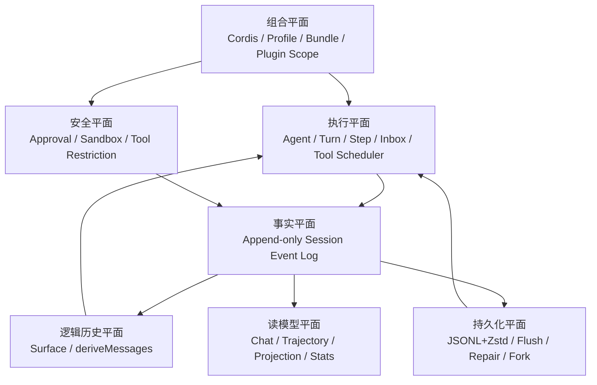
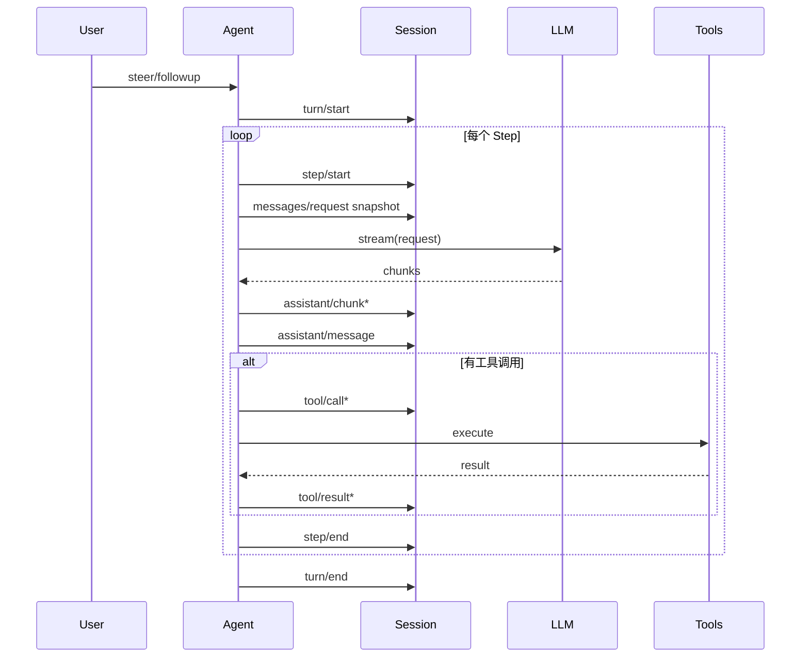
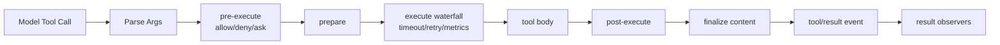
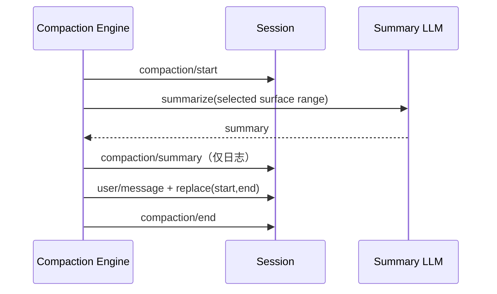
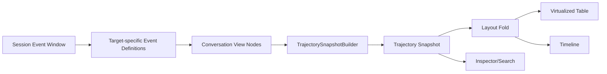

# DeepSeek Harness（DSH）Trajectory 与事件溯源 Agent Runtime 设计思路学习报告

> **研究对象**：DeepSeek Harness（下文简称 DSH）官方 Trajectory 页面与 `deepseek-ai/deepseek-harness` 源码  
> **源码快照**：commit `76fda729799fe9b3848dbe2c211d4b231032b81e`  
> **研究日期**：2026-09-04  
> **报告定位**：不是功能罗列或 README 翻译，而是从源码反推其架构目标、核心抽象、执行语义、持久化模型、恢复策略、可观测 UI，以及可迁移到 Java Agent Runtime／“太初 Taichu”的工程方法。  
> **重要说明**：DSH 当前仍属于 Developer Preview，源码与官网页面之间已出现实现迭代差异；本报告以所列 commit 的源码为准，官网用于理解产品表达。

---

## 0. 先给结论：DSH 真正设计的不是“Trajectory 页面”，而是一套可生成 Trajectory 的 Agent Runtime

官网对 Trajectory 的表达是：系统提示词、推理、工具调用、工具结果、子 Agent 调度、上下文注入等行为被记录到同一条事件流，继续执行、分叉、搜索和回放都使用该事件流。源码进一步说明：**Trajectory 并不是在 Agent 执行完成后额外抓取日志，而是 Agent Runtime 从一开始就把每次有语义的状态迁移建模为 Session Event；Trajectory 只是这条事实流的一个只读投影。**

可以把 DSH 压缩成下面这个公式：

```text
DSH
= Cordis 插件组合
+ Agent Turn/Step 状态机
+ Append-only Session Event Log
+ 可替换的模型历史 Surface
+ Prompt/Tool/Context 请求快照
+ 可插拔能力 Seam
+ 持久化检查点与崩溃修复
+ Chat / Trajectory / Domain Projection 等读模型
```

最值得学习的是以下四个分离：

```text
事实日志 ≠ 模型当前看到的历史
模型历史 ≠ UI 当前显示的状态
持久 Session ≠ 内存中正在运行的 Agent
工具可见性 ≠ 工具执行权限与沙箱
```

传统 Agent 项目常把这些概念揉进一个 `AgentState`、一张 `conversation_message` 表和若干回调中；DSH 则为它们分别建立抽象，并用稳定标识、来源关系和生命周期协议连接。

---

## 1. 报告阅读地图

|部分|回答的问题|
|---|---|
|第 2～4 章|DSH 想解决什么问题？为何采用 Everything-as-a-Plugin？|
|第 5～8 章|Session Event、Surface、Turn/Step/Inbox 分别是什么？|
|第 9～11 章|系统提示词、运行时上下文、请求快照、流式输出如何记录？|
|第 12～16 章|工具调度、持久化、崩溃恢复如何配合？|
|第 17～20 章|Resume、Fork、Replay、Compaction、Subagent 如何实现？|
|第 21～30 章|Trajectory、Projection、Approval、Sandbox 如何设计？|
|第 31～34 章|源码体现哪些架构原则、局限？与 LangGraph 有何区别？|
|第 35～52 章|如何用 Java 实现；如何迁移到太初？|
|第 53 章以后|实施路线、源码学习路径、附录与检查清单|

---

# 第一部分：问题域与总架构

## 2. DSH 解决的根本问题：Agent 是长生命周期、有副作用、可中断的执行系统

普通聊天程序只需保存“用户消息—助手消息”。工程化 Agent 还会出现：

1. 一轮模型请求产生多次 Step：模型先调用工具，工具结果回填，再请求模型。
2. 工具修改文件、运行命令、访问远程 API，具有不可逆副作用。
3. 多个工具可并行完成，但结果必须以模型原始顺序回填，才能稳定重放。
4. 用户可能在执行中追加要求、纠偏、取消，消息必须落在正确边界。
5. 进程可能在模型响应、工具执行、写盘或子 Agent 运行中崩溃。
6. 长会话要压缩上下文，但不能破坏审计和回放。
7. 子 Agent 可能是独立、可恢复、可继续通信的 Session。
8. UI 既要显示聊天，也要显示 Prompt 变化、TTFT、工具树、错误、压缩和中断。
9. 不同部署需要不同模型、工具、沙箱、审批、记忆、前端和传输层。

DSH 的设计目标可归纳为：

|目标|源码中的对应机制|
|---|---|
|**Observable 可观测**|统一 Session Event；Trajectory 从事件投影|
|**Recoverable 可恢复**|持久日志、语义检查点、尾部修复、Resume|
|**Forkable 可分叉**|继承事件前缀、父子谱系、独立后续日志|
|**Interruptible 可干预**|Inbox、Steer、Cancel、Approval、Step 边界|
|**Composable 可组合**|Cordis 插件树、能力 Seam、作用域覆盖|
|**Auditable 可审计**|只追加事实、来源序列、请求快照、审批事件|

核心观念是：**Agent Runtime 的核心不是“调用 LLM”，而是管理状态迁移、副作用边界和事实记录。**

---

## 3. 五个平面：统一理解 DSH



### 3.1 组合平面
决定当前部署拥有哪些能力：模型适配器、工具、沙箱、审批器、压缩后端、子 Agent Provider、客户端 UI 等。它不保存会话事实。

### 3.2 执行平面
内存中的 Agent Driver，处理 Inbox，打开 Turn，循环 Step，组装模型请求，接收流式输出，调度工具和取消。

### 3.3 事实平面
Session Event Log 是唯一事实源。所有重要动作都变成带 `seq/time/type/data` 的事件。事实只追加，不原地修改。

### 3.4 逻辑历史平面
Surface 是从事实日志折叠出的“当前模型历史”。新增 replace 事件可以遮蔽旧历史，所以能压缩或替换动态上下文，同时不删除原始证据。

### 3.5 读模型平面
Chat、Trajectory、todo/goal、统计都从事件或投影状态读取。读模型可重建、缓存、独立升级，不反向控制 Agent。

### 3.6 持久化与安全平面
持久化保证恢复；Approval 与 Sandbox 控制副作用。二者通过能力接口组合，而非硬编码进某个工具。

---

## 4. Cordis 与 Everything-as-a-Plugin：为何不做一个巨型 Agent 类

传统实现常是：

```text
AgentExecutor
  ├─ model
  ├─ prompt
  ├─ tools
  ├─ memory
  ├─ checkpoint
  ├─ callbacks
  ├─ permissions
  ├─ subagents
  └─ UI events
```

其问题是增加能力要修改核心类，生命周期由各模块各自管理，插件只能观察而难以参与正式决策，全局配置与单 Agent 覆盖混杂。

DSH 使用 Cordis 管理插件挂载、依赖注入、上下文作用域、事件瀑布和资源释放。Agent Loop、Tools、Persistence、Approval 本身也是插件。

### 4.1 能力 Seam：Definition / Provider / Consumer

```text
Definition：定义能力词汇和接口
Provider：提供某种实现
Consumer：消费能力，不知道具体实现
```

例如：

```text
Sandbox Definition
  ├─ sandbox-local Provider
  └─ bash-sandbox Consumer

Subagent Definition
  ├─ in-process Provider
  ├─ Codex Provider
  ├─ Claude Code Provider
  └─ tool-subagent Consumer
```

收益：

1. **依赖倒置**：工具依赖 `ctx.sandbox`，不依赖具体 runner。
2. **部署可替换**：本地、CI、远程环境选不同 Provider。
3. **能力发现明确**：不支持的选项在启动前报错，而非静默降级。
4. **Contract Test 可复用**：同一套契约约束多个 Provider。
5. **可失败关闭**：缺少安全能力时拒绝，而非偷偷走危险路径。

### 4.2 Waterfall 与广播事件

|模式|作用|例子|
|---|---|---|
|广播/观察|事实已经发生，监听方消费|`session/event`、`tools/result`|
|Waterfall/责任链|参与决策或变换，可调用 `next()`|`tools/pre-execute`、`tools/execute`、`system-prompt/assemble`|

Waterfall 适合策略链：

```text
工具请求
→ 参数校验
→ Approval Gate
→ Timeout
→ Metrics
→ Tool Body
→ Post Processor
→ Final Result
```

### 4.3 Scoped Layer

系统提示词、工具、变量使用作用域层：

- 全局提供默认；
- Agent/子 Agent 作用域覆盖同名条目；
- 最近作用域优先；
- 注册与销毁跟随 fiber/effect；
- 退出作用域自动恢复上层定义。

这样能确保“模型看到的工具集合”和“实际允许 Dispatch 的工具集合”使用同一解析逻辑。

---

# 第二部分：Session 事件溯源与模型历史

## 5. Session Event Log：DSH 的事实源

### 5.1 基本事件信封

```json
{
  "type": "tool/result",
  "seq": 42,
  "time": 1788492345678,
  "data": {"...": "..."},
  "surfaceOp": "append",
  "sourceEventSeqs": [41]
}
```

|字段|含义|
|---|---|
|`type`|事件类型，决定 `data` 结构|
|`seq`|Session 内严格单调、连续的序号|
|`time`|事件发生时间|
|`data`|领域数据|
|`ignorable`|前向兼容的可忽略标记|
|`surfaceOp`|是否以及如何改变模型 Surface|
|`sourceEventSeqs`|该表层事件由哪些原始事实产生|

### 5.2 事件家族

|家族|典型事件|作用|
|---|---|---|
|Turn|`turn/start`、`turn/end`|一次完整 Agent 回合|
|Step|`step/start`、`step/end`|一次 LLM 请求及工具处理|
|输入|`user/message`|人类输入、插件上下文、运行时快照|
|请求|`request/header`、`request/context`|记录真正发给模型的稳定环境和动态上下文|
|流式输出|`assistant/chunk`|文本、reasoning、tool-call 参数增量|
|最终输出|`assistant/message`|组装后的规范 Assistant Message|
|工具|`tool/call`、`tool/result`|顶层工具调用与结果|
|恢复/谱系|`session/end-seed` 等|区分继承前缀与当前运行后缀|
|扩展领域|`approval/*`、`compaction/*`、`subagent/*`、`tool/code-dispatch*`|插件扩展|

TypeScript 通过 declaration merging 扩展 `SessionEventMap`。架构含义是：Session 核心只定义最小词汇，各领域拥有自己的事件，但统一使用序号、持久化、回放和投影机制。

### 5.3 事件日志不是 debug log

DSH 校验：

- `seq` 连续；
- 一个 Session 只能有一个打开 Turn；
- 一个 Turn 只能有一个打开 Step；
- `tool/result` 必须对应 `tool/call`；
- 请求事件处于正确生命周期；
- Replace 范围与来源关系合法；
- 修复事件也要恢复所有不变式。

它更接近**领域事件账本**，而不是 `logger.info()`。

---

## 6. Surface：为何“日志只追加”仍能“替换历史”

DSH 区分：

```text
Event Log：历史上真实发生过什么
Surface：下一次模型调用当前应该看到什么
```

只有 `user/message`、`assistant/message`、`tool/result` 等少数事件可改变 Surface：

```text
append：把当前事件加入 Surface 尾部
replace(start,end)：用当前事件替换 Surface 中一个连续范围
```

“替换历史”不是 UPDATE/DELETE，而是新增事实：

```text
seq=100 compaction/summary      仅日志
seq=101 user/message            surface replace [10,60]
```

原始 10～60 仍在日志中，只是不再出现在下一次模型请求。

### 6.1 示例

```text
0  user/message A
1  assistant/message B
2  tool/result C
3  user/message D
4  assistant/message E
5  user/message SUMMARY，replace [0,2]
```

物理日志：`[0,1,2,3,4,5]`  
当前 Surface：`[5,3,4]`

Trajectory 可展示全部事实；模型只看到摘要、D、E。

### 6.2 `sourceEventSeqs`

它表达工具结果来源、摘要覆盖范围、投影节点来源。该机制提供应用级 provenance，但不是密码学防篡改：源码默认没有哈希链、签名或不可抵赖证明。

### 6.3 Append-origin 与 Replacement-origin

源码区分事件本来按 append 进入，还是作为 replace 节点进入。聊天 Transcript 可能只关心自然追加；审计页面需要显示替换和被遮蔽历史。

### 6.4 `deriveMessages()` 缓存

每个 Step 都要从 Surface 生成模型消息。Session 维护 Surface Node 顺序、replace generation 和派生缓存。普通 append 可增量复用；replace 才让相应代际失效。这适合长会话，但要求折叠逻辑确定且经过强测试。

---

## 7. Session、Agent、Turn、Step

|概念|是否持久|生命周期|职责|
|---|---|---|---|
|Session|是|可跨进程|保存事件事实与谱系|
|Agent|否，live object|一次驻留期|驱动 Session 执行|
|Turn|事件化|一次外部意图到回合终止|承载一组 Step|
|Step|事件化|一次模型请求到工具处理结束|Agent Loop 最小迭代|

同一 Session 可在新进程 Resume，由新的内存 Agent 接管。Session 不能保存 Promise、线程、进程句柄；这些属于 Agent/Activation。

### 7.1 典型序列



Turn 结束原因采用封闭词汇，如 completed、aborted、blocked、error、max-tokens、interrupted。无论模型报错、工具报错、取消还是资源释放，已打开的边界都要进入可解释终态；来不及正常关闭时，下次恢复追加修复事件。

---

## 8. Agent Inbox：把用户干预纳入正式执行语义

源码存在 followup、steer、inject 等入口，概念上可理解为：

|操作|主要意图|运行中|空闲|
|---|---|---|---|
|Followup|排队一个正常后续回合|当前 Turn 后执行|启动新 Turn|
|Steer|对当前任务纠偏|在可领取 Step 边界注入|唤醒并形成新 Turn|
|Inject|插件/系统追加上下文|进入下一请求边界|通常不伪装成人类新问题|

两点最重要：

1. **Inbox 是唯一队列**：主 Agent、可继续子 Agent 不再维护第二套 Task 队列。
2. **领取过程可观察**：inserted、claimed、discarded 等生命周期可记录。

Steering 必须落在请求边界，而不是篡改已发出的 wire request：

```text
当前 Step 完成/取消
→ 下一 Step 领取干预
→ 干预进入日志
→ 回放时能解释模型为何改变方向
```


# 第三部分：请求构建、上下文与流式输出

## 9. System Prompt Registry：提示词是可组合、可作用域覆盖的运行时产物

`SystemPrompt` 服务组装四类输入：

|输入|用途|
|---|---|
|Sections|系统提示词的有序段落|
|Contexts|动态运行时上下文|
|Tools|当前模型可见的工具 Schema|
|Variables|严格插值变量|

### 9.1 确定性排序

Section 使用数值 order，再按 code-unit name 排序；工具也采用规范化顺序。意义：

- 同一组合在不同机器上生成相同前缀；
- 便于 Prompt Cache；
- Trajectory 能准确比较请求；
- 插件装载顺序不应意外改变模型行为。

源码集中声明 Harness Identity、Persona、Plan Policy、Tool 文档、Tools SDK、Structured Output 等位置，属于“受控扩展点”：插件可以贡献内容，但不能各自随意决定全局前后关系。

### 9.2 Scoped Shadowing

同名 Section/Context/Variable 在子 Agent 作用域可遮蔽全局项。例如子 Agent persona 使用与全局 persona 相同的 slot 名，就能替换而非重复拼接。

### 9.3 严格变量插值

`{{name}}`：

- 名称必须符合封闭规则；
- 未注册或值为 undefined 直接失败；
- 插入值不再次扫描；
- 不默默保留错误占位符。

原则：**配置错误要在组装阶段失败，不要把半成品 Prompt 发给模型。**

---

## 10. 稳定请求头、动态上下文与对话历史分离

### 10.1 `request/header`

记录本次模型请求使用的稳定环境：

- 模型/适配器配置；
- 完整 System Prompt；
- 当前 Tool Schema；
- 请求级配置。

它不会在每个 token chunk 重复写，而会在初始、Resume、配置变化或新的 request series 时记录。Trajectory 因而能显示 SYSTEM 行和 Prompt Change。

### 10.2 `request/context`

动态 Context 与稳定 System Prompt 分开，可来自：

- 沙箱策略；
- 审批策略；
- 子 Agent 委派深度；
- 记忆召回；
- 其他插件状态。

它们被渲染为带来源的 user-role snapshot，并且：

- 内容实际变化才新增；
- 清空时写明确的 cleared marker；
- 新快照取代旧快照；
- 不修改稳定 System Prompt 前缀。

这对 Prompt Cache 友好，也避免多份过期政策同时留在上下文。

### 10.3 请求不是从 UI 消息列表直接拼接

概念上：

```text
当前请求
= 当前 Request Header
+ Surface.deriveMessages()
+ 本 Step 新领取的 Inbox Context
+ 当前 Runtime Context Snapshot（若变化）
```

真正发送前，请求头和上下文变化被记录进 Session。于是“模型当时看到了什么”有证据，而不是事后用当前配置反推。

### 10.4 与五层记忆模型的映射

DSH 未直接规定五层记忆，但可这样映射：

|五层记忆|DSH 中接近的承载方式|
|---|---|
|稳定记忆|System Prompt Sections、Tool Schema、Persona|
|工作记忆|Inbox、Step Context、Goal/Todo Projection、工具结果|
|长期记忆|带来源的 Recall/Context `user/message`，按需进入 Surface|
|历史对话|Surface 派生消息；较早部分可被 Compaction 替换|
|当前请求|本轮 user/steer message|

启发是：**长期记忆和运行时状态不必硬塞进 system prompt；可作为带来源、可替换、可审计的动态上下文。**

---

## 11. Assistant 流式输出：Chunk 是过程事实，Message 是规范历史

模型流式返回时，Agent Loop 逐步追加：

```text
assistant/chunk
assistant/chunk
...
assistant/message
```

- Chunk 保存流式过程、时间、usage、reasoning/tool-call delta；
- 最终 Message 是组装后的规范输出；
- 真正进入 Surface 的通常是最终 `assistant/message`；
- Chunk 用于 Trajectory、指标与故障部分恢复。

仅存最终 Message 会丢 TTFT、reasoning 顺序、工具参数生成过程、中断前缀和 retry；仅存 Chunk 又会让模型历史重建昂贵且适配器细节外泄。因此二者职责分离。

若没有最终 Message，但已有可见 Chunk，Step/Turn 已关闭，Trajectory 可根据边界构建 `interrupted` 视图节点。它是 Projection，不是假装持久化了一条正常 Message。

关于 reasoning：只有 Provider 暴露 reasoning block/delta 时才可记录；Harness 无法读取模型未公开的隐藏思维链。

---

# 第四部分：工具运行时、并发与副作用

## 12. Tool Runtime：不仅是 `Map<String, Function>`

### 12.1 三重输出模型

```text
Canonical Value：工具真实返回、经 Schema 校验的 JSON 值
Model Content：给模型看的 ContentBlock
UI Presentation：给 UI 看的卡片、Diff、终端、搜索结果
```

|层|价值|
|---|---|
|Canonical Value|可验证、可组合、可供代码模式消费|
|Model Content|控制 token 和错误表达|
|UI Presentation|无需从模型文本反解析，Replay 可重建同样卡片|

工具还可保存私有 `meta` 到 `tool/result`，模型不必看到全部展示元数据。

### 12.2 执行流水线



职责：

- `tools/pre-execute`：审批、策略门禁；
- `tools/execute`：around wrapper，可实现超时、重试、埋点；
- Tool Body：实际副作用；
- `tools/post-execute`：接受、替换、补充或阻断结果；
- Finalize：统一生成模型内容；
- `tools/result`：观察最终冻结结果。

### 12.3 可见性与 Dispatch 使用同一解析器

Scoped Tool Registry 同时服务：

1. 给 System Prompt 提供 Tool Schema；
2. 按名称查找 Tool；
3. 执行时判定是否允许。

避免“Prompt 隐藏了危险工具，但模型通过历史名称仍能调用”。不过工具过滤仍不是 OS 安全边界，真正隔离依赖 Sandbox。

---

## 13. 工具并发调度：并行执行，模型顺序提交

直接 `Promise.all` 会导致：

- 非并发安全工具竞态；
- 结果顺序不稳定；
- 后续工具忽视前面调用造成的注册/策略变化；
- 取消后执行状态不清；
- Replay 顺序漂移。

DSH 策略：

```text
Exclusive 调用形成屏障
Parallel 调用进入有上限的滚动池
只有 dispatch/body 可以重叠
pre/finalize/result/context commit 仍按模型顺序
```

### 13.1 并发显式 opt-in

- 只有分类器明确返回 `true` 才并行；
- 未声明、抛错、无效参数默认 Exclusive；
- 共享状态必须自身并发安全或具交换律。

即：速度优化由工具作者证明，确定性由框架兜底。

### 13.2 有界滚动池与有序槽

假设 10 个安全工具，最大并行 3：

```text
启动 1,2,3
任一完成 → 尝试提交从 committed 游标开始的连续已完成槽
池空出 → 启动下一个
直到全部处理
```

Tool 3 即使先完成，也等 1、2 后按模型顺序写 `tool/result` 和 `additionalContexts`。下一次模型历史因此稳定。

### 13.3 开始前重新分类

启动后续调用前重新读取 execution mode，因为前面有序 Commit 可能改变工具注册或策略，使未启动调用变为 Exclusive。这解决动态插件组合与并发调度的冲突。

### 13.4 取消

- 已启动：等待 quiescence，记录真实结果；
- 未启动：追加成对 synthetic call/result，标记 aborted；
- 调度器内部失败：停止新启动、等待已开始任务，不伪造未知结果。

取消不是删除记录，而是让每个模型已经提出的调用进入可解释终态。

### 13.5 PTC / Code Mode

模型可只看到 `run_code`，其他工具以 SDK 暴露给代码运行时：

```text
Model
→ run_code
   → SDK call A
   → SDK call B
   → SDK call C
```

嵌套调用通过 `tool/code-dispatch-start` / `tool/code-dispatch` 记录，Trajectory 重建 Subtool Tree。优点是模型可用代码做循环、分支和数据变换，并减少原生 Tool Schema 压力；代价是沙箱、超时、嵌套追踪和错误归因更复杂。

---

# 第五部分：持久化、检查点与崩溃恢复

## 14. 一致性模型：先内存提交，再异步持久，在副作用前设检查点

### 14.1 `Session.append()` 热路径

```text
构造事件
→ 深拷贝/校验/不变式检查
→ 分配 seq/time
→ 提交内存日志与 Surface
→ 发出 session/event
```

`session/event` 是 post-commit、fire-and-forget；持久化监听器不能让已提交的内存事实回滚。优点是流式 Chunk 不被磁盘 I/O 阻塞，核心 Session 不依赖具体存储；代价是：

```text
内存已提交 ≠ 磁盘已落盘
```

### 14.2 Write-behind

JSONL Provider：

- 每个写句柄有串行 Promise Chain；
- live batch 有约 200ms 最大聚合窗口；
- 并发 drain 合并；
- 写失败批次留在缓冲；
- close 反复 drain，尽量不丢尾部。

### 14.3 `session/flush`

```text
flush 成功
⇒ 所有已提交事件经过当前 Persistence Provider 的耐久屏障
```

### 14.4 Semantic Checkpoint Policy

在三类边界 flush：

1. LLM Adapter 发请求前；
2. 顶层 Tool Body 执行前；
3. 下一 Step 前。

flush 失败就不调用模型、不执行顶层工具，fail closed。

```text
过程事件允许短暂 write-behind
不可逆外部副作用之前必须耐久
```

### 14.5 一致性阶段

|阶段|内存可见|UI 可见|磁盘保证|允许外部副作用|
|---|---:|---:|---:|---:|
|append 完成|是|通常是|未必|否，若未 checkpoint|
|后台写入|是|是|未必|否|
|flush 成功|是|是|是|可进入下一语义边界|
|工具开始|是|是|call 已耐久|是|
|result append、未 flush|是|是|未必|下一外部动作前再 checkpoint|

---

## 15. 当前 JSONL Provider 的真实磁盘格式

官网将日志概括为“未压缩 JSONL”。当前默认实现已演进为：

```text
默认：带 checksum 的 Zstandard 分帧 JSONL
可选：compression:none 的纯文本 JSONL
```

目录：

```text
<root>/
  --<normalized-cwd>--/
    <encoded-session-id>/
      session.jsonl.zstd
      # 或 session.jsonl
```

Session ID 用单射编码，避免路径穿越、绝对路径、分隔符和 UTF-16 特殊码元碰撞。

### 15.1 分帧

```text
Header Frame（带校验和）
Append Batch Frame
Append Batch Frame
...
```

每批独立压缩，崩溃时可识别撕裂尾帧，已提交前缀无需重写。

### 15.2 延迟实体化

- 创建 Session 不一定立即产生文件；
- 第一次 append 写 Header + 第一批事件并 fsync；
- 从未 append 的 Session 默认不留空文件；
- 显式 flush 空 Session 才写 Header。

### 15.3 Chunk Packing

连续、同 block、达到阈值的 `assistant/chunk` 可打包为：

- `text-chunks`
- `reasoning-chunks`
- `tool-call-chunks`

保留起始 seq/time、fragments、dt；读取时无损展开。因此：

```text
packChunks 只改变物理布局
不改变上层逻辑事件流
```

连续 `sourceEventSeqs` 也可存为区间。

### 15.4 撕裂尾部与损坏

- append 前记住旧文件长度；
- write/fsync 失败回滚；
- 不完整最后一行/帧不返回；
- 撕裂帧内完整 Record 可恢复；
- 下次写前截断坏尾再重写恢复记录；
- 已提交前缀 checksum/结构错误直接拒绝加载。

### 15.5 单写者

当前 Backend 只在**进程内**保证同一 Session 一个 active writer；共享目录多进程仍需外部锁或数据库 Provider。

---

## 16. 崩溃修复：区别“未开始”与“结果未知”

恢复器检查未关闭 Turn/Step、Assistant Tool Call、耐久 `tool/call`、缺失 `tool/result`。

|情况|含义|Synthetic Result|
|---|---|---|
|模型输出 Tool Call，但无耐久 `tool/call`|Checkpoint 前崩溃，工具没开始|`TOOL_NOT_STARTED`|
|已有 `tool/call`，无 `tool/result`|工具可能执行，结果未知|`TOOL_OUTCOME_UNKNOWN`|

```text
Not Started → 通常可安全重试
Outcome Unknown → 非幂等操作先验证外部状态或询问用户
```

恢复只追加：

```text
synthetic tool/result
step/end (interrupted)
turn/end (interrupted)
```

旧证据仍在，修复动作可审计，日志重新满足配对和生命周期不变式。

Resume 顺序：

```text
1. 获取 Session 写所有权
2. 读取并验证 Header/Event
3. 修复撕裂尾部
4. 重建 Session/Surface/Projection
5. 检查未闭合 Turn/Step/Tool
6. 追加并 flush 修复后缀
7. 构造 Agent Scope/Inbox/Prompt Projection
8. 发布 Agent
```


# 第六部分：Resume、Fork、Replay、Compaction 与 Subagent

## 17. 四个相似词的严格区分

|能力|输入|是否调用模型/工具|输出|
|---|---|---:|---|
|Resume|已有 Session 日志|之后继续调用|同一 Session 的新后缀|
|Fork|父 Session 的安全前缀|之后独立继续|新 Session + lineage|
|Replay|已有事件流|通常不调用|重建 Surface/UI/Projection|
|Re-execution|旧输入与配置|会重新调用|新的执行结果，不保证相同|

官网说 Resume/Fork/Search/Replay 使用同一事件流，不等于模型和外部工具可确定性重新执行。真正确定的是：

```text
对同一已记录事件序列，
纯投影应生成相同历史和 UI。
```

模型、网页、文件系统、时间、随机数、远程 API 会变化；确定性 Re-execution 还需记录或替换这些依赖。

---

## 18. Fork：复制事件前缀，而非篡改父会话

Fork 创建新 Session，并保存：

- `parentSession`
- `isSeeded`
- `inheritedEventCount`
- 继承前缀
- 新 Session 后续事件

`firstLiveSeq`/继承切点区分：

```text
0 ... N-1   从父 Session 继承
N ...       子 Session 自己产生
```

优点：

- 子日志自包含；
- 父子后缀独立；
- 读取时不必跨 Session join；
- 谱系仍可追踪。

代价：

- 前缀复制占空间；
- 深分叉重复事件；
- 改用虚拟继承会增加读取、删除、迁移和一致性复杂度。

### 18.1 Fork 不自动等于工作区快照

源码明确分叉 Session 事件前缀。若 Agent 操作代码目录，希望两个 Fork 对应不同文件状态，还需绑定：

- Git commit/worktree；
- 文件快照；
- Copy-on-write workspace；
- 远程沙箱 checkpoint。

这是从能力边界得到的工程结论：**会话分支与外部世界分支必须显式关联。**

---

## 19. Compaction：改写模型历史，但保留原始证据

### 19.1 成功路径



### 19.2 Marker Pair 是审计也是日志锁

- `compaction/start` 声明操作开始；
- `compaction/end` 正常释放；
- 未匹配 start 是崩溃/busy/stale evidence；
- 失败也要尝试追加 end/error。

这比内存 `compacting=true` 可恢复。

### 19.3 唯一 Surface 变化

`compaction/*` 只写日志；真正改变模型历史的是带摘要的 `user/message replace(...)`：

```text
Compaction 事件描述过程
Surface Event 描述模型历史变化
```

### 19.4 工具配对边界

压缩范围不能切在：

```text
assistant tool-call 已出现
但对应 tool/result 未出现
```

DSH 建立边界配对缓存，缺失调用或孤立结果视为 Surface 损坏。

### 19.5 Prompt Cache

Replace 会从首个被替换 token 起使缓存失效。策略应：

- 保留近期尾部；
- token 压力足够大再压缩；
- 不高频重写稳定前缀；
- 记录 freed tokens / summary cost。

---

## 20. Subagent：每个可继续子 Agent 都是一条持久 Session

### 20.1 Subagent 是可选能力 Seam

多个 Provider 可共存：

- 进程内 Spawn/Fork；
- DSH SDK；
- Codex；
- Claude Code；
- ACP。

Consumer 按名称请求，不把传输细节写入主循环。

### 20.2 能力先声明

Provider 声明是否支持：

- Agent Options；
- Output Schema；
- Depth Limit；
- Tool Filter；
- Persona；
- Continuable。

请求使用不支持选项时，在执行前返回类型化错误，不允许静默忽略。

### 20.3 One-shot 与 Continuable

|类型|生命周期|适用|
|---|---|---|
|One-shot|启动、执行、返回一次结果|独立研究、审查、一次性任务|
|Continuable|持久 Child Session，多轮通信、冷恢复|长期协作、后台 Agent、团队工作流|

### 20.4 Continuable 模型

```text
Persisted Child Session
  → 0 或 1 个 Live Activation
      → 1 个 AgentHandle
      → Agent Inbox（唯一 FIFO）
      → 0..N 个 Owned Child Activations
```

Activation 是持久 Session 被物化成 live Agent 的驻留期，不是第二套 Task/执行状态机。

### 20.5 Send Message 路由

- running：在当前 Activation steer；
- waiting：唤醒同一 Activation；
- 无 Activation：Cold Resume，再 steer。

消息仍进入 Agent Inbox。

### 20.6 权限来自在线拓扑

仅允许：

- 直接 Parent → Child；
- 直接 Continuable Child → Parent。

拒绝 sibling、跨多级 ancestor、self、stale Agent、一次性 child。`parentSession` 与在线所有权图共同校验；来源字段只用于审计，不授予权限。

### 20.7 收益

- 子 Agent 自带完整 Trajectory；
- 可独立恢复；
- 父子消息边界明确；
- 生命周期可按子级优先释放；
- 主 Agent 无需在自己的大 State 中嵌套所有子图状态。

---

# 第七部分：Trajectory 的源码级设计

## 21. Trajectory 是纯读模型，不拥有 Agent 状态

### 21.1 数据流水线



它不：

- 调用模型；
- 执行工具；
- 修改 Chat Snapshot；
- 回写 Agent 状态；
- 保存第二份权威 Session。

UI 崩溃或关闭不影响 Agent。

### 21.2 Chat 与 Trajectory 各自拥有投影定义

|事件|Chat|Trajectory|
|---|---|---|
|`request/header`|通常不显示|显示 SYSTEM/Prompt Change|
|`assistant/chunk`|更新当前气泡|记录 TTFT、partial、reasoning|
|`tool/call`|工具卡|Step 中的工具 Ledger|
|Compaction|只看摘要后历史|独立 Compaction 请求与耗时|
|中断前缀|部分回复|标注 interrupted 与闭合边界|

同一事实共享，不同视图独立解释，避免一个“大 UI State”互相污染。

---

## 22. Event Definition：每类事件折叠成小状态机

### 22.1 Assistant Step

按 `(turn, step)` 聚合：

```text
step/start
assistant/chunk*
llm/retry*
assistant/message?
step/end?
```

状态保存开始 seq/time、block 内容、第一可见输出、第一 token、usage、retry、final message、step end。既支持实时单 Chunk，也支持磁盘 packed chunk row。

若最终 Message 缺失、边界关闭、已有内容，则生成 UI-only interrupted node。

### 22.2 Tool

按 root `callId` 聚合：

```text
tool/call
tool/code-dispatch-start*
tool/code-dispatch*
tool/result?
```

维护 call map、parent→children、child→parent、root id，并防止：

- 自环；
- 多 Parent；
- 循环；
- 超过 256 层；
- 中断后悬空。

悬空 Tool 可在 UI 投影为 interrupted error；持久日志是否由恢复器补正式 synthetic result，是另一层职责。

### 22.3 Compaction

Compaction 可在 Turn 内或 Turn 间独立运行，状态可能 complete/error/running，也能根据 Session Boundary 推断 interrupted，不强行塞进普通 Assistant Step。

---

## 23. SnapshotBuilder：构建一致快照

输出：

```text
eventNodes
eventLocations
requests
callSchemas
partial
runningCalls
```

### 23.1 Upsert 与结构更新

- key 已存在且 anchorSeq 不变：只替换 contribution；
- 新节点或 anchorSeq 变化：重建排序；
- 按 `anchorSeq + key` 确定性排序。

流式内容更新无需每帧重排全部节点。

### 23.2 调用时 Tool Schema

Tool Schema 后续可能变化。Builder 根据当时最近 Request Header 把 Schema 绑定到 Call ID。Inspector 展示“调用发生时模型看到的 Schema”，不是当前新版。

### 23.3 Prompt Change

Builder 将 Header 与 `(turn,step)` 对齐，维护每个 Step 最新完整 Header并保留真实 change，避免后续 series snapshot 抹掉变化证据。

### 23.4 后续边界完善局部事实

`turn/end` 错误会归入该 Turn 最后 Assistant Request；Session end 可把 running Compaction 标成 interrupted：

```text
原始事件陈述局部事实
读模型结合后续边界推导完整状态
```

---

## 24. Layout：Turn → Message/Step → Cell

Cell Kind：

- `system`
- `user`
- `context`
- `compacted`
- `message`
- `tool`
- `subtool`

Layout 把 Event Nodes、Request、Partial Assistant、Running Tool、Call-time Schema、Compaction 组装成 Turn、Message Group、Step Group。

事件过细，用户真正要看的是：

```text
Turn 3
  Message
    SYSTEM changed
    USER ...
  Step 1
    MESSAGE
    TOOL read_file
    SUBTOOL ...
  Step 2
    MESSAGE ...
```

### 24.1 稳定身份

优先使用：

1. `recordId`
2. `callId`
3. `sourceSeq`
4. index fallback

向前加载旧历史后，已有行保持 key，避免 React 重挂载、滚动跳动和选择丢失。

---

## 25. 时间线与指标

Assistant 保存：

- Step Start；
- First Token；
- Complete；
- Input Tokens；
- Cache Read/Write；
- Output Tokens；
- Reasoning Tokens。

可派生：

```text
TTFT = firstTokenTime - stepStartTime
Decode Time = completedTime - firstTokenTime
Decode Throughput ≈ outputTokens / decodeTime
```

Tool 用 call/result time，Compaction/错误也有时间跨度。

运行中记录不会虚构 duration，Overview 只显示开始标记。这样 Replay 不会混入“当前浏览器时间”。

Timeline 支持真实时序投影、TTFT/Decode 区分、拖选区间、缩放、平移、尾部跟随；用户上滚后暂停 tail follow，避免打断排查。

---

## 26. 大日志前端性能

### 26.1 尾部优先

- 初始只派生挂载时尾部附近约 50 个 target node；
- 顶部按需加载更早页；
- 新事件扩展固定起点；
- 用户快速看到正在发生的行为。

### 26.2 双层节流

1. Chunk 使用 animation-frame publication 合并更新；
2. Table 只挂载可视行与 overscan。

### 26.3 内容更新不改变几何

只改变文本的 stream frame 保持 row key，复用测量结果，不重复写末尾滚动位置；结构变化才重建 contributions。

### 26.4 范围边界

部分选择、搜索或时间导航只覆盖当前驻留/可见窗口；跨全历史搜索应由 Session Query/后端索引承担，不应让浏览器扫描百万事件。

---

## 27. Trajectory 的安全细节

- AUTH 类 Provider 错误不把原始 message 放进浏览器状态，避免凭据片段泄漏；
- 原始诊断可留在受控 Session Log；
- Tool Presentation 函数要求纯、无副作用，live/replay 一致；
- 持久图片通过会话级授权缓存读取；
- 未知扩展 Message Source 按 opaque producer 保留，支持前向兼容。

事实保真与展示最小泄露可采用不同策略。

---

# 第八部分：投影、安全与跨域设计

## 28. 两类 Projection

### 28.1 Host Session Projection

适合 todo、goal、统计、工作流：

```text
Session Event
→ ProjectionDefinition.apply
→ Host State
→ 可选 wire.view
→ Client Snapshot
```

特点：

- Domain 提供 `init/apply/view/schema/stateVersion`；
- Registry 只订阅一次事件；
- 无关事件应返回同一 State 引用；
- `Object.is` 跳过 State/View 工作；
- Snapshot 提供统一 `asOfSeq`；
- Checkpoint Cache 跳过冷启动全量重放。

### 28.2 Client Conversation Target Projection

Chat/Trajectory 面向分页 Event Window：

```text
Event Definition
→ Target View Node
→ Target Snapshot Builder
→ React Layout
```

它强调局部节点、流式 upsert、前向分页和 UI 结构。

Host Projection 目标是“当前值”；Trajectory 目标是“有顺序的历史记录”，不应强行统一。

Java 不建议照搬 `Object.is`，可显式返回 `FoldResult.Unchanged/Changed`。

---

## 29. Approval：独立、可审计、失败关闭

一次请求返回封闭结果：

- `allowed-once`
- `rejected`
- `cancelled`
- `unavailable`

没有 allow-always 或永久授权。

策略：

- `ask`：交给已组合 Answerer；
- `never`：在 Answerer 前确定性拒绝，适合 CI。

无 Answerer、Answerer 不负责或抛错，都变为 unavailable 并 fail closed。

审计：

```text
approval/asked
→ Answerer/Abort Signal
→ approval/decided
```

审计事件无法提交，则请求本身拒绝，避免“执行了但没有授权记录”。

模型只看到当前 Approval Policy 的运行时 Snapshot 和工具最终结果，不看到人类 UI 与内部审计事件。

---

## 30. Sandbox：限制真实执行环境

|模式|文件权限|
|---|---|
|`read-only`|拒绝写入，必要 sink 除外|
|`workspace-write`|仅工作区和受控临时目录可写|
|`danger-full-access`|不隔离，直接执行|

若受限模式无法强制执行，返回 `SANDBOX_UNAVAILABLE`，绝不静默无沙箱运行。

被拒绝后可针对完全相同调用请求一次严格更宽模式：

```text
read-only → workspace-write → danger-full-access
```

需同时提供 `sandbox_permissions` 和 `justification`，再经 Approval。

当前 Sandbox 主要表达文件操作限制，不等于完整容器安全：不直接覆盖网络、全部 syscall、设备与凭据；需要强隔离时应替换为容器、microVM 或远程执行。

安全分层：

```text
Tool Visibility
→ Tool Runtime Policy
→ Sandbox
→ External Idempotency
```


# 第九部分：源码体现的架构原则、局限与对比

## 31. 十五条可复用设计原则

1. **事实与投影分离**：事实只追加；Surface、Chat、Trajectory、统计均可重建。
2. **运行状态与持久状态分离**：Session 持久，Agent/Activation 是 live resource。
3. **每个外部副作用前先写意图**：Tool Body 前持久 `tool/call`。
4. **并发执行与有序提交分离**：获得性能，同时保持日志和模型历史确定。
5. **取消也是业务状态**：Started、Skipped、Unknown 都有明确结果。
6. **压缩只改变 Surface**：不为节省 Context 删除审计历史。
7. **Prompt 是请求数据**：记录 System、Tools、Model Config，而非只保存在当前配置。
8. **动态状态用可替换 Snapshot**：政策/记忆变化时追加完整新状态并 supersede 旧值。
9. **Capability Fail Loud**：Provider 不支持能力时启动前报错。
10. **Fail Closed**：Approval、Sandbox、Checkpoint 缺失或失败时拒绝副作用。
11. **读模型不反向拥有执行**：Trajectory 关闭不影响 Agent。
12. **Stable Identity First**：Seq、Message ID、Call ID、Record ID 是分页和关联基础。
13. **领域拥有事件**：Approval/Compaction/Subagent 定义自己的事件。
14. **配置组合也需要生命周期**：注册、覆盖、销毁由统一框架管理。
15. **存储优化不改变逻辑流**：Zstd、Chunk Packing、Projection Cache 对上层透明。

---

## 32. 官网表达与当前源码的差异

|官网/常见理解|源码准确解释|
|---|---|
|日志是未压缩 JSONL|当前默认是 checksummed Zstd frame JSONL；纯文本可选|
|记录所有 reasoning|仅记录 Provider 暴露的 reasoning chunk/block|
|Replay|确定性重建记录状态/视图，不保证重跑 LLM/工具相同|
|Append-only|物理日志只追加；逻辑 Surface 可由新 replace 事件改写|
|Fork 会复现环境|明确分叉 Session 事件；外部文件/远程状态需独立快照|
|Audit Log|有应用级来源与顺序；默认不是密码学不可篡改账本|
|工具过滤就是安全|过滤保证可见性和 dispatch；强隔离依赖 Approval/Sandbox|
|Session append 即落盘|append 先内存提交，flush/checkpoint 才是耐久屏障|
|单写者|当前 JSONL Provider 是进程内单写者，不是分布式锁|

---

## 33. 主要代价与风险

|设计|收益|代价/风险|建议|
|---|---|---|---|
|细粒度事件|完整轨迹、恢复、指标|事件量大|Chunk Packing、分页、冷热分层|
|Surface Replace|压缩且保留历史|折叠和来源校验复杂|纯函数 + 不变式测试|
|请求快照|精确审计|System/Tool Schema 占空间|Series Header、内容寻址去重|
|Write-behind|流式性能|短暂 durability gap|副作用前强制 checkpoint|
|插件化|可替换、可测试|依赖图复杂|配置目录、启动校验|
|动态 Tool Registry|灵活|并发中能力会变化|未启动调用重新分类|
|并行工具|降低 wall time|共享状态竞态|默认 Exclusive，显式 opt-in|
|Projection|UI 解耦|投影代码漂移|stateVersion、重放测试|
|Fork 复制前缀|读取简单|存储重复|规模大时评估 CAS/虚拟 lineage|
|Compaction|长会话可持续|摘要丢信息、Cache 失效|边界评测、保留尾部|
|JSONL v0|简单可观察|迁移能力弱|生产前定义格式升级|
|进程内 Writer Lock|实现简单|多进程冲突|数据库 Event Store/外部租约|
|UI 合成中断节点|排障友好|可能被误认为事实|标记 Projection-only|
|同世界 Sandbox|本地成本低|不是完整安全域|高风险用容器/microVM|

---

## 34. DSH 与 LangGraph：中心问题不同

|维度|DSH|LangGraph 类框架|
|---|---|---|
|核心问题|Runtime 如何组合、记录、恢复、干预、展示|任务如何按节点/边流转|
|执行结构|固定 Turn/Step 状态机 + 动态工具/子 Agent|显式 Graph/State Transition|
|持久化|Append-only Event Log + Surface|State Checkpoint/Snapshot 为主|
|可观测|事件原生，Trajectory 为读模型|节点事件/Callback/Trace|
|工具|完整流水线、审批、并发、结果投影|节点或 LLM tool binding|
|上下文|请求快照、动态 Context、Surface Replace|Graph State 中组装|
|恢复|修复生命周期/工具对后继续|从 checkpoint/node boundary|
|插件组合|Cordis Scope 与 Capability Seam|节点、middleware、store|
|擅长|通用代码 Agent、交互式长时 Agent Infra|业务流程、显式工作流|

```text
LangGraph 更关心“下一步走哪个节点”；
DSH 更关心“这一步发生了什么、是否耐久、如何恢复、谁能执行、如何展示”。
```

两者可组合：LangGraph/业务 DAG 可成为 DSH 中的 Workflow Tool；也可在 LangGraph 节点内采用 DSH 式 Event Log、Checkpoint 和 Tool Runtime。

---

# 第十部分：Java 后端落地设计

## 35. 推荐模块划分

```text
agent-runtime/
├─ agent-domain/
│  ├─ SessionEvent / SessionHeader / Surface
│  ├─ TurnState / StepState
│  └─ InvariantValidator
├─ agent-event-store/
│  ├─ EventStore / JdbcEventStore / LocalJsonlEventStore
│  └─ ProjectionCheckpointStore
├─ agent-loop/
│  ├─ Agent / AgentDriver / Inbox
│  ├─ RequestAssembler
│  └─ RecoveryService
├─ agent-llm/
│  ├─ LlmAdapter / StreamAssembler
│  └─ ModelRequestSnapshot
├─ agent-tools/
│  ├─ ToolDefinition / ToolRuntime
│  ├─ ToolInterceptor / ToolScheduler
│  └─ ApprovalGate
├─ agent-context/
│  ├─ PromptSectionRegistry
│  ├─ RuntimeContextProvider
│  └─ MemoryRecallProvider
├─ agent-projection/
│  ├─ ProjectionRegistry
│  ├─ TrajectoryProjector / ChatProjector
│  └─ SessionStatsProjector
├─ agent-subagent/
│  ├─ SubagentProvider / ActivationManager
│  └─ LineageService
├─ agent-security/
│  ├─ ApprovalService / SandboxExecutor
│  └─ ToolPolicy
└─ agent-api/
   ├─ SessionController / AgentController
   ├─ TrajectorySseController
   └─ Fork/Resume APIs
```

先按能力边界拆模块，再按部署决定是否同进程；不要一开始拆成微服务。

---

## 36. Java 领域类型

### 36.1 事件信封

```java
public record SessionEvent(
        String sessionId,
        long seq,
        Instant occurredAt,
        String type,
        int eventVersion,
        JsonNode data,
        SurfaceOp surfaceOp,
        List<Long> sourceEventSeqs,
        boolean ignorable
) {}
```

扩展事件建议使用：

```text
type = "approval/asked"
event_version = 1
data = JSON
```

不要把所有扩展都写进永久膨胀的 `enum`。可采用“核心 sealed record + EventCodecRegistry”，每个 codec 提供 type、version、validator、upcaster。

### 36.2 SurfaceOp

```java
sealed interface SurfaceOp {
    record None() implements SurfaceOp {}
    record Append() implements SurfaceOp {}
    record Replace(long startSeq, long endSeq) implements SurfaceOp {}
}
```

### 36.3 构造与提交分离

```java
record PendingEvent(
    String type,
    int version,
    JsonNode data,
    SurfaceOp surfaceOp,
    List<Long> sourceEventSeqs
) {}

interface SessionAppender {
    List<SessionEvent> append(String sessionId, List<PendingEvent> batch);
    void flush(String sessionId);
}
```

`seq/time` 必须由 Session Writer/Event Store 分配，业务插件不能自行猜测。

---

## 37. 数据库表设计

### 37.1 Session Header

```sql
CREATE TABLE agent_session (
    id                    VARCHAR(64) PRIMARY KEY,
    format_version        INT NOT NULL,
    created_at            DATETIME(3) NOT NULL,
    cwd                   VARCHAR(1024),
    parent_session_id     VARCHAR(64),
    inherited_event_count BIGINT NOT NULL DEFAULT 0,
    origin                VARCHAR(32),
    delegation_depth      INT NOT NULL DEFAULT 0,
    agent_preset          VARCHAR(128),
    next_seq              BIGINT NOT NULL DEFAULT 0,
    status                VARCHAR(32) NOT NULL,
    revision              BIGINT NOT NULL DEFAULT 0,
    KEY idx_parent(parent_session_id),
    KEY idx_created(created_at)
);
```

### 37.2 Event Log

```sql
CREATE TABLE agent_session_event (
    session_id        VARCHAR(64) NOT NULL,
    seq               BIGINT NOT NULL,
    occurred_at       DATETIME(3) NOT NULL,
    event_type        VARCHAR(96) NOT NULL,
    event_version     INT NOT NULL DEFAULT 1,
    data_json         JSON NOT NULL,
    surface_op        VARCHAR(16),
    replace_start_seq BIGINT,
    replace_end_seq   BIGINT,
    source_seqs_json  JSON,
    ignorable         TINYINT(1) NOT NULL DEFAULT 0,
    PRIMARY KEY(session_id, seq),
    KEY idx_type_time(event_type, occurred_at)
);
```

### 37.3 Projection Checkpoint

```sql
CREATE TABLE agent_projection_checkpoint (
    session_id      VARCHAR(64) NOT NULL,
    projection_key  VARCHAR(96) NOT NULL,
    state_version   INT NOT NULL,
    as_of_seq       BIGINT NOT NULL,
    state_json      JSON NOT NULL,
    updated_at      DATETIME(3) NOT NULL,
    PRIMARY KEY(session_id, projection_key)
);
```

### 37.4 Outbox

```sql
CREATE TABLE agent_event_outbox (
    id          BIGINT AUTO_INCREMENT PRIMARY KEY,
    session_id  VARCHAR(64) NOT NULL,
    seq_start   BIGINT NOT NULL,
    seq_end     BIGINT NOT NULL,
    payload     JSON NOT NULL,
    published   TINYINT(1) NOT NULL DEFAULT 0,
    created_at  DATETIME(3) NOT NULL,
    KEY idx_pub(published, id)
);
```

Event 与 Outbox 同事务写入，事务提交后向 SSE/WebSocket/Kafka 发布；客户端按 `(sessionId,seq)` 去重和补洞。

---

## 38. 单 Session Writer

同一 Session Append 必须串行。

### 38.1 单进程
`ConcurrentHashMap<SessionId, SerialExecutor>`，每个 Session 一个逻辑队列，不同 Session 并行。

### 38.2 数据库悲观锁

```sql
SELECT next_seq
FROM agent_session
WHERE id = ?
FOR UPDATE;
```

批量插入连续事件，更新 `next_seq` 后提交。

### 38.3 乐观锁

```sql
UPDATE agent_session
SET next_seq = next_seq + ?, revision = revision + 1
WHERE id = ? AND next_seq = ?;
```

预分配序号和 Event Insert 必须同事务。

### 38.4 不建议

- Redis `INCR` 分 seq、MySQL 写事件：跨系统事务会形成洞；
- 每个插件直接写 Event 表：无法统一校验顺序；
- 多节点同时 append 同一 Session，只按时间排序。

---

## 39. Java SurfaceProjector

```java
public final class SurfaceProjector {
    private final LongArrayList nodes = new LongArrayList();
    private long replaceGeneration;

    public void apply(SessionEvent event) {
        switch (event.surfaceOp()) {
            case SurfaceOp.None ignored -> {}
            case SurfaceOp.Append ignored -> appendValidated(event);
            case SurfaceOp.Replace r -> replaceValidated(event, r);
        }
    }

    public List<ModelMessage> deriveMessages(EventLookup lookup) {
        // 按 nodes 读取 user/message、assistant/message、tool/result
        // 结合 replaceGeneration 做缓存
    }
}
```

校验：

- Replace 是当前 Surface 连续范围；
- 新节点不引用未来 seq；
- Tool Result 替换不破坏 pairing；
- source seq 存在且早于当前事件；
- 事件不能重复进入 Surface。

Property-based Test 应验证：

```text
replay(events) == incrementalApply(events)
deriveMessages(replay) == deriveMessages(incremental)
```

---

## 40. Java Agent Loop 伪代码

```java
while (!cancelled && inbox.hasWork()) {
    Turn turn = openTurn();
    try {
        int stepNo = 0;
        while (!turn.shouldEnd()) {
            Step step = openStep(++stepNo);
            try {
                ClaimedBatch batch = inbox.claimForStep();

                RequestAssembly assembly =
                    requestAssembler.assemble(agentScope, session, batch);

                session.append(assembly.auditEvents());
                session.flush(); // 模型副作用边界

                StreamResult stream =
                    llmAdapter.stream(assembly.request(), cancelToken);

                session.append(stream.chunkEvents());
                AssistantMessage message = stream.finalMessage();
                session.append(assistantMessageEvent(message));

                List<ToolCall> calls = message.toolCalls();
                if (calls.isEmpty()) {
                    turn.complete();
                } else {
                    toolScheduler.execute(calls, result -> {
                        session.append(result.events());
                        inbox.acceptAdditionalContext(result.contexts());
                    });
                }
            } catch (CancellationException e) {
                step.interrupt(e);
                throw e;
            } finally {
                closeStepWithReason(step);
            }
        }
    } finally {
        closeTurnWithReason(turn);
        session.flush();
    }
}
```

真实实现还要加入 pre-step waterfall、compaction pressure、LLM retry、token/step budget、tool concludesTurn、partial、Inbox keep/discard、逆序资源释放。

---

## 41. Java ToolRuntime

### 41.1 定义

```java
interface ToolDefinition<A, V> {
    String name();
    JsonSchema inputSchema();
    JsonSchema outputSchema();
    CompletionStage<V> execute(A args, ToolRunContext context);
    List<ContentBlock> renderForModel(A args, V value);
    Optional<JsonNode> presentationMeta(A args, V value);
    boolean isConcurrencySafe(A args);
}
```

### 41.2 Interceptor

```java
interface ToolInterceptor {
    CompletionStage<ToolExecutionResult> around(
        ToolExecution request,
        ToolChain next
    );
}
```

可提供 Validation、Approval、Timeout、Retry、Metrics、Sandbox、ResultNormalization。

### 41.3 调度器

Java 21 可用 Virtual Thread + `StructuredTaskScope` + `Semaphore`：

- 每个调用一个 slot；
- 完成顺序与 commit 顺序分开；
- Cancellation Token 融合 caller、agent、scope 信号。

```java
for (Group group : planner.groups(calls)) {
    if (group.exclusive()) {
        runOneAndCommit(group.first());
    } else {
        runBoundedInParallel(group.calls());
        commitContiguousInModelOrder();
    }
}
```

不要 `CompletableFuture.allOf(...).join()` 后按完成顺序写库。

---

## 42. Java Durability Checkpoint

数据库 Event Store 下，`flush` 可定义为：

```text
该 Session 当前 buffered batch 已完成数据库事务提交，
且 Outbox 已写入同一事务。
```

Outbox 是否已推到前端不属于副作用前 checkpoint；真正需要保证的是事实已耐久。

工具顺序：

```text
TX1：写 tool/call → commit
执行外部工具
TX2：写 tool/result → commit
```

非幂等工具带：

```text
idempotency_key = sessionId + ":" + callId
```

远程服务支持 Idempotency-Key 就直接传；否则记录外部资源 ID，Outcome Unknown 时先查询。

---

## 43. Java 恢复器

```text
load header + events
→ validate seq
→ fold lifecycle
→ find open turn/step
→ collect assistant tool calls
→ match tool/call and tool/result
→ append repair batch
→ flush
→ build live Agent
```

推荐错误码：

```text
AGENT_TOOL_NOT_STARTED
AGENT_TOOL_OUTCOME_UNKNOWN
AGENT_MODEL_STREAM_INTERRUPTED
AGENT_STEP_INTERRUPTED
AGENT_TURN_INTERRUPTED
AGENT_PERSISTENCE_CORRUPT
AGENT_FORMAT_UNSUPPORTED
```

恢复不能只看最后一条事件，必须折叠全量或可信 checkpoint + 尾部。

---

## 44. Java Trajectory API

### 44.1 事件窗口

```http
GET /sessions/{id}/events?beforeSeq=5000&limit=500
```

```json
{
  "sessionId": "...",
  "startSeq": 4500,
  "endSeq": 4999,
  "events": [],
  "hasMoreBefore": true,
  "asOfSeq": 5208
}
```

### 44.2 Live Stream

```http
GET /sessions/{id}/events/stream?afterSeq=4999
```

SSE ID 使用 Session Seq：

```text
id: 5000
event: session-event
data: {...}
```

断线用 `Last-Event-ID` 补发；不要只推当前 UI 卡片，否则前端无法独立重建。

### 44.3 投影位置

|方案|优点|适合|
|---|---|---|
|后端返回 Trajectory Records|前端简单、逻辑统一|多端共享|
|前端从 Event Window 投影|流式体验强、后端通用|Web 单端|

折中：后端返回规范化 Event + Request Snapshot，前端维护 Trajectory Target；服务端提供全历史搜索/统计 Projection。

---

## 45. 可观测指标

|类别|指标|
|---|---|
|LLM|request、TTFT、decode、tokens/s、input/output/reasoning/cache、retry|
|Agent|turn duration、steps/turn、interrupt、resume、fork depth|
|Tool|queue delay、prepare、dispatch、post、total、error、abort、parallelism|
|Persistence|batch size、buffer lag、flush latency、error、repair|
|Context|surface messages、prompt tokens、snapshot changes、compaction ratio|
|Projection|fold lag、checkpoint hit、replay events、UI publish rate|
|Subagent|start latency、activations、cold resume、depth、messages|
|Security|approval asked/allowed/rejected/unavailable、sandbox denied/escalated|

维度可带 `sessionId/turn/step/callId/provider/model/toolName`，但 Prompt、凭据和大 Tool Result 不能作为 Metric Label。

---

## 46. 测试体系

### 46.1 Domain Invariant

- Turn/Step 非法嵌套；
- seq 洞；
- 重复 Call ID；
- 孤立 Tool Result；
- 非法 Surface Replace；
- 错误 provenance；
- Compaction 切断工具对。

### 46.2 Provider Contract

对 Persistence、LLM Adapter、Tool Runtime、Subagent、Sandbox 运行统一 Contract Test。

### 46.3 Crash Point

在下列位置模拟 kill：

```text
request/header 前后
LLM 请求前后
每个 chunk 后
assistant/message 后
tool/call commit 前后
tool body 中
tool/result commit 前后
step/end 前
compaction start/replace/end
fork create/materialize
```

重启后验证日志合法、不重复非幂等副作用、Outcome Unknown 正确、Surface 可重建、Trajectory 可解释。

### 46.4 Projection Golden

固定 Event Fixture，断言 Chat、Trajectory Rows、Timeline、Stats、Compaction 后 Surface。

### 46.5 Deterministic Fake

提供 Fake Clock、Fake LLM Stream、Fake Tool、Fake Persistence Failure、Fake Approval、Fake Cancel，否则时间和并发测试会不稳定。


# 第十一部分：迁移到“太初 Taichu”的建议

## 47. 不要直接照抄 DSH：先识别太初的三条事实线

太初同时存在：

```text
A. Agent 执行事实
B. 小说内容与设定事实
C. UI 工作台状态
```

不要全部塞进同一 Session Event Log。

### 47.1 Agent Trace Log

记录：

- 用户请求；
- Prompt Snapshot；
- RAG/GraphRAG 召回；
- Tool/Subagent 调用；
- 审校结果；
- 中断/恢复；
- Token/时间；
- Approval。

### 47.2 Novel Domain Version Log

记录：

- 章节创建/重命名；
- 正文 Revision；
- 设定卡 Revision；
- 人物/关系变更；
- 修订计划；
- 事实簿条目；
- Accept/Reject Proposal。

### 47.3 UI Projection State

派生或保存：

- 当前打开章节；
- Agent Task 卡；
- 未读灵笺；
- Inbox 分类；
- Timeline；
- 失败重试入口。

原因：Agent 压缩不应删除小说版本；小说正文修改也不应通过对话 Surface Replace 表达。

---

## 48. 太初事件建议

### 48.1 Agent Session Event

```text
turn/start
step/start
request/header
request/context
retrieval/query
retrieval/result
assistant/chunk
assistant/message
tool/call
tool/result
subagent/started
subagent/completed
approval/asked
approval/decided
artifact/proposed
artifact/applied
step/end
turn/end
```

### 48.2 小说 Domain Event

```text
chapter/created
chapter/revision-created
chapter/revision-activated
setting-card/created
setting-card/revised
fact/recorded
conflict/detected
revision-plan/created
proposal/accepted
proposal/rejected
```

### 48.3 关联

Agent 事件不复制整章正文，只记录：

```json
{
  "artifactId": "chapter-17",
  "baseRevision": 12,
  "proposedRevision": 13,
  "contentHash": "...",
  "diffRef": "..."
}
```

Trajectory 能解释 Agent 基于哪个版本工作，小说域仍拥有正文真相。

---

## 49. 太初的 Surface

模型历史可包含：

```text
稳定协作规则
+ 当前章节选择/正文范围
+ 按需召回设定与事实
+ 最近对话
+ 当前 Agent 工作结果
+ 用户本轮请求
```

较早工具细节可 Compaction，但以下内容不能只依赖对话摘要：

- 当前章节 Revision；
- 角色设定；
- 世界观硬约束；
- 已接受修订；
- 事实来源；
- 未解决冲突。

它们应从小说知识库/Domain Projection 按需重新注入，并带来源版本。

---

## 50. 太初的人类可干预语义

|UI 行为|Runtime 命令|
|---|---|
|补充要求|Steer 当前 Agent|
|稍后执行|Followup|
|停止|Cancel，可保留未领取 Inbox|
|批准写入正文|Approval + proposal/accepted|
|拒绝修改|proposal/rejected|
|从此处重试|Fork Session + 继承切点|
|回到某版本|激活 Novel Revision，不篡改 Agent Log|

不要让前端直接改 `task.status=cancelled`；后端必须追加事件并驱动 live Agent。

---

## 51. 太初 Trajectory 页面建议

### 51.1 左侧 Ledger

```text
SYSTEM    本轮创作规则、模型、工具
USER      请求与选区
CONTEXT   章节、设定、召回证据
MESSAGE   推理摘要/输出
TOOL      全文检索、设定查询、事实核验
SUBAGENT  专业审校/一致性检查
PROPOSAL  正文或知识卡修改提案
```

### 51.2 顶部 Timeline

显示 LLM TTFT/Decode、Retrieval、Tool、Subagent、人类审批等待、Persistence/Retry。

### 51.3 右侧 Inspector

显示当时 System Prompt、Tool Schema、Input/Output、证据引用、Artifact Revision、Diff、Token、错误与恢复解释。

### 51.4 UX 原则

- 默认展示结论级别，不把几十个 Chunk 直接铺开；
- reasoning 默认折叠；
- Tool 结果先摘要，原文按需展开；
- 持久事实与 UI 推断中断状态使用不同标识；
- Fork 明确“只分叉 Agent 会话”还是“同时创建章节工作副本”。

---

## 52. 太初最值得先借鉴的六点

按收益/复杂度排序：

1. **Turn/Step/Tool 事件账本**；
2. **Prompt + Tool Schema 请求快照**；
3. **工具副作用前持久化 Checkpoint**；
4. **Surface 与原始日志分离**；
5. **Trajectory 作为纯读模型**；
6. **Compaction、Fork、可继续 Subagent**。

不要一开始复制全套 Cordis、多 Provider Subagent、Zstd 自定义分帧、完整前端虚拟化和跨平台 Sandbox。先把语义做对，再优化物理实现。

---

# 第十二部分：实施与源码学习路径

## 53. 七阶段实施路线

### M0：领域语义

交付 Event Envelope、Turn/Step 状态机、Tool Pairing、Surface append/replace、Invariant Test。  
完成标准：任意 Event Fixture 可确定接受/拒绝，并重建同一 Surface。

### M1：单机 Agent Loop

交付 Inbox、Fake LLM、Chunk/Message、串行 Tool、Cancel、In-memory Session。  
完成标准：中断任何 Step 后日志仍可解释。

### M2：持久化与恢复

交付数据库 Event Store、flush、Not Started/Outcome Unknown、Resume、Outbox+SSE。  
完成标准：Crash Point Test 通过。

### M3：工具运行时

交付 Schema、Interceptor、Approval、Timeout、并发 Scheduler、Idempotency。  
完成标准：并行完成顺序随机，Event Commit 顺序恒定。

### M4：Prompt/Context/Memory

交付 Prompt Section Registry、Runtime Context Snapshot、Request Header、RAG Recall 来源、Prompt Diff。  
完成标准：Trajectory 能还原当时请求，而非用当前配置猜。

### M5：Trajectory/Projection

交付 Event Window API、Target Projection、Timeline、Inspector、分页/虚拟列表、Projection Checkpoint。  
完成标准：百万事件不全量加载，尾部仍实时查看。

### M6：Long-Horizon

交付 Compaction、Fork、Subagent Session、Workspace Snapshot 关联、OTel/评测。  
完成标准：长任务可恢复、分支、压缩，外部副作用不因恢复重复。

---

## 54. 推荐源码阅读顺序

### 第一轮：最小心智模型

1. `packages/core/session/src/types.ts`
2. `packages/core/session/src/index.ts`
3. `packages/core/session/src/surface.ts`
4. `packages/core/agent-loop/src/agent.ts`
5. `packages/core/agent-loop/src/index.ts`

目标：解释 Event、Surface、Turn、Step、Resume。

### 第二轮：副作用与恢复

6. `packages/core/agent-loop/src/tool-calls.ts`
7. `packages/core/tools/src/index.ts`
8. `packages/session/session-checkpoint-policy/src/index.ts`
9. `packages/session/session-persistence-jsonl/src/storage.ts`
10. `packages/core/session/src/repair.ts`

目标：解释并发确定性与工具崩溃恢复。

### 第三轮：上下文与长会话

11. `packages/core/system-prompt/src/index.ts`
12. `packages/core/agent-loop/src/runtime-context.ts`
13. `packages/compaction/compaction/README.zh.md`
14. Compaction Backend 源码

目标：解释 Prompt Snapshot、动态 Context、Surface Replace、KV Cache。

### 第四轮：Trajectory

15. `trajectory-*-definition.ts`
16. `trajectory-snapshot-builder.ts`
17. `layout.ts`
18. `TrajectoryTable.tsx`
19. `TrajectoryTimeline.tsx`

目标：解释 raw event 如何变成用户可读 Ledger。

### 第五轮：扩展能力

20. Subagent
21. Approval
22. Sandbox
23. Session Projection
24. Bundle/Profile/Cordis

目标：解释为何它不是一个 Agent 类，而是可组合 Runtime。

---

## 55. 源码学习练习

1. 手写 20 条事件，人工折叠 Surface。
2. 构造 Tool Call 在三个崩溃点的恢复结果。
3. 让 Tool 3 先完成，验证结果仍按 1、2、3 Commit。
4. 用 Replace Event 压缩历史，验证原始 Transcript 仍可看。
5. 从 Chunk-only 日志重建 interrupted Assistant Record。
6. 实现 `todo` Projection，保证无关事件 unchanged。
7. 增加 `review/*` 事件族，不修改 Session Core。
8. 为子 Agent 加 Persona/Tool Filter，验证 Scope 退出后恢复。
9. 把 JSONL 换成数据库 Provider，保持上层 Contract Test 不变。
10. 为非幂等工具设计 Idempotency Key 和 Outcome Unknown 处理。

---

## 56. 面试表达模板

> 我理解 DeepSeek Harness 的核心不是一个 ReAct while-loop，而是把 Agent 当成可中断、带副作用的长生命周期运行时。它以 append-only Session Event Log 保存 Turn、Step、请求快照、流式输出和工具事实；通过 Surface 生成模型当前历史，通过 Trajectory/Projection 生成 UI 与统计。工具并发采用“并行 dispatch、模型顺序 commit”，副作用前用 durability checkpoint 保证意图已落盘，崩溃后区分 Tool Not Started 与 Outcome Unknown。能力通过 Cordis 的 Definition/Provider/Consumer seam 组合，Approval、Sandbox、Compaction、Subagent 都不侵入核心循环。这套设计的价值是可观测、可恢复、可分叉和可扩展，而不只是让模型调用工具。

---

# 第十三部分：最终评价

## 57. DSH 最先进的地方

它把 Agent 工程中的隐式状态显式化：

- 请求环境显式；
- 生命周期显式；
- 工具意图显式；
- 持久化边界显式；
- 并发顺序显式；
- 恢复不确定性显式；
- 压缩替换显式；
- 子 Agent 谱系显式；
- UI 推断与持久事实的差别显式。

因此系统能回答：

```text
模型当时看到了什么？
为什么调用这个工具？
工具是否真的开始？
结果是否可能已产生副作用？
用户何时改变了策略？
哪段历史被摘要遮蔽？
这个 UI 行来自哪些事件？
崩溃后为何从这里继续？
```

## 58. 需要谨慎的地方

- Developer Preview，格式/API 仍会变化；
- 事件协议复杂，成本高于普通聊天；
- 当前 JSONL v0 迁移能力有限；
- 进程内单写者不等于分布式一致性；
- Prompt/Tool Snapshot 可能很大；
- Chunk 对存储和前端压力高；
- Fork 不自动快照外部世界；
- Approval/Sandbox 需正确组合，插件化不自动等于安全；
- Event Sourcing 的价值依赖强不变式与恢复测试，不能只“存日志”。

## 59. 最核心的学习结论

```text
不要先做 Trajectory UI，再想办法补日志；
应先设计可被可靠回放的 Agent 事件语义，
Trajectory 自然成为这套语义的一个投影。
```

正确顺序：

```text
统一事件信封
→ Turn/Step 边界
→ 请求快照
→ Tool Call/Result 配对
→ 副作用前持久化
→ Surface
→ 恢复器
→ Trajectory
```

---

# 附录 A：一次完整轨迹示例

```jsonc
// 简化示例，不是源码逐字段复制
{"seq":0,  "type":"turn/start",        "data":{"turn":1}}
{"seq":1,  "type":"user/message",      "data":{"text":"检查并修复登录 Bug"},"surfaceOp":"append"}
{"seq":2,  "type":"step/start",        "data":{"turn":1,"step":1}}
{"seq":3,  "type":"request/header",    "data":{"model":"...","system":"...","tools":["read","grep","edit"]}}
{"seq":4,  "type":"request/context",   "data":{"sandbox":"workspace-write"}}
{"seq":5,  "type":"assistant/chunk",   "data":{"kind":"reasoning-delta","text":"先定位认证入口"}}
{"seq":6,  "type":"assistant/chunk",   "data":{"kind":"tool-call-delta","name":"grep"}}
{"seq":7,  "type":"assistant/message", "data":{"toolCalls":[{"id":"c1","name":"grep"}]},"surfaceOp":"append"}
{"seq":8,  "type":"tool/call",          "data":{"callId":"c1","name":"grep"}}
{"seq":9,  "type":"tool/result",        "data":{"callId":"c1","matches":[]},"surfaceOp":"append","sourceEventSeqs":[8]}
{"seq":10, "type":"step/end",           "data":{"turn":1,"step":1}}
{"seq":11, "type":"step/start",         "data":{"turn":1,"step":2}}
{"seq":12, "type":"assistant/message",  "data":{"text":"定位到空指针并准备修改"},"surfaceOp":"append"}
{"seq":13, "type":"tool/call",           "data":{"callId":"c2","name":"edit"}}
{"seq":14, "type":"approval/asked",      "data":{"requestId":"a1","tool":"edit"}}
{"seq":15, "type":"approval/decided",    "data":{"requestId":"a1","result":"allowed-once"}}
{"seq":16, "type":"tool/result",         "data":{"callId":"c2","diffRef":"..."},"surfaceOp":"append","sourceEventSeqs":[13]}
{"seq":17, "type":"step/end",            "data":{"turn":1,"step":2}}
{"seq":18, "type":"step/start",          "data":{"turn":1,"step":3}}
{"seq":19, "type":"assistant/message",   "data":{"text":"已修复并通过测试"},"surfaceOp":"append"}
{"seq":20, "type":"step/end",            "data":{"turn":1,"step":3}}
{"seq":21, "type":"turn/end",            "data":{"turn":1,"reason":"completed"}}
```

同一批事件可生成 Chat、Trajectory、Stats、Recovery State 和下一次模型 Surface。

---

# 附录 B：关键源码索引

|主题|路径|
|---|---|
|Session Event 类型|`packages/core/session/src/types.ts`|
|Session append / deriveMessages / Store|`packages/core/session/src/index.ts`|
|Surface 折叠|`packages/core/session/src/surface.ts`|
|Session 不变式|`packages/core/session/src/invariant.ts`|
|崩溃工具修复|`packages/core/session/src/repair.ts`|
|Agent Loop 创建/Resume|`packages/core/agent-loop/src/index.ts`|
|Turn/Step/Request|`packages/core/agent-loop/src/agent.ts`|
|Tool Scheduler|`packages/core/agent-loop/src/tool-calls.ts`|
|Runtime Context|`packages/core/agent-loop/src/runtime-context.ts`|
|Tool Runtime|`packages/core/tools/src/index.ts`|
|System Prompt Registry|`packages/core/system-prompt/src/index.ts`|
|Checkpoint Policy|`packages/session/session-checkpoint-policy/src/index.ts`|
|JSONL 格式|`packages/session/session-persistence-jsonl/src/format.ts`|
|JSONL Writer|`packages/session/session-persistence-jsonl/src/storage.ts`|
|Projection Registry|`packages/session/session-projection/`|
|Compaction|`packages/compaction/compaction/`|
|Subagent|`packages/subagent/subagent/`|
|Approval|`packages/interaction/user-approval/`|
|Sandbox|`packages/sandbox/sandbox/`|
|Trajectory Assistant|`packages/client/ui-trajectory/src/client/trajectory-assistant-definition.ts`|
|Trajectory Tool|`packages/client/ui-trajectory/src/client/trajectory-tool-definition.ts`|
|Trajectory Snapshot|`packages/client/ui-trajectory/src/client/trajectory-snapshot-builder.ts`|
|Trajectory Layout|`packages/client/ui-trajectory/src/client/layout.ts`|
|Trajectory UI|`TrajectoryTable.tsx`、`TrajectoryTimeline.tsx`|

---

# 附录 C：架构评审清单

## C.1 事件

- [ ] 每个事件有稳定 type/version
- [ ] seq 由单一 Writer 分配
- [ ] 扩展事件无需修改 Core
- [ ] 区分事实事件与 UI 合成状态
- [ ] 有来源 seq/Artifact Revision
- [ ] 定义前向兼容和格式升级

## C.2 生命周期

- [ ] Turn/Step 严格配对
- [ ] Cancel/Error/Dispose 都关闭边界
- [ ] Resume 先获写权再发布 Agent
- [ ] Live Resource 逆序释放
- [ ] Inbox 是唯一消息队列

## C.3 工具

- [ ] Tool Call 在 Body 前耐久
- [ ] 区分 Not Started 与 Outcome Unknown
- [ ] 非幂等工具有 Idempotency Key
- [ ] 并发显式 opt-in
- [ ] 结果按模型顺序 Commit
- [ ] Prompt 可见性与 Dispatch 一致
- [ ] 有 Approval/Sandbox

## C.4 Context

- [ ] 当时 System/Tool Schema 有快照
- [ ] 动态政策用 Snapshot，不污染稳定 Prompt
- [ ] Context 更新明确 supersede 旧值
- [ ] Compaction 保留原始事实
- [ ] 压缩边界保证 Tool Pair 完整
- [ ] 重要业务事实独立于摘要

## C.5 Trajectory

- [ ] 原始 Event 可完整重建
- [ ] 按 Turn/Step 聚合，而非逐 Chunk 倾倒
- [ ] Call-time Schema 可查看
- [ ] TTFT/Decode 来自持久时间
- [ ] Running 不伪造 duration
- [ ] 分页后 Record ID 稳定
- [ ] UI 对敏感错误脱敏
- [ ] 跨全历史搜索放后端

---


# 附录 D：核心结论—源码证据映射

以下链接均固定到本报告分析的 commit，防止默认分支后续变化导致语义漂移。

|结论|主要源码证据|
|---|---|
|Session Event 是统一事实信封，Surface Event 只有少数类型|`packages/core/session/src/types.ts`|
|Append 先提交内存，Persistence 通过事件监听与 flush 解耦|`packages/core/session/src/index.ts`|
|逻辑历史允许 append/replace，物理日志不删除|`packages/core/session/src/surface.ts`|
|未闭合 Tool 区分 Not Started 与 Outcome Unknown|`packages/core/session/src/repair.ts`|
|Agent 以 Turn/Step 循环，Request Header/Context 在请求前记录|`packages/core/agent-loop/src/agent.ts`|
|工具并发采用 Exclusive Barrier、Bounded Pool、Model-order Commit|`packages/core/agent-loop/src/tool-calls.ts`|
|副作用前设置模型/工具/Step Durability Checkpoint|`packages/session/session-checkpoint-policy/src/index.ts`|
|默认持久化为 checksummed Zstd frame，纯文本可选|`packages/session/session-persistence-jsonl/README.zh.md`、`src/format.ts`、`src/storage.ts`|
|Prompt 由有序 Sections、Contexts、Tools、Variables 和 Scope 组装|`packages/core/system-prompt/src/index.ts`|
|Runtime Context 仅变化时追加，并可明确清空/替换|`packages/core/agent-loop/src/runtime-context.ts`|
|Compaction 用日志 Marker Pair 包裹唯一 Surface Replace|`packages/compaction/compaction/README.zh.md`|
|Continuable Subagent 是持久 Session + 可选 live Activation|`docs/subsystems/subagent.zh.md`|
|Trajectory 通过 target-specific 状态机和 SnapshotBuilder 投影|`packages/client/ui-trajectory/src/client/trajectory-*-definition.ts`、`trajectory-snapshot-builder.ts`|
|Approval 先审计 asked，再审计 decided，缺失 Answerer 时 fail closed|`packages/interaction/user-approval/README.zh.md`|
|Sandbox 无法强制时拒绝运行，升权只能一次且必须严格变宽|`packages/sandbox/sandbox/README.zh.md`|
|Host Projection 通过纯 fold、stateVersion、checkpoint 构建读模型|`packages/session/session-projection/README.zh.md`|

固定链接示例：

- Session：`https://github.com/deepseek-ai/deepseek-harness/blob/76fda729799fe9b3848dbe2c211d4b231032b81e/packages/core/session/src/index.ts`
- Surface：`https://github.com/deepseek-ai/deepseek-harness/blob/76fda729799fe9b3848dbe2c211d4b231032b81e/packages/core/session/src/surface.ts`
- Agent Loop：`https://github.com/deepseek-ai/deepseek-harness/blob/76fda729799fe9b3848dbe2c211d4b231032b81e/packages/core/agent-loop/src/agent.ts`
- Tool Scheduler：`https://github.com/deepseek-ai/deepseek-harness/blob/76fda729799fe9b3848dbe2c211d4b231032b81e/packages/core/agent-loop/src/tool-calls.ts`
- Trajectory Snapshot：`https://github.com/deepseek-ai/deepseek-harness/blob/76fda729799fe9b3848dbe2c211d4b231032b81e/packages/client/ui-trajectory/src/client/trajectory-snapshot-builder.ts`

---

# 参考资料

1. DeepSeek Harness Trajectory：`https://www.harness.vin/trajectory/`
2. DeepSeek Harness 官网：`https://www.harness.vin/`
3. DeepSeek Harness GitHub：`https://github.com/deepseek-ai/deepseek-harness`
4. 本报告源码固定基准：`https://github.com/deepseek-ai/deepseek-harness/tree/76fda729799fe9b3848dbe2c211d4b231032b81e`
5. 仓库内 `docs/`、各 package `README.zh.md`、`.agents/notes/implemented/`。
