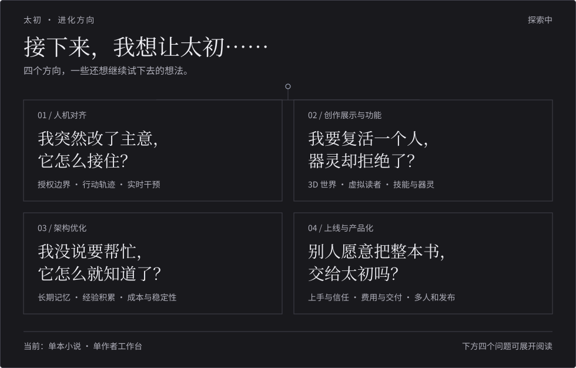

<div align="center">
  <h1 align="center">
    <picture>
      <source media="(prefers-color-scheme: dark)" srcset="./assets/taichu-readme-mark-dark.png" />
      
    </picture>
    &nbsp;太初 Taichu
  </h1>
  <p><strong>面向长篇小说创作的可观测、可恢复、可干预 Agent 工作台</strong></p>
  <p>An observable, recoverable, and human-interruptible Agent workspace for long-form fiction.</p>

  <p>
    <a href="https://github.com/qingluo201816/taichu">Homepage</a>
    · 中文
    | <a href="./README.en.md">English</a>
  </p>

  <p>
    <a href="./LICENSE"></a>
    
    
    
    
    
    
  </p>
</div>

---

> 人与 Agent 之间真正稀缺的，不是输出 Token，而是可理解、可验证、可干预的信息带宽。

太初把正文创作、事实检索、专业审校和知识沉淀组织为可追踪的长程任务。创作者不需要理解底层 Agent 框架，也能看见计划、节点、证据、记忆、成本与失败原因，并在关键写入前接管执行。

太初不是单纯的 RAG 检索增强应用，也不是追求即时反馈的一键生成玩具。它是一套**状态驱动、证据可信、人机共决**的长程创作运行时。

## 目录

- [产品定位](#产品定位)
- [产品展示](#产品展示)
- [系统设计](#系统设计)
- [工程证据](#工程证据)
- [技术栈与运行](#技术栈与运行)
- [当前边界与进化方向](#当前边界与进化方向)
- [许可证](#许可证)

## 产品定位

<p align="center">
  
</p>

长篇小说创作不是一次 Prompt 能完成的生成任务，而是一个跨数百万字、持续数百轮的长期 Agent 协作过程。

真正困难的不是某一章能不能写出来，而是在章节、人物、设定、伏笔和创作任务不断累积后，模型仍要在有限上下文下持续解决四类问题：

1. **任务如何持续推进**：一次跨章节创作可能同时涉及剧情规划、人物状态更新、伏笔回收和正文生成，系统需要把任务正确拆解、连续执行，并根据中间结果动态调整。

2. **小说事实如何保持一致**：人物关系、境界、时间线和世界观设定分散在大量正文、知识卡和历史对话中；检索可能出错，上下文也可能残留作者已经修改的旧规划、旧设定。系统必须区分当前有效事实、失效信息、检索结果和模型推断，避免错误上下文持续污染后续推理与创作。

3. **人机协作如何持续进行**：Agent 不能只会一路自动执行，还要知道什么时候信息不足、存在冲突或涉及关键创作决策，并主动停下来向作者确认；作者介入、任务中断或执行失败后，又要能够保存当前计划和执行状态，从原位置继续，而不是重新跑完整条创作链路。

4. **哪些内容允许真正写进小说**：剧情分析和修改建议可以自动生成，但章节正文、人物设定、世界观等正式内容的修改，必须经过权限控制和作者确认。

所以这个项目真正解决的，不只是“怎么让大模型写小说”，而是**怎么让一个概率性、上下文受限的模型，在长期小说创作中持续理解已有剧情、保持事实一致、知道何时与作者协作，并可靠、受控地推进创作任务。**

太初围绕这四类长期协作问题建立产品能力：

<table align="center" width="72%">
  <thead>
    <tr>
      <th width="30%">核心能力</th>
      <th>作者看到的结果</th>
    </tr>
  </thead>
  <tbody>
    <tr>
      <td>可观测（Observable）</td>
      <td>计划、动态 DAG、节点状态、Trace、Checkpoint、证据和成本均可查看</td>
    </tr>
    <tr>
      <td>可恢复（Recoverable）</td>
      <td>长任务可从检查点继续，失败节点可定位、重试和重规划</td>
    </tr>
    <tr>
      <td>可干预（Human-interruptible）</td>
      <td>候选内容先进入审核流程，关键持久化写入由作者授权</td>
    </tr>
    <tr>
      <td>可验证（Verifiable）</td>
      <td>检索证据、作者约束和输出作用域绑定，评测结果可复验</td>
    </tr>
    <tr>
      <td>可治理（Governable）</td>
      <td>正文、候选知识、确认知识和派生索引具有明确边界</td>
    </tr>
  </tbody>
</table>

## 产品展示

### 1. 带证据的长篇创作空间


支持按选区、章节、章节范围或全文执行问答、续写、润色、总结与审校。AI 输出与正文作用域、检索证据和作者约束绑定，生成内容先作为候选进入创作流程，不直接覆盖事实源。

当前编辑器已经提供聊天、续写、润色、设定、建议、证据、章节总结、灵感和事实等 AI 入口。

<details>
<summary><strong>为什么要这样设计？</strong></summary>

写作区允许作者随时创作、提问和核验，但模型不替作者完成最终写入，也不替作者承担意图判断。太初希望扩大思考能力，而不是用流畅输出掩盖思考的缺席。

一句忠告：**不要把判断力外包给模型。**

</details>

### 2. 可观测的长程 Agent 执行


<table>
  <tr>
    <td width="50%" valign="top"></td>
    <td width="50%" valign="top"></td>
  </tr>
  <tr>
    <td align="center">知识沉淀工作流</td>
    <td align="center">运行、节点与恢复监控</td>
  </tr>
</table>

高层 Orchestrator 将复杂请求规划为动态 DAG，按依赖调度确定性 Tool 与专业 Sub-agent，并通过 Verification / Replan 收敛结果。计划修订、节点状态、Trace、Checkpoint、失败与恢复全过程均可查看；持久化写入前由作者授权。

<details>
<summary><strong>它适合处理什么？</strong></summary>

你可以把脑中的混乱思路交给太初，让它拆解问题、多方取证并整理矛盾；也可以批量检查设定、战力体系和跨章节冲突，或从近期正文中生成待确认的知识卡候选。

大模型生成内容可能有误。请确认后再写入知识库。

</details>

### 3. 可确认、可重建的知识系统

<table>
  <tr>
    <td width="50%"></td>
    <td width="50%"></td>
  </tr>
  <tr>
    <td align="center">知识卡生命周期与确认</td>
    <td align="center">RAG 同步、索引和检索监控</td>
  </tr>
</table>

系统从正文中抽取人物、势力、地点、功法等结构化候选，经由草稿、确认、废弃生命周期进入知识库。Markdown 正文与作者确认的知识卡是事实源；Milvus 中的 Passage、Entity 和 Relation 是可删除、可增量同步、可重建的派生索引。

<details>
<summary><strong>为什么检索系统必须分层？</strong></summary>

检索效果差，常常不是缺少更大的模型，而是正文、候选知识、确认知识和派生索引的边界不清。当模型生成内容能够绕过确认流程成为事实，错误就会进入后续检索并不断放大。

在太初中：正文由作者编辑，知识卡由作者确认，向量与图索引随时可以重建。

</details>

## 系统设计

### 运行与恢复

Agent 按需生成计划，调度工具与子 Agent，在执行中校验结果并调整路径。  
检查点保存运行状态，支持失败重试与人工介入，让中断的任务在同一会话中继续。


### 记忆管理

模型输入按稳定记忆、长期记忆、历史对话、工作记忆与当前请求五层组装。  
每轮调用按需召回、压缩与投影，保留当前请求原文，让模型获得当前阶段所需的信息。


### 数据治理

Markdown 保存正文原文，MongoDB 保存已确认知识，检索索引从这两类事实源派生。  
AI 候选经过结构、来源、冲突与生命周期校验，再由作者确认、应用层写入，保留完整审核记录。


### 代码结构

系统按接口、应用、领域与基础设施划分职责，基于 LangChain / LangGraph 组织智能体执行。  
工具与子 Agent 通过能力协议接入，模型与存储通过适配层连接，支持独立扩展与替换。


## 工程证据

太初把“能跑”与“可信”分开验证。以下数据来自当前仓库的固定评测集、恢复基准和真实产品评测页面；它们是可复验的工程证据。

### 当前验证矩阵

| 验证对象 | 规模 | 当前结果 | 证明范围 |
| --- | ---: | --- | --- |
| 通用写作能力集 | 37 类固定场景 | 固定样例持续回归 | 写作请求的能力覆盖与契约稳定性 |
| 多步骤 Agent 合同集 | 18 个合同 / 9 类任务 | 18 / 18 | 能力选择、预算、行为、产物、终态、安全和证据链 |
| 中断恢复合同集 | 8 个合同 / 4 类任务 | 8 / 8 | Checkpoint、恢复、幂等与授权边界 |
| 恢复压力矩阵 | 36 个组合 | Completion Rate 100%；Recovery Rate 100%；Duplicate Successful Side Effects 0 | 1/3/6/12/20/40 节点、并发 1/3/8、正常与中断两种模式 |
| RAG 语义评测 | 30 个固定样例 | Context Relevance 0.8530；Faithfulness 0.9933；Answer Relevance 0.9526 | 检索与回答质量趋势、失败尾项定位 |

恢复压力矩阵中，最大 Checkpoint 约为 7.63 MiB。当前默认运行边界保持为 12 个节点、并发 3、运行时限 900 秒，并坚持每次作者授权最多一个持久化写节点。

### Opik 评测与追踪

<table>
  <tr>
    <td width="50%" valign="top"></td>
    <td width="50%" valign="top"></td>
  </tr>
  <tr>
    <td align="center">中断恢复评分对比</td>
    <td align="center">多步骤 Agent 评测洞察</td>
  </tr>
</table>

太初将 Dataset、Experiment 与 Trace 关联到本地评测页面，并校验评测套件哈希、版本、样例和完成状态。截图中的合成运行时用于证明编排、能力调用、恢复与证据契约，不代表未来全部任务100%通过，也不等价于文学质量评判。

- [Opik：Agent Evaluation 官方文档](https://www.comet.com/docs/opik/evaluation/evaluate_agents)
- [Opik：Dashboard 官方文档](https://www.comet.com/docs/opik/v1/production/dashboards)
- [DeepEval：Evaluation 官方文档](https://deepeval.com/docs/evaluation-introduction)

## 技术栈与运行

| 层级 | 技术 |
| --- | --- |
| Agent Runtime | LangChain、LangGraph、官方 Checkpoint / Store / Human-in-the-loop |
| 后端 | Python 3.12+、FastAPI、Pydantic |
| 前端 | Next.js、React、TypeScript、Tailwind CSS、shadcn/ui |
| 结构事实 | MongoDB |
| 派生检索 | Milvus、向量 + 关键词 + 图检索 |
| 向量模型 | Qwen3-Embedding-4B-Q4_K_M（本地 llama.cpp、2560 维、OpenAI-compatible HTTP） |
| 重排模型 | BAAI/bge-reranker-v2-m3（本地 Hugging Face TEI、CUDA） |
| 评测与观测 | Opik、DeepEval、本地 Trace 与审计数据 |
| 容器与编排 | Docker、Docker Compose（Milvus Standalone、etcd、MinIO、BGE Reranker） |
| 包管理 | uv、npm |

### 本地启动

```bash
uv sync
cd web
npm install
cd ..
start.bat
```

启动后访问：

- 前端：`http://localhost:3000`
- 后端：`http://127.0.0.1:8000`

太初处于 开发者预览 阶段，正在快速迭代。**未来将出现破坏兼容性的变更。**

## 当前边界与进化方向

### 当前边界

- 当前聚焦**单本玄幻小说**的个人写作场景。
- 当前不提供多小说管理、多租户隔离和自动发布。
- AI 产物默认是候选，不自动成为正文或确认知识。

明确边界不是缩小愿景，而是让每一层承诺都能被验证。

<!-- taichu-evolution:start -->
### 进化地图

下面是接下来想继续探索的方向，不代表已实现能力。点开四个问题，读完整想法。



<details>
<summary><strong>01 · 人机对齐｜我突然改了主意，它怎么接住？</strong></summary>

- 继续探索人工介入（Human-in-the-loop）的边界：什么可以自动执行，什么需要提示，什么必须等待作者授权，以及怎样以最低干扰保留最高控制权。
- 轨迹如何展示出来？怎样让人最直观地感受到智能体（Agent）的行为逻辑，从而做出干预？
- 太初如何流式地、实时地与环境交互？比如用户看到太初突出某个观点，或者自己突然想到一些事情，就去改变太初的目标。太初如何接住这个目标，并且做到最小粒度的对齐？

</details>

<details>
<summary><strong>02 · 创作展示与功能｜我要复活一个人，器灵却拒绝了？</strong></summary>

- 将小说地图演进为可生成、可交互的 3D 世界展示。
- 为太初首页引入与创作理念相呼应的开屏动画。
- 使用多模态模型或世界模型生成角色形象、场景与视觉设定候选。
- 文案素材库功能：章节片段、名场面、台词、伏笔片段。
- **虚拟读者评论区**：探索用真实小说的章节—评论配对数据监督微调小模型，也可通过教师模型生成示范进行知识蒸馏。让不同口味的虚拟读者带着阅读记忆跟随连载，由章节更新等事件触发，主动评论、追更、催更、虚拟打赏，甚至差评、弃书，形成随作品发展而变化的模拟评论区。
- **实验模式**：太初本身就是一个类似能预知小说世界情节的器灵，真正把现实世界与幻想世界的壁垒打通。甚至太初的能力是成长性约束的——你想写死或者复活一个人物，太初器灵会拒绝你的请求。
- 语气和风格应该是用户可以选择的配置，探索模型的风格适应能力。
- 技能（Skill）的加载方式留给用户，后续用最简单的引导帮助用户建立自己想要的技能。本项目本身大量用到这种渐进性披露的能力，但不一定依赖于 `skill.md` 这个文件；把自定义技能的能力留给用户也不错。
- 初期需要频繁的设定变更，中期需要精彩的伏笔规划，后期需要伏笔回收和防战力崩坏。

</details>

<details>
<summary><strong>03 · 架构优化｜我没说要帮忙，它怎么就知道了？</strong></summary>

- 优化长链路的时间、词元（Token）消耗与调用成本。
- 基于真实数据分析、作者反馈和使用经验来迭代提示词（Prompt）规则定义，并探索受评测约束的提示词自进化。
- 探索用户、协作和小说画像的长期记忆，调研 LLM-Wiki、LoCoMo、Memobase 等相关思路。希望系统能综合跨越多个、甚至很久以前的会话信息，提供有预见性的主动帮助，从看似无关的记忆中发现深层联系。比如用户提到最近进展不佳时，主动从多轮对话提取出用户可能遇到的困难并提供帮助。用户没有说让它做什么，它自己就知道做——这是运行框架（Harness）为智能体赋予的另一层智能。
- 持续验证多模型接入稳定性，扩展长链路任务与恢复场景。
- 建立模型与工具健康状态自动检测系统。
- 工具（泛指）决定智能体能做什么事情。太初将持续探索，重新定义或扩展观察空间与动作空间。
- 太初如何像人一样，从与环境交互的成功与失败中持续积累经验，甚至对使用者产生不一样的感情？
- 将架构约束、评测门禁与发布流程纳入自动化持续集成与交付（CI/CD）。

</details>

<details>
<summary><strong>04 · 上线与产品化｜别人愿意把整本书，交给太初吗？</strong></summary>

- 调研多租户、多类型小说切换、自动发布和线上部署方案。这些属于未来产品化方向；当前实现仍坚持单本小说、单作者工作台的清晰边界。
- 多用户共享的权限与租户隔离。

#### 补充想法 · 待讨论

<details>
<summary>第一次打开，作者能顺利用起来吗？</summary>

很多作者已经有稿子，不会从一张白纸开始。需要考虑已有正文、大纲和设定怎么导入，太初如何理解它们，以及怎样让作者尽快完成一次真正有用的协作。模型配置、技能和高级选项，可以在需要时再出现。

</details>

<details>
<summary>写了几十万字，能放心存进来吗？</summary>

自动保存、历史版本、修改对比、误操作恢复和备份，都应该纳入产品设计。整本书还应能连同设定、素材和创作记录导出；即使以后不用太初，作者也能把自己的东西完整带走。

</details>

<details>
<summary>未发表的稿件，到底会被谁看到？</summary>

研究本地使用、自己部署和云端托管的选择。让作者知道哪些内容会发送给模型、哪些会留在记忆或日志里，以及如何查看和删除。不同作品、作者与协作者之间的稿件和记忆，应该有明确的访问边界。

</details>

<details>
<summary>这次任务要花多少钱，能不能设上限？</summary>

探索用户自带模型密钥与平台提供调用两种方式。尽可能在执行前说明大致耗时和费用，允许作者设预算、停止任务，并查看实际消耗。长任务失败或重试时的费用，也需要有能说清楚的处理规则。

</details>

<details>
<summary>编辑或合作者进来之后，谁能改什么？</summary>

在已有权限与租户隔离的方向上，进一步区分阅读、评论、改稿、修改设定和发布。多人同时修改如何处理，最终稿由谁确认；哪些风格偏好与记忆属于作者个人，哪些可以在这本书里共享，也需要想清楚。

</details>

<details>
<summary>作者为什么会继续用，又愿意为什么付费？</summary>

先找愿意持续试用的作者，观察太初是否帮助他们继续推进创作、减少返工，并保留自己的表达。再研究哪些能力值得收费、按什么方式收费，以及如何收集和回应反馈；不能只用生成字数或调用次数判断价值。

</details>

<details>
<summary>更新出问题之后，作者找谁、稿子怎么办？</summary>

考虑问题反馈、任务诊断、服务状态提示，以及升级前备份、数据迁移和失败回退。诊断信息也要让作者知道会提交什么，避免要求他们为排查问题交出整本未发表的小说。

</details>
</details>

<!-- taichu-evolution:end -->

## 许可证

本项目采用 [MIT 许可证](./LICENSE)。

---

<div align="center">
  <strong>太初不替你思考。它让复杂创作更清楚，让每次交给 Agent 的权力都有迹可循。</strong>
</div>
