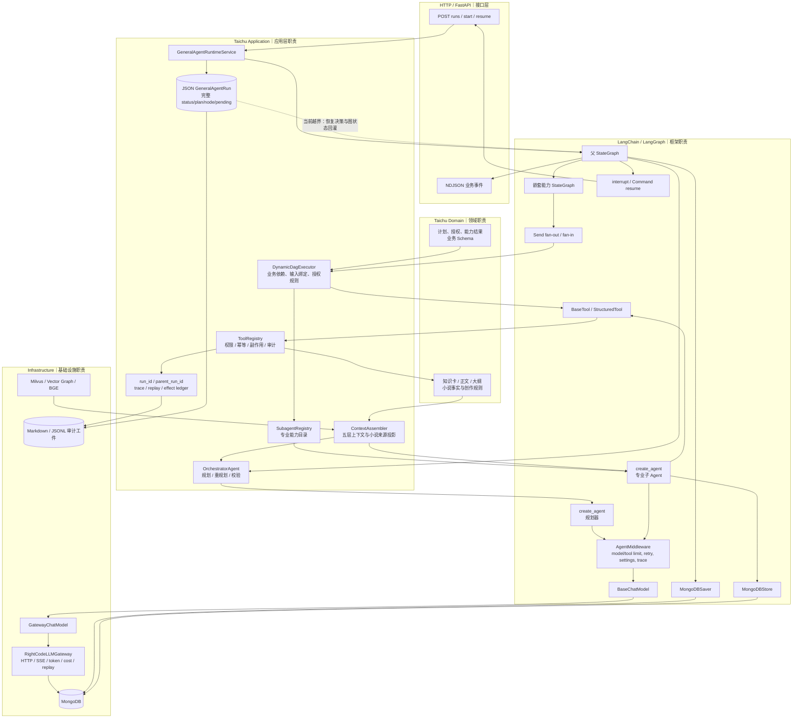

# 太初 Agent / LLM 架构迁移独立审计

> 审计日期：2026-08-30  
> 审计对象：当前工作树，而非仅审计 `HEAD`  
> 基准提交：`5b9dc37db8c585c7011234345e12561640a4ff12`  
> 工作树状态：审计开始时有 351 个变更项；这些变更均视为待验证代码事实，没有把迁移说明或 README 当作完成证据。  
> 方法：直接读取源码与测试、追踪调用链、检查实际安装版本、运行测试与只读复现；未修改业务代码。

## 实施后复验摘要（2026-08-30）

> 本节记录审计后按任务包实施并再次逆向验证的当前状态。下方原始审计正文保留为修复前证据快照，因此其中“70%”及 P0/P1 缺陷描述不能再当作当前实现结论。

**当前迁移完成度：95%。** Agent Runtime 官方化迁移的必须项已闭合，可以结束这一轮框架迁移；下一阶段应转向产品能力、RAG、Eval 与 Context Engineering，而不是继续为了“更像 LangChain”拆除太初业务能力。

| 领域 | 当前评估 | 实施后结论 |
|---|---:|---|
| LangGraph Runtime | 96% | 官方 checkpoint 是执行与恢复唯一事实源；JSON run 只作可重建业务投影。 |
| Agent orchestration | 95% | `StateGraph`、`Send`、`create_agent` 与 middleware 各自承担真实运行职责。 |
| Tool system | 94% | `ToolRuntime` 真实 call identity 已贯通，任务总预算由共享持久仓储原子扣减。 |
| LLM abstraction | 96% | 应用/领域面向 `BaseChatModel` 和公共模型端口，provider transport DTO 限定在 infrastructure。 |
| Structured Output | 95% | 结构化链使用原生 Tool/structured output；应用层手写模型 JSON 协议有 AST 防回归门禁。 |
| Streaming | 96% | Anthropic/OpenAI Responses 的 Tool Call chunk、usage 与背压链已闭合。 |
| Checkpoint | 97% | `conversation_id` 是稳定 thread，独立 DAG 也必须显式注入 saver，不再静默内存降级。 |
| Store / Memory | 94% | `MongoDBStore` 承担运行记忆；小说事实源、派生索引与 Runtime Store 边界保持不变。 |
| Human-in-the-loop | 97% | `StateSnapshot.interrupts`、`interrupt()`、`Command(resume=...)` 是唯一恢复协议。 |
| Middleware | 93% | 模型选择、限制、重试、trace 等横切职责已在官方 middleware 链内；业务权限仍留在太初。 |
| Provider isolation | 96% | 公共 profile 与 transport profile 分离，API 只依赖应用端口；RightCode 只在 infrastructure。 |
| Context boundary | 95% | 当前请求、历史对话、HIL 回答和运行记忆改用显式身份，不再靠文本相等猜测。 |
| Legacy cleanup | 95% | 旧 tool loop、JSON checkpoint/memory、词法索引、生产 mock/adapter 和零调用兼容入口已清理。 |

### 13 条声明实施后状态

| 声明 | 当前状态 | 复验证据 |
|---|---|---|
| 1. `conversation_id` 是长期 `thread_id` | **PASS** | `GeneralAgentRuntimeService._runtime_thread_id`、`DynamicDagExecutor.execute` 与恢复基准均按 conversation 配置 saver；测试反向断言 run ID 下无根 checkpoint。 |
| 2. HIL 统一为 interrupt/resume | **PASS** | resume 先读官方 `StateSnapshot.interrupts` 再发送 `Command(resume=...)`；JSON pending 不再选择恢复协议。 |
| 3. 使用官方 MongoDBSaver/MongoDBStore | **PASS** | composition root 强制 saver、store、Tool 预算仓储成组注入；资源由同一 lifespan 关闭。 |
| 4. 动态 DAG 使用 `Send` | **PASS** | fan-out/fan-in 仍由 LangGraph `Send` 调度；业务依赖判断未被误删。 |
| 5. 高层/子 Agent 使用 create_agent 与 middleware | **PASS** | 编排器及结构化子 Agent 的真实 `.ainvoke()` 链继续使用官方实现。 |
| 6. 模型能力统一到 BaseChatModel 原生协议 | **PASS** | Tool、`tool_choice`、structured output、streaming 均由 LangChain 消息/工具协议传输。 |
| 7. 各业务模型调用链已迁移 | **PASS** | Writing、Summary、Selection、Knowledge、Judge、RAG/Vector Graph 的定向测试与全量回归通过。 |
| 8. provider DTO 退出应用层 | **PASS** | 新架构测试 AST 扫描 application/domain 的 provider import 与 transport DTO；当前为零。 |
| 9. 旧 Runtime/Memory/索引已删除 | **PASS** | 旧文件不存在；`JsonGeneralAgentRunRepository` 仅保留业务审计投影，不再回灌图状态。 |
| 10. DeepAgents 运行时引用为 0 | **PASS** | `src`、`pyproject.toml`、`uv.lock` 由架构门禁持续检查。 |
| 11. Prompt 手写模型协议为 0 | **PASS** | AST 门禁区分业务 JSON 与模型协议，禁止伪 Tool/JSON Agent 协议和模型 JSON 手工解析。 |
| 12. application/domain 不依赖 provider transport | **PASS** | 公共管理端口与公共模型 profile 已分离；供应商传输字段留在 infrastructure。 |
| 13. run/audit/ledger 不承担 Runtime | **PASS** | `run_id`、`parent_run_id`、effect ledger、trace/replay 只承担谱系、幂等、副作用与审计。 |

### 已实施的关键修复

- 删除 JSON run 对 LangGraph 计划、等待态和 resume 的反向控制；官方 snapshot 单向投影业务 run。
- 修复 Anthropic `tool_use/input_json_delta` 与 OpenAI Responses Tool chunk，Writing AI 直接消费规范化 `AIMessageChunk`。
- Tool 执行使用 `ToolRuntime` 注入的真实 `tool_call_id`；Mongo Tool 预算仓储对直接 Tool、子 Agent 与预取统一原子扣减并支持幂等重放。
- HIL 请求、回答与当前轮改为显式 message/turn/request identity；澄清 issue 可解析失效，一次性回答不再升级为永久偏好。
- 事件快照改为 256 项 LRU，run/conversation lock 改为弱引用；RightCode、Mongo、vector 与各服务纳入 `AsyncExitStack` 生命周期。
- 删除生产测试 adapter/mock、零调用 catalog/benchmark/memory 兼容入口与 RightCode 旧错误别名；应用测试改用原生 `BaseChatModel` fake。
- 将恢复故障点放到 `start_dag`/`verify` 节点入口，绑定已提交的 LangGraph super-step，消除 stream 消费侧读取 `StateSnapshot.next` 的时序竞态。

### 实施后验证

- `uv run pytest -q --basetemp ...`：**1062 passed，23 subtests passed**。
- Synthetic Runtime 与冻结门禁：**12 passed**；未修改 synthetic fixture、Suite、Oracle 或 baseline 掩盖问题。
- Mongo 运行/预算集成测试：**3 passed**。
- 恢复压力基准：6 种节点规模 × 3 种并发 × 正常/中断恢复，共 **36 组通过**。
- `uv run ruff check .`、`uv lock --check`、`git diff --check`：**通过**。
- 本轮 12 个核心生产文件与新增架构测试的 scoped MyPy：**通过**。
- 全仓 `uv run mypy`：**仍失败，621 errors in 86 files**。这是真实既有类型债务基线，不属于本轮 Runtime 官方化修复，不能写成通过。
- 固定端口真实服务：`/health`、`/api/llm/models`、General Agent 列表、Vector Graph 状态、LLM usage 与前端 `/home` 均为 **200**。
- 实际依赖：LangChain `1.3.11`、langchain-core `1.4.8`、LangGraph `1.2.6`、langgraph-checkpoint `4.1.1`、MongoDB checkpoint `0.4.0`。

### 当前剩余项的归属

- **不再属于 Agent Runtime 迁移**：部分非 LLM API 对具体基础设施异常/仓储的越层，应作为独立分层治理处理。
- **低优先级协议治理**：尚未接入真实执行消费者的 Agent/Subagent Manifest 字段，应另行决定“接入还是删除”，不应在本轮盲删稳定插件协议。
- **独立质量债务**：全仓 MyPy 基线需要专门任务逐域收敛，不能夹带进框架迁移。

## 1. Executive Summary

**迁移完成度：70%。**

主链确实已经接入 LangChain/LangGraph 官方 `BaseChatModel`、`create_agent`、`AgentMiddleware`、`StateGraph`、`Send`、`interrupt()`、`Command(resume=...)`、`MongoDBSaver` 和 `MongoDBStore`，但迁移不能判定为完成：通用 Agent 仍有一套会参与恢复决策的 JSON 全量运行状态，默认 RightCode Anthropic 流式适配无法还原结构化 Tool Call，Tool Call 身份与任务级预算也没有闭合。

该百分比是按架构职责和缺陷风险加权后的工程判断，不是代码行数、已删除文件数或测试通过率。P0 级双恢复事实源和默认模型流式失败对总分设了上限。

| 领域 | 评分 | 状态 | 核心判断 |
|---|---:|---|---|
| LangGraph Runtime | 62% | PARTIAL | 官方图负责真实调度，但 JSON `GeneralAgentRun` 仍能回灌图状态并参与恢复。 |
| Agent orchestration | 84% | PASS | 外层业务图、规划器、子 Agent 都真实调用官方能力；依赖判断属于太初业务 DAG。 |
| Tool system | 63% | PARTIAL | 模型侧是 `StructuredTool`，内层仍有自定义协议；真实 Tool Call ID 未进入审计上下文。 |
| LLM abstraction | 82% | PARTIAL | 生产模型调用均面向 `BaseChatModel`，但动态模型设置隐含依赖 `GatewayChatModel`。 |
| Structured Output | 83% | PARTIAL | 大多数链已使用官方结构化输出；编排器与 Eval Judge 仍有兼容层。 |
| Streaming | 48% | FAIL | 默认 Anthropic tool-use SSE 未解析；正式写作流接口不能产生其声明的结构化增量。 |
| Checkpoint | 55% | PARTIAL | `MongoDBSaver` 真实接入，但不是唯一恢复事实源。 |
| Store / Memory | 78% | PASS | `MongoDBStore` 真实保存运行记忆与能力结果；记忆生命周期仍有业务缺陷。 |
| Human-in-the-loop | 55% | PARTIAL | 正常路径是官方 interrupt/resume；故障窗下第一次批准会丢失。 |
| Middleware | 76% | PARTIAL | 官方限制、重试、模型设置和 trace 中间件已运行；跨子 Agent 总预算与 trace 语义未闭合。 |
| Provider isolation | 72% | PARTIAL | HTTP/SSE DTO 主要留在 infrastructure；API 与应用模型目录仍暴露供应商细节。 |
| Context boundary | 70% | PARTIAL | 小说 Context 与 Runtime Context 总体可区分；当前轮定位和澄清记忆有实质错误。 |
| Legacy cleanup | 70% | PARTIAL | DeepAgents、旧 tool loop、JSON memory 文件已退出；JSON Runtime checkpoint 与测试兼容桥仍在。 |

### 最重要的四个结论

1. **P0：官方 checkpoint 不是唯一恢复事实源。** `JsonGeneralAgentRunRepository` 持久化完整执行状态，`pending_human_request` 会决定 resume 协议，`_plan_node()` 还会把 JSON 状态回灌 LangGraph。已复现一次授权必须提交两次。
2. **P0：默认模型的结构化流式调用真实失败。** `deepseek-v4-pro` 默认走 Anthropic Messages；当前 SSE 只读文本 delta，不处理 `tool_use` 和 `input_json_delta`，tool-only 响应最终被判空。
3. **P1：LangChain Tool Call 与太初审计 Call 使用不同身份。** `ToolMessage.tool_call_id` 来自模型，而 artifact/trace 使用工具绑定时预生成的固定 `call_id`。
4. **P1：测试绿灯不能证明架构完成。** 全量 `pytest` 为 `1025 passed, 23 subtests passed`，但现有测试遗漏并部分固化上述裂缝；当前全量 `mypy` 实际为 `602 errors in 85 files`，与“已通过”的声明不一致。

## 2. Migration Claims Verification

| 声明 | 状态 | 代码证据 | 风险 |
|---|---|---|---|
| 1. `conversation_id` 直接作为长期 `thread_id`，`run_id` 只作业务审计 | **PASS** | `application/general_agent/service.py:917-934,1840-1843`；`recovery.py:245-289`；`test_runtime.py:1412-1473` | 生产主链成立。`executor.py:138-166` 的测试兼容入口仍以 `run_id` 建线程，应清理但未进入主链。 |
| 2. 人工授权/澄清统一为 `interrupt()` 与 `Command(resume=...)` | **PARTIAL** | 官方路径见 `service.py:929-948,1265-1315`；第二状态源见 `service.py:280-350,1445-1460`、`executor.py:409-444` | JSON 已进入 `WAITING_HUMAN` 而官方图尚未到 interrupt 时，第一次批准只推进到 interrupt，必须再次批准。 |
| 3. Checkpoint / Store 使用 `MongoDBSaver` / `MongoDBStore` | **PARTIAL** | `main.py:313-349,559-573`；父图编译 `service.py:1060-1109`；Store 仓储 `infrastructure/agent_memory/langgraph_repository.py:18-71` | 组件真实使用；但 JSON 全量运行仓储重复 checkpoint。外部只注入 checkpointer 时还会静默配 `InMemoryStore`。 |
| 4. 动态 DAG 使用官方 `Send` | **PASS** | `executor.py:168-196,322-349,478-558` | `Send` 真实负责 fan-out/fan-in；太初保留的依赖、授权、输入绑定判断是业务语义，不是手工调度器。 |
| 5. 高层 Agent 与子 Agent 使用 `create_agent` / `AgentMiddleware` | **PASS** | `orchestrator.py:409-435`；`subagents/runner.py:107-180,186-226` | 调用真实存在。外层 `StateGraph` 是业务编排，不要求强行改成单一 `create_agent`。 |
| 6. 模型能力统一到 `BaseChatModel`、原生 tools/tool_choice/structured output/stream | **PARTIAL** | `GatewayChatModel`：`infrastructure/llm/adapter.py:50-222`；各调用表见第 9 节 | 接口层基本完成；默认 Anthropic 结构化流失败，编排器仍有手工 output Tool/parser/retry 层。 |
| 7. 写作、摘要、选区、知识提取、评测、RAG、向量图等已迁移 | **PARTIAL** | `writing_ai_service.py`、`chapter_summary_service.py`、`selection_ai_service.py`、`knowledge_extraction/workflow.py`、`vector_graph/llm_adapter.py`、`evaluations/llm_judge_adapter.py` | 非流式链大多成立；写作流式链失败，章节摘要会静默降级，Eval Judge 重新降级为 JSON 字符串。 |
| 8. 供应商 DTO 退出应用层，仅留 infrastructure | **PARTIAL** | DTO 位于 `infrastructure/llm/contracts.py`；但 `api/deps.py:13,160`、`api/routes/llm.py:23,28-89` 直连 infrastructure，`application/contracts/llm.py:12-33` 含 `wire_protocol/base_url_key` | 生产应用服务没有直接收发 `LLMRequest/LLMResponse`，但供应商管理和 transport 配置边界仍泄漏。 |
| 9. 旧 tool loop、JSON checkpoint、JSON runtime memory、旧词法索引均已删除 | **FAIL** | 旧 tool loop 与 JSON memory 文件已删除；但 `contracts/general_agent_run.py:1-25`、`json_repository.py:26-84`、`models.py:621-668` 仍是完整 Runtime checkpoint | 复合声明不成立。记忆词法评分保留为业务选择策略，不等于旧持久索引；真正失败点是 JSON Runtime checkpoint 仍有恢复权。 |
| 10. DeepAgents 运行时代码引用为 0 | **PASS** | `src/`、`tests/`、`pyproject.toml`、`uv.lock` 全局搜索无依赖或 import | `AGENTS.md` 中的边界说明不是运行时引用。 |
| 11. Prompt 手写 Tool Schema / JSON Schema / 伪 JSON Agent 协议为 0 | **PASS** | `orchestrator.py:67-90` 明确要求原生 Tool；全仓 Prompt/解析搜索未发现输出协议；`model_json_schema()` 用于原生 schema 或审计哈希 | Prompt 中 JSON 是业务数据/工作记忆，不是 LLM 输出协议。`capability_resolution.py` 仍手工生成原生 function schema，但不在 Prompt 中。 |
| 12. application/domain 不依赖供应商 HTTP DTO 或自定义 LLM transport DTO | **FAIL** | `application/contracts/llm.py:12-33` 定义 transport-aware profile；`domain/models/writing_ai.py:133-134` 保存 `wire_protocol`；API 直连 `RightCodeLLMGateway` | 没有直接 import 请求/响应 DTO 是正面进展，但绝对边界要求未满足。审计字段可留，`base_url_key` 与具体网关分支不可留。 |
| 13. `run_id`、副作用账本、审计/replay 元数据不重新承担 Runtime | **PARTIAL** | `run_id/parent_run_id` 本身正确；越界字段见 `GeneralAgentRun`、`checkpoint_revision`、`pending_human_request` 和 `_plan_node()` 回灌 | 业务谱系与副作用账本应保留；包裹在同一 run JSON 中的计划/节点/等待态目前仍是第二恢复状态机。 |

### 逐项详细证据

#### 声明 1：线程身份

- **结论**：PASS。正常创建、续轮、故障恢复和 HIL resume 都使用稳定 `conversation_id`。
- **代码路径与关键函数**：`GeneralAgentRuntimeService.create_run/_execute_run/_runtime_thread_id`（`service.py:163-228,898-948,1840-1843`），`GeneralAgentRecoveryCoordinator.recover`（`recovery.py:245-289`）。
- **调用关系**：API 创建业务 run → `_execute_run` → `config.configurable.thread_id=_runtime_thread_id(run)` → 父图；resume 仍走同一配置。
- **判断理由**：测试实际列举 conversation thread 的 checkpoints，并断言 `first.run_id` 下不存在根 checkpoint。
- **隐藏兼容层/旧残留**：`DynamicDagExecutor.execute()` 的测试入口仍 `thread_id=run.run_id`；旧 JSON 可从 `task_id/run_id` 补 conversation，但未进入生产主链。

#### 声明 2：人工介入

- **结论**：PARTIAL。正常路径官方化，故障路径仍有第二恢复状态。
- **代码路径与关键函数**：`_human_input_node()`、`resume()`、`_execute_run()`、`_checkpoint()`；`executor._execute_capability`（`service.py:280-350,929-948,1265-1315,1445-1460`；`executor.py:409-444`）。
- **调用关系**：能力节点先把 pending 写入 JSON → 节点返回后图才进入 `human_input` → `interrupt()`；API 却可先看到 JSON waiting 并提交 resume。
- **判断理由**：已复现第一次批准只把图推进到真正 interrupt，第二次批准才完成。
- **隐藏兼容层/旧残留**：没有 `resume_token` 等显式第二协议，但 `pending_human_request`、JSON status 和恢复筛选共同形成隐式状态机。

#### 声明 3：官方 checkpoint/store

- **结论**：PARTIAL。官方组件真实接入，checkpoint 单一事实源未成立；Store 本身成立。
- **代码路径与关键函数**：`create_app()`（`main.py:313-349`）、`GeneralAgentRuntimeService._build_graph()`（`service.py:1060-1109`）、`LangGraphAgentMemoryRepository`。
- **调用关系**：composition root 构造 `MongoDBSaver/MongoDBStore` → 注入父图/create_agent → Mongo；同时 `_checkpoint()` 另写 JSON run。
- **判断理由**：Mongo integration tests 通过且生产图持有真实 saver/store；JSON 仍可恢复/回灌。
- **隐藏兼容层/旧残留**：只注入 checkpointer 时 Store 静默为 `InMemoryStore`；集合初始化有先查后建竞态。

#### 声明 4：动态 DAG 与 `Send`

- **结论**：PASS。
- **代码路径与关键函数**：`DynamicDagExecutor.build_graph/_dispatch_capabilities/_project_results`（`executor.py:168-196,322-349,478-558`）。
- **调用关系**：prepare 计算 ready nodes → 返回 `list[Send]` → LangGraph 并行执行 capability → reducer/fan-in → project 计算下一批。
- **判断理由**：未发现 `asyncio.gather` 或自定义并行调度器承担 fan-out/fan-in；剩余 Python 判断表达业务依赖。
- **隐藏兼容层/旧残留**：独立 `execute()` 有自己的 saver/thread，但不改变主链 `Send` 结论。

#### 声明 5：`create_agent` 与 Middleware

- **结论**：PASS。
- **代码路径与关键函数**：`OrchestratorAgent._complete_json()`（`orchestrator.py:352-505`）、`run_structured_subagent()`（`subagents/runner.py:42-180`）。
- **调用关系**：规划/校验构造 `create_agent` + 三个 middleware；子 Agent 构造 `create_agent` + ToolStrategy + limit/retry/source middleware。
- **判断理由**：这些对象实际 `.ainvoke()`，不是仅 import 或测试替身。
- **隐藏兼容层/旧残留**：编排器仍有 output Tool/parser/repair glue；外层业务 StateGraph 合理保留，不算旧 Agent loop。

#### 声明 6：BaseChatModel 原生能力

- **结论**：PARTIAL。
- **代码路径与关键函数**：`GatewayChatModel._agenerate/_astream/bind_tools`，各 application service 的 `with_structured_output`，Writing 的 `bind_tools().astream()`。
- **调用关系**：application BaseChatModel → GatewayChatModel → infra gateway DTO → RightCode；响应反向转换为 AIMessage/AIMessageChunk。
- **判断理由**：所有生产模型入口类型统一，原生 tools/tool_choice/structured output 已真实传输；默认 streaming tool call 在 adapter 内断裂。
- **隐藏兼容层/旧残留**：动态 model kwargs 暗含 GatewayChatModel 语义；测试注入走双重 adapter；Orchestrator 有手工结构化 glue。

#### 声明 7：各模型调用链迁移

- **结论**：PARTIAL。
- **代码路径与关键函数**：第 9 节完整调用表所列 Writing、Summary、Selection、Knowledge、Vector Graph、Judge、RAG 文件。
- **调用关系**：API/service → BaseChatModel/create_agent → GatewayChatModel → provider；RAG query/rerank 中不需要 ChatModel 的路径保持专用实现。
- **判断理由**：非流式结构化链多数通过；Writing stream FAIL、Summary 静默 fallback、Judge 二次 JSON 边界仍在。
- **隐藏兼容层/旧残留**：query rewrite/独立 intent/classifier 并不存在，不能把 NOT APPLICABLE 误判成“待迁移遗漏”。

#### 声明 8：供应商 DTO 隔离

- **结论**：PARTIAL。
- **代码路径与关键函数**：`infrastructure/llm/contracts.py`、`GatewayChatModel`、`api/routes/llm.py`、`application/contracts/llm.py`。
- **调用关系**：业务模型调用不接触 transport DTO；但 provider 管理 API 直接取得 gateway 并判断具体类，application profile 承载 transport 配置。
- **判断理由**：供应商请求/响应/SSE/cost/replay 留在 infra 是正确的；管理和配置边界未完全隔离。
- **隐藏兼容层/旧残留**：`LangChainLLMAdapter` 把 native BaseChatModel 再转回自定义 DTO，仅服务注入/测试路径。

#### 声明 9：旧基础设施删除

- **结论**：FAIL。
- **代码路径与关键函数**：`GeneralAgentRunRepository`、`JsonGeneralAgentRunRepository.save/get`、`GeneralAgentRuntimeService._checkpoint/_plan_node`。
- **调用关系**：运行节点 → `_checkpoint` → JSON 全量 run；恢复/plan 节点 → JSON get → graph state 回灌。
- **判断理由**：旧 tool loop、JSON memory repository 和独立词法索引文件已删除，不足以抵消仍在运行的 JSON checkpoint。
- **隐藏兼容层/旧残留**：记忆的确定性词法评分仍在 application service，但它是业务召回排序，不是独立持久索引；不应与 JSON checkpoint 混判。

#### 声明 10：DeepAgents 为零

- **结论**：PASS。
- **代码路径与关键函数**：`src/`、`tests/`、依赖声明与锁文件全局搜索。
- **调用关系**：不存在运行调用链。
- **判断理由**：无 import、依赖或动态加载。
- **隐藏兼容层/旧残留**：仅 `AGENTS.md` 保留“不默认使用 DeepAgents”的架构边界说明，合理保留。

#### 声明 11：Prompt 伪协议为零

- **结论**：PASS。
- **代码路径与关键函数**：`orchestrator.py:67-90`、knowledge extraction prompts、vector graph adapter、evaluation prompts；全仓搜索 `json.loads`、`extract_json`、`repair_json` 和 JSON 代码围栏。
- **调用关系**：业务 JSON 作为 developer/human 数据；输出 schema 通过 tools/`with_structured_output` 传输。
- **判断理由**：没有发现要求模型在正文手写 tool/action/thought/arguments JSON，再由 application parse 的生产链。
- **隐藏兼容层/旧残留**：`capability_resolution._native_tool_definition/_planning_schema` 手工生成原生 tools 参数，但不在 Prompt；Orchestrator parser 解析真实 ToolCall，而非正文 JSON。

#### 声明 12：application/domain 无 transport DTO 依赖

- **结论**：FAIL。
- **代码路径与关键函数**：`application/contracts/llm.LLMModelProfile`、`domain/models/writing_ai.py`、`api/routes/llm._provider_gateway`。
- **调用关系**：infra catalog 构造 transport-aware profile → application service/run model/API；API 直接分支具体 gateway。
- **判断理由**：请求/响应 DTO 已退出 application 是正面，但 `base_url_key`、wire protocol 和具体 gateway 仍影响上层契约，绝对声明不成立。
- **隐藏兼容层/旧残留**：审计用途的 provider/upstream/endpoint identity 可以保留；必须与可执行 transport 配置区分。

#### 声明 13：业务元数据不承担 Runtime

- **结论**：PARTIAL。
- **代码路径与关键函数**：`GeneralAgentRun`、`_checkpoint()`、`resume()`、`_plan_node()`、effect/capability result repositories。
- **调用关系**：effect/trace/replay 只关联业务 ID，合理；run JSON 的 pending/status/plan/node state 则参与恢复和图状态重建。
- **判断理由**：标识本身没有越界，围绕标识保存并消费的全量运行对象越界。
- **隐藏兼容层/旧残留**：`checkpoint_revision` 名称和恢复协调器仍把业务 run 当 checkpoint 证据；历史审计兼容需要保留读取但停止执行权。

### 隐藏兼容层与旧实现残留

- `application/general_agent/executor.py:138-166`：公开的独立 `execute()` 默认 `InMemorySaver` 且 `thread_id=run.run_id`；生产未调用，测试在调用。
- `application/general_agent/models.py:670-699`、`infrastructure/general_agent_runs/json_repository.py:222-242`：旧数据可从 `task_id/run_id` 推导 conversation。
- `infrastructure/llm/adapter.py:225-300`：测试注入路径形成 `BaseChatModel → LangChainLLMAdapter → GatewayChatModel → BaseChatModel` 双重桥接。
- `infrastructure/llm/mock.py`：仅测试引用，却位于生产源码。
- `capability_resolution.py:20-24,226-287`：手工 OpenAI function schema 与运行时字段裁剪。

## 3. Current Agent Architecture



### 经源码修正后的主链

```text
HTTP API
  → GeneralAgentRuntimeService
  → 父 StateGraph（conversation_id 作为 thread_id）
      → plan / verify
          → OrchestratorAgent
          → create_agent + AgentMiddleware
      → execute_dag（嵌套 StateGraph）
          → Send 并行能力节点
          → BaseTool.ainvoke 或 SubagentRegistry
              → create_agent + ToolStrategy + AgentMiddleware
      → human_input
          → interrupt()
          → 同一 conversation thread 上 Command(resume=...)
  → GatewayChatModel(BaseChatModel)
  → RightCodeLLMGateway
  → RightCode HTTP/SSE

官方持久化：MongoDBSaver + MongoDBStore
业务持久化：side-effect ledger、trace/replay、context snapshot、产品历史
当前越界：JsonGeneralAgentRunRepository 仍保存并恢复完整图状态
```

### 职责边界判断

- **LangChain/LangGraph 应负责**：Agent loop、消息/ToolCall 配对、图调度、fan-out/fan-in、checkpoint、interrupt/resume、框架运行时 context、模型与工具 middleware。
- **Taichu application 应负责**：小说写作目标解释、动态计划语义、能力选择策略、授权/预算/幂等、上下文选择、业务运行投影、产品历史、审计与回放。
- **Taichu domain 应负责**：与框架无关的正文、章节、知识卡、计划/候选/写作规则与结构事实。
- **Infrastructure 应负责**：RightCode/DeepSeek HTTP 与 SSE、计费、重放、Mongo/Milvus/BGE、文件仓储和应用端口实现。

## 4. Remaining Migration Candidates

### P0-1：删除官方 checkpoint 之外的第二恢复事实源

**现状**

`GeneralAgentRun` JSON 同时保存业务审计与完整执行状态。能力节点会先调用自定义 `_checkpoint()` 把 `WAITING_HUMAN/pending_human_request` 写入 JSON，再返回 LangGraph 节点；若在两者之间崩溃，JSON 和官方 checkpoint 分裂。

**代码位置**

- `application/general_agent/executor.py:409-444`
- `application/general_agent/service.py:280-350,1135-1149,1445-1460,1719-1763`
- `application/general_agent/models.py:621-668`
- `application/contracts/general_agent_run.py:1-25`
- `infrastructure/general_agent_runs/json_repository.py:26-84`
- `tests/unit/application/general_agent/test_recovery_cases_24_25.py:334-541`

**为什么属于重复基础设施**

它不只是 UI/审计投影：resume 读取 JSON pending kind 决定协议，启动恢复按 JSON 状态筛选，plan 节点把 JSON plan 回灌图。它正在承担 checkpoint identity 之外的恢复状态机。

**官方替代能力**

当前版本提供 `MongoDBSaver`、`CompiledStateGraph.aget_state()`/`StateSnapshot.interrupts`、`interrupt()` 和 `Command(resume=...)`。官方 checkpoint 应是恢复状态唯一事实源；JSON 只从已经提交的图快照单向生成业务投影。

**迁移收益**

- 消除双写顺序窗口和重复批准。
- 让故障恢复、HITL 和节点重放共享一个框架语义。
- 明确 `run_id` 只作审计/幂等，不再成为第二 checkpoint 主键。

**迁移风险**

现有 case22/case25 测试和历史 run JSON 固化了旧恢复行为。必须先建立双读观测和故障窗测试，再逐步停止回灌，不能直接删除 run JSON。

**影响范围**

General Agent service、executor、recovery、run repository、事件投影、API resume 和恢复评测。

**是否建议现在做**：**是，必须做。**

**决定性复现**

```text
initial_graph_next=('execute_dag',), interrupts=0, graph_status=executing
initial_json_status=waiting_human, pending_kind=write_authorization
第一次 resume(approve=True) → 仍 waiting_human，图才到 human_input/interrupts=1
第二次 resume(approve=True) → completed
```

### P0-2：补齐 RightCode Anthropic 结构化流式 Tool Call

**现状**

默认模型 `deepseek-v4-pro` 使用 `anthropic_messages` 并声明支持 streaming。Writing AI 流式路径强制 `bind_tools(..., tool_choice=...)`，但 provider SSE 仅解析文本 `content_block_delta.delta.text`，忽略 `content_block_start.tool_use` 和 `input_json_delta.partial_json`；tool-only 响应在 `message_stop` 被判为空。

**代码位置**

- `config.py:24`、`.env.example:6`
- `infrastructure/llm/catalog.py:57-62`
- `application/services/writing_ai_service.py:466-505`
- `infrastructure/llm/rightcode.py:600-652`
- `infrastructure/llm/adapter.py:163-222`
- `tests/unit/infrastructure/llm/test_rightcode_gateway.py:375-391,799-857`
- `tests/integration/api/test_llm_api.py:191-234`

**为什么属于迁移缺口**

应用层已经正确使用官方 `bind_tools`/`AIMessageChunk`，但基础设施没有把供应商流事件还原为 LangChain `tool_call_chunks`，导致官方协议在 adapter 边界被截断。修复位置应留在 infrastructure，不能在 application 再造 SSE 状态机。

**官方替代能力**

LangChain `AIMessageChunk.tool_call_chunks`、消息 chunk 合并和 `JsonOutputToolsParser(diff=True)`。RightCode 特有 SSE 仍须由 provider adapter 解析。

**迁移收益**

默认模型的 Writing AI 流接口真正可用；同一 BaseChatModel 契约覆盖 OpenAI Responses 与 Anthropic Messages。

**迁移风险**

必须正确处理跨 chunk JSON、多个 tool call、usage、取消、错误、重放与无正文 tool-only 响应；不得把 provider event 泄漏到 application。

**影响范围**

RightCode gateway、GatewayChatModel、Writing AI 流接口、API 集成测试和前端增量展示。

**是否建议现在做**：**是，必须做。**

### P1-1：用 `ToolRuntime.tool_call_id` 统一 Tool Call 身份

**现状**

`ToolRegistry.bind_langchain_tool()` 绑定时捕获固定 `InvocationContext.call_id`。模型实际调用后，LangChain 的 `ToolMessage.tool_call_id` 使用模型生成 ID，而 artifact、trace 和结果信封仍使用预绑定 ID。

**代码位置**

- `application/tools/registry.py:88-115`
- `application/subagents/runner.py:92-104`
- `tests/unit/application/tools/test_registry.py:219-236`

**已复现**

```text
ToolMessage.tool_call_id=model_generated_call
artifact.invocation.call_id=bound_call
```

**官方替代能力**

当前安装版本已有 `ToolRuntime.tool_call_id`、`InjectedToolCallId`、`InjectedToolArg` 和 `BaseTool.tool_call_schema`。应在每次真实调用时构造太初 `InvocationContext`，而不是在工具绑定时预生成模型调用身份。

**迁移收益**

ToolMessage、幂等、trace、artifact 和 replay 可一一关联；删除一部分手工运行时字段透传。

**迁移风险**

太初业务 call ID 与模型 call ID 的历史含义需要迁移策略；若仍需独立业务 ID，应显式保存双字段和映射，不能混名。

**影响范围**

ToolRegistry、Subagent runner、invocation models/trace、能力结果与测试。

**是否建议现在做**：**是。**

### P1-2：让任务级工具预算真正生效

**现状**

`max_total_tool_calls` 只复制进 `InvocationBudget`，未找到递减或共享消费。子 Agent 的 `ToolCallLimitMiddleware` 只执行 manifest 局部限制，确定性来源预取又走另一条工具调用路径。

**代码位置**

- `application/general_agent/models.py:103`
- `application/general_agent/executor.py:1298`
- `application/invocations/models.py:32`
- `application/subagents/runner.py:107-129,229-342`

**为什么属于重复/缺失 Runtime 能力**

单 Agent 局部计数已由官方 middleware 提供；太初仍需要跨子 Agent、预取和直接 Tool 的任务级共享预算。当前既没有完全交给官方，也没有完成业务层聚合。

**官方替代能力**

保留 `ToolCallLimitMiddleware` 负责局部 loop；用 LangGraph state 或显式业务预算账本承载跨节点总量，并通过 `ToolRuntime`/调用上下文统一消费。

**迁移收益**

预算字段从“声明性安全感”变成可验证约束，避免多个子 Agent 累计越界。

**迁移风险**

并行 `Send` 下必须使用原子/可归并计数；不能用进程内可变全局变量。

**影响范围**

执行器、子 Agent middleware、预取工具、运行状态与评测。

**是否建议现在做**：**是。**

### P1-3：修正当前轮边界与澄清记忆生命周期

**现状**

- `_current_turn_start()` 通过 `message.content == run.user_goal` 倒查当前轮；重复文本会把澄清回答误认为新轮起点。
- 澄清问题写为受保护的 `UNRESOLVED_ISSUE`，回答后不失效；回答又无条件写成无过期的 `USER_INSTRUCTION`。

**代码位置**

- `application/general_agent/context.py:1487-1522`
- `application/services/agent_memory_service.py:615-653`
- `application/general_agent/service.py:1281-1302`
- `application/general_agent/memory_policy.py:22-25,71-100`

**官方替代能力**

消息/运行边界应使用稳定 message ID、turn sequence 或图状态字段；Store 负责持久化，不会替太初决定“问题已解决”这种业务生命周期。

**迁移收益**

防止 HIL 消息丢失、已解决问题反复召回和一次性回答污染长期偏好。

**迁移风险**

现有历史数据没有显式 turn marker，需要兼容投影；不能把完整 LangGraph 内部 Tool 消息写进产品历史。

**影响范围**

ContextAssembler、AgentMemoryService、human node、历史投影和行为评测。

**是否建议现在做**：**是，但这是太初业务语义修复，不是“换框架”。**

### P1-4：恢复可信的类型门禁

**现状**

`uv run mypy` 当前返回 `602 errors in 85 files`；与“mypy passed”的迁移报告冲突。架构核心子集（general_agent/subagents/invocations/infrastructure/llm）为 56 文件零错误，但加入 `application/tools` 后有 31 个错误。

**代码位置**

错误集中于评测、Tool reconciliation、测试 fake 和 API fixture；与本审计最相关的包括：

- `application/tools/resolve_knowledge_identity.py`
- `application/tools/list_knowledge_catalog.py`
- `application/tools/apply_manuscript_patch.py`
- `application/tools/create_confirmed_knowledge.py`
- `application/tools/_structure_reconciliation.py`

**官方替代能力**

无。这是代码质量门禁，不应被误包装为 LangChain 迁移。

**迁移收益**

避免 `Any`/cast 和测试 fake 掩盖 Tool、Store、checkpoint 契约错配。

**迁移风险**

错误范围大，必须按模块分批修复，禁止借机重构无关业务。

**是否建议现在做**：**是；至少所有本任务触及路径必须零错误，最终报告不得再声称全量通过，除非命令实际为零。**

### P2-1：从官方 Tool schema 派生模型可见 schema

**现状**

`capability_resolution.py` 手工构造 OpenAI function dict，并递归删除 `author_grant_id`、`external_access_grant_id`、`idempotency_key` 等运行字段。

**代码位置**

- `application/general_agent/capability_resolution.py:20-24,226-287`
- `tests/unit/application/general_agent/test_orchestrator_planning_schema.py:9-54`

**官方替代能力**

`InjectedToolArg`、`ToolRuntime`、`BaseTool.tool_call_schema`、`convert_to_openai_tool`。

**迁移收益**

减少自维护 schema adapter；模型可见 schema 与真实 BaseTool 契约自动一致。

**迁移风险**

规划器当前只“看”候选能力 schema，不允许执行这些候选。必须保持该安全语义，不能仅把全部 BaseTool 直接交给 agent loop。

**是否建议现在做**：**建议，在 Tool Call ID 统一后做。**

### P2-2：收敛 Eval Judge 的二次 JSON 协议

**现状**

`llm_judge_adapter.py` 已用 `with_structured_output` 得到 Pydantic 对象，却又序列化为 `raw_response: str`，应用层随后 `model_validate_json` 二次解析。

**代码位置**

- `infrastructure/evaluations/llm_judge_adapter.py:62-108`
- `application/contracts/evaluation_judge.py:12-19`
- `application/evaluations/knowledge_extraction/judge.py:215-242`

**官方替代能力**

直接让应用端口返回 typed structured result；原始消息/JSON 作为独立审计快照保存。

**迁移收益**

删除 LLM↔application 的重复 JSON 边界和错误转换。

**迁移风险**

评测工件可能依赖原始字符串与哈希，需保持审计字段兼容。

**是否建议现在做**：**建议。**

### P2-3：隔离供应商管理与动态模型设置

**现状**

API 直接依赖 `RightCodeLLMGateway` 并 `isinstance`；应用模型 profile 包含 `base_url_key` 和 `wire_protocol`。`BaseChatModel` 类型背后还假定模型接受 `model_id/task_type/temperature/max_output_tokens` 等太初特定 kwargs。

**代码位置**

- `api/deps.py:13,160`
- `api/routes/llm.py:23,28-89`
- `application/contracts/llm.py:12-33`
- `application/invocations/config.py:11-45`
- `application/subagents/runner.py:61-75`

**官方替代能力**

应用层定义 provider-neutral 的模型目录/探测/选择服务端口；运行时动态模型可通过 `wrap_model_call`/request override 或明确模型解析器完成。HTTP/wire/base URL 只留 infrastructure。

**迁移收益**

API 不再越层；任意合规 `BaseChatModel` 可注入而无需走双重 adapter。

**迁移风险**

模型身份、成本与 replay 需要保留供应商审计元数据；不能为了纯化接口丢失可追踪性。

**是否建议现在做**：**建议。**

### P2-4：修正 trace 语义和生命周期

**现状**

- 正常 Agent loop 的第 N 次模型调用被当成 `retry_count`。
- 输入哈希遗漏 `tool_calls`、ToolMessage call ID 与 artifact。
- trace 写入失败在 middleware、ToolRegistry、SubagentRegistry 中被静默吞掉。
- 事件 subscriber queue、run/conversation lock 字典缺少明确回收/背压。

**代码位置**

- `application/invocations/middleware.py:93-108,171-210`
- `application/tools/registry.py:373-379`
- `application/subagents/registry.py:211-217`
- `application/general_agent/events.py:12-71`
- `application/general_agent/service.py:157-159,194-197,292-295,906`

**官方替代能力**

Middleware 仍是正确收敛点；`RunnableConfig.metadata`、模型响应 metadata 和真实 Tool Call ID 可组成稳定 trace。业务审计持久化仍由太初负责。

**迁移收益**

让 replay/trace 真正可用于因果审计，不再只是尽力而为日志。

**迁移风险**

若 trace 是强一致审计，写入失败策略会影响主业务可用性；需要先明确 fail-open/fail-closed。

**是否建议现在做**：**建议。**

### P2-5：清理持久资源的混合配置与并发竞态

**现状**

- 仅注入 checkpointer 时，Store 静默退化为 `InMemoryStore`。
- Mongo Store 集合使用“先列出再创建”，多进程启动存在竞态。
- `DynamicDagExecutor` 某些独立入口/副作用仓储可静默回退到内存。

**代码位置**

- `main.py:313-349`
- `application/general_agent/executor.py:103-115,138-166,1496-1515`

**官方替代能力**

官方 Saver/Store 已可直接构造；太初 composition root 应强制成对注入并明确定义生命周期。

**迁移收益**

避免“checkpoint 持久、memory 丢失”的半持久运行配置。

**迁移风险**

测试大量依赖 InMemory 组件，需提供显式 test factory，不能靠生产默认降级。

**是否建议现在做**：**建议。**

### P3-1：只在官方语义等价后评估 Orchestrator `response_format`

**现状**

编排器通过 output Tool + `PydanticToolsParser` + 两次 repair 取得结构化计划。它同时把候选能力 schema 作为 tools 暴露，但候选 tools 不允许执行。

**代码位置**

- `application/general_agent/orchestrator.py:352-505,545-572`

**官方替代能力与限制**

`create_agent(response_format=ToolStrategy(...))` 是官方入口，但当前 LangChain 1.3.11 在结构化工具存在时使用 `tool_choice="any"`。直接替换可能允许模型选择候选能力 Tool，改变安全语义。

**迁移收益**

若能证明等价，可删除 parser/repair glue。

**迁移风险**

计划 schema、候选能力 schema 和可执行工具的角色混淆，可能导致模型实际执行规划候选。

**是否建议现在做**：**只做隔离 spike 和契约测试，不建议直接迁移。**

### P3-2：可选清理与优化

- 章节摘要应记录 `parsing_error`，不要把结构化失败静默伪装成成功 fallback：`chapter_summary_service.py:125-154,321-330`。
- `DynamicDagExecutor.execute()` 若无外部调用，应删除或私有化；不得保留 `run_id` thread 兼容入口。
- `infrastructure/llm/mock.py` 应迁入 `tests/fakes`；应用测试改用 `BaseChatModel` fake 后再删 `LangChainLLMAdapter`。
- `SubagentManifest.accepted_scopes/max_retries/exposures/supports_streaming` 与 Tool `exposures` 要么执行、要么删除，不能只声明。
- `executor.py:1255-1290` 未消费的 runtime scope 负载应类型化或删除。
- `MongoDBStore` semantic search 可做独立可行性评估；当前记忆词法评分是业务排序，不应为“官方化”强制删除。

**为什么值得处理**

这些对象要么会隐藏结构化输出失败，要么只服务测试/兼容，要么声明了没有执行者的运行约束，继续保留会误导维护者对真实架构和安全边界的判断。它们不构成新的通用 Runtime，不能与 P0/P1 混成一轮大改。

**官方替代能力**

章节摘要继续使用现有 `with_structured_output(include_raw=True)` 并检查 `parsing_error`；测试 fake 使用 `BaseChatModel`；manifest 声明优先接入现有 middleware/ToolRuntime，无法执行且无产品用途的再删除。MongoDBStore semantic search 仅在当前部署提供可验证索引时评估。

**迁移收益**

减少死代码、测试专用生产代码、无消费者字段和静默降级，降低下一次架构判断的噪声。

**迁移风险**

历史数据可能包含旧状态/manifest 字段；Store semantic index 还受本地 Mongo 部署能力约束。任何删除前都要再次搜索真实调用与历史序列化。

**影响范围**

章节摘要、executor、Subagent/Tool manifest、LLM 测试注入、Agent Memory 检索与相关测试。

**是否建议现在做**：**仅在 P0/P1 完成后逐项处理；Store semantic search 不作为本批阻塞项。**

## 5. Things That Should NOT Be Migrated

### 必须保留

| 能力 | 原因 | 边界要求 |
|---|---|---|
| `run_id`、`parent_run_id` | 业务运行谱系、评测、审计与回放需要 | 不得用作 LangGraph thread/checkpoint/resume identity。 |
| 副作用账本与 reconciler | 写作/知识写入需要幂等、对账和人工确认 | 不得保存图节点调度状态；必须与官方 checkpoint 关联但不替代它。 |
| 业务 trace/replay/cost | 供应商计费、问题复现、评测证据 | 明确强/弱一致性；Tool Call 身份必须可关联。 |
| Markdown 正文与 MongoDB 知识卡 | 太初数据宪法规定的文本/结构事实源 | LangGraph Store 不能成为小说事实源。 |
| Milvus / Graph RAG / BGE reranker | 小说检索与派生索引是产品核心能力 | 可重建，不反向成为事实源；不强塞进 ChatModel。 |
| Tool 权限、幂等、副作用、调用方、结果预算 | 太初业务安全契约，官方 BaseTool 不提供等价策略 | 可通过 ToolRuntime/middleware 注入运行信息，但策略本身必须留在 application。 |
| 五层 ContextAssembler | 固定业务记忆层次、来源和产品历史边界 | 不把内部 Tool/子 Agent 轨迹混入历史事实源。 |
| RightCode adapter | 供应商 HTTP/SSE/鉴权/计费/replay 是基础设施职责 | 只向上暴露 BaseChatModel/provider-neutral service，不泄漏 wire DTO。 |

### 建议保留

- `SubagentRegistry` 和能力 manifest 的领域/权限元数据；官方多 Agent 组合没有等价替代太初的能力目录、安全暴露和工件契约。
- 动态 DAG 的业务依赖、输入绑定、授权串行、`continue_on_failure` 规则；`Send` 负责调度，太初负责含义。
- 产品历史单独持久化；LangGraph checkpoint 不是面向用户的历史查询数据库。
- 基于 Store 的记忆有效期、替代、来源指纹和检索后投影；官方 Store 只提供存储/搜索，不知道小说业务有效性。
- Context snapshot 审计工件；只要它明确是快照，不参与 resume。
- API 的 NDJSON 业务事件桥；它是后台任务传输投影，不是平行 LangGraph runtime。

### 可以进一步官方化

- Tool 的 call ID、注入参数和模型可见 schema。
- 模型/工具横切 retry、fallback、limit、trace 的 middleware 组合。
- 结构化输出 typed boundary。
- checkpoint/interrupt 恢复唯一事实源。
- Provider adapter 到 `AIMessageChunk.tool_call_chunks` 的规范化。

## 6. Legacy / Dead Code

### 有删除证据的生产兼容层

| 对象 | 证据 | 建议 |
|---|---|---|
| `DynamicDagExecutor.execute()` 独立入口 | `executor.py:138-166`；生产主链只用 `build_graph()`，当前调用者为测试 | 删除/私有化；若保留，强制显式传 conversation thread 与 checkpointer。 |
| `LangChainLLMAdapter` 双重桥 | `main.py:189-230`、`adapter.py:225-300`；注释说明服务测试注入 | 应用测试迁到 native BaseChatModel fake 后删除。 |
| `infrastructure/llm/mock.py` | 全仓引用来自测试 | 移到 `tests/fakes`，不作为生产 infrastructure。 |
| `NodeAttemptStatus/NodeAttempt` | `recovery.py:49-77`，未找到生产调用 | 删除前再做一次引用与历史序列化核对。 |
| `GeneralAgentRunStatus.CLARIFYING` | 定义/路由存在，未找到迁入该状态的代码 | 核对历史 JSON 后删除或补真实状态转换。 |
| `task_id` 会话别名与 conversation fallback | `models.py:670-699`、`json_repository.py:222-242` | 完成一次性历史数据迁移后删除，当前不能直接删。 |

### 可删除/重写的测试固化

- `test_recovery_cases_24_25.py` 只验证 JSON waiting，未验证官方 interrupt 和一次 resume；应以新故障窗契约重写。
- `test_runtime.py` case22 固化 JSON plan 回灌；迁移后应改为验证官方 checkpoint 不重复规划。
- `test_registry.py:219-236` 把模型 Tool Call ID 与预绑定 ID 设置成相同值；应新增不相同与同工具多次调用。
- `test_orchestrator_planning_schema.py` 固化手工 schema 裁剪；迁移后应断言 `BaseTool.tool_call_schema`。
- application/API 测试直接构造 infrastructure `LLMRequest/LLMResponse/LLMToolCall`：`test_capability_resolution.py:29-44`、`test_runtime.py:21-29`、`test_general_agent_api.py:15-23`；应改用 `BaseChatModel` fake。
- `test_llm_api.py:191-234` 把 Writing AI 流式 `deltas == ""` 固化为成功；应改为真实 tool arg delta 或明确的非增量产品契约。

### 依赖结论

- 没有 `deepagents` 运行依赖或 import。
- 没有证据支持删除 `deepeval`、`vector-graph-rag`、`openai` 等传递依赖；它们由当前评测/向量组件带入。
- 没有发现旧 checkpoint/memory/lexical 库仍作为独立依赖。
- 当前可删除项集中在兼容代码与测试，不在 `pyproject.toml` 的核心框架依赖。

## 7. Architecture Boundary Violations

| 边界 | 状态 | 证据 | 判断与整改方向 |
|---|---|---|---|
| API → infrastructure | **VIOLATION** | `api/deps.py:13,160`；`api/routes/llm.py:23,28-89` | API 依赖具体 `RightCodeLLMGateway` 并 `isinstance`。改为 application provider-management service/port。 |
| application → provider DTO | **PARTIAL VIOLATION** | `application/contracts/llm.py:12-33` | 未依赖 `LLMRequest/Response` 是正面；`base_url_key` 是 transport 配置，应移出。`wire_protocol` 只可作为审计快照。 |
| domain → LangChain/provider | **PASS** | domain 未 import LangChain 或 infrastructure DTO | `writing_ai.py` 的 `wire_protocol` 是审计字段但命名暴露 transport；可改成 provider-neutral endpoint identity。 |
| infrastructure → application business policy | **PASS WITH CAUTION** | infra 实现 application port 是正常方向 | RightCode 的 provider fallback/计费/replay 可留；模型路由业务偏好不应由具体 gateway 决定。 |
| Agent runtime → novel source-of-truth | **PASS** | 小说事实仍来自 Markdown/Mongo，Store 保存运行记忆/能力结果 | 未发现 LangGraph Store 反向成为正文或知识卡事实源。 |
| JSON run → Agent runtime | **VIOLATION** | `service.py:280-350,1135-1149,1445-1460` | JSON 业务投影越界成为 checkpoint/恢复状态，应改为官方 graph → projection 单向关系。 |
| Tool abstraction → business policy | **ACCEPTABLE, NEEDS SPLIT** | `tools/registry.py:88-230` | Registry 内鉴权/幂等/副作用应留；call ID、schema 隐藏、ToolMessage 配对应交给官方 ToolRuntime。 |
| Store / Memory → novel facts | **PASS** | `LangGraphAgentMemoryRepository` 与知识仓储独立 | 运行记忆不是知识卡兼容源，当前边界基本清楚。 |

## 8. Recommended Next Migration

### 必须做

1. **以 LangGraph checkpoint/interrupt 为唯一恢复事实源。** 先补授权前后崩溃测试，再停止 JSON 回灌和 pending 驱动 resume，最后把 run JSON降为审计投影。
2. **修复 Anthropic tool-use streaming。** 在 RightCode infrastructure adapter 解析并规范化 tool call chunks；补默认模型端到端流测试。
3. **统一真实 Tool Call ID。** 使用 `ToolRuntime.tool_call_id`/`InjectedToolCallId`，保证 ToolMessage、artifact、trace、幂等与 replay 可关联。
4. **执行任务级工具预算。** 官方 middleware 负责单 Agent 局部限制；LangGraph state/业务账本负责跨节点总量。
5. **修正 HIL 当前轮和记忆生命周期。** 使用稳定 turn/message identity，回答后关闭 unresolved issue，区分一次性回答与长期偏好。
6. **恢复可信门禁。** 不再把当前 602 个 MyPy 错误描述为“已通过”；所有迁移触及路径必须先零错误。

### 建议做

- 用 `ToolRuntime`/injected args/`tool_call_schema` 减少手工 schema adapter。
- 把 provider 管理/probe 包进 application service，移除 API 具体网关依赖。
- 让 Eval Judge 端口直接返回 typed structured result，raw 只作审计。
- 明确 trace 是强审计还是 best-effort observability，并补完整 call-chain 哈希。
- 强制 checkpointer/store 成对注入，移除生产默认的半持久配置。
- 清理测试专用双重 LLM adapter、mock 和 run-id thread 入口。

### 不建议做

- 不建议把 `run_id`、副作用账本、审计/replay、计费迁进 LangGraph checkpoint。
- 不建议用 LangGraph Store 替代 Markdown 正文、MongoDB 知识卡或 Milvus 派生索引。
- 不建议用通用 `SummarizationMiddleware` 直接替代太初五层 ContextAssembler；它不能保证产品历史只含真实用户/助手消息。
- 不建议把 BGE reranker、确定性 query expansion、Graph RAG 当成 ChatModel 能力。
- 不建议机械把 Orchestrator parser 改成 `ToolStrategy`；当前官方版本无法直接保持“候选 schema 可见但不可执行、只允许输出 Tool”的语义。

**最终结论：当前 Agent Runtime 官方化迁移尚不能结束。** 下一批应只处理上述有实证的 Runtime、streaming、Tool identity 和边界问题；完成这些后，应停止以“更像 LangChain”为目标的重构，转向产品能力、RAG、Eval 与 Context Engineering。

## 9. BaseChatModel 调用清单

| 调用场景 | 入口文件 | 模型方式 | BaseChatModel | `bind_tools` | `with_structured_output` | `tool_choice` | 手写 LLM JSON 协议 | Provider DTO 泄漏 | 结论 |
|---|---|---|---|---|---|---|---|---|---|
| General Agent 规划/重规划/校验 | `general_agent/orchestrator.py:352-505` | `create_agent().ainvoke` | 是 | 由 agent factory 绑定 | 否，手工 output Tool | `NamedToolChoiceMiddleware` | 否 | 否 | PARTIAL |
| 专业子 Agent | `subagents/runner.py:42-180` | `create_agent().ainvoke` | 是 | 由 agent factory 绑定 | `ToolStrategy` | 官方策略 | 否 | 否 | PASS |
| Writing AI 非流式 | `writing_ai_service.py:549-577` | `ainvoke` | 是 | 间接 | 是 | function calling | 否 | 否 | PASS |
| Writing AI 流式 | `writing_ai_service.py:415-547` | `bind_tools().astream` | 是 | 是 | 否，最后 Pydantic parser | 命名 Tool | 否 | 否 | FAIL |
| 章节摘要 | `chapter_summary_service.py:72-165` | `ainvoke` | 是 | 间接 | 是 | function calling | 否 | 否 | PARTIAL（静默 fallback） |
| 选区 AI | `selection_ai_service.py:62-147` | `ainvoke` | 是 | 间接 | 是 | function calling | 否 | 否 | PASS |
| 知识提取 | `knowledge_extraction/workflow.py:1712-1821` | `ainvoke` | 是 | 间接 | 是 | function calling | 否 | 否 | PASS |
| Vector Graph 三元组抽取 | `infrastructure/vector_graph/llm_adapter.py:136-204` | `ainvoke` | 是 | 间接 | 是 | function calling | 否 | 仅 infra | PASS |
| RAG 生成答案 | `infrastructure/evaluations/rag/answer_generator.py:24-55` | plain `ainvoke` | 是 | 否 | 否 | 否 | 否 | 仅 infra | PASS |
| Graph RAG 查询 | `infrastructure/vector_graph/hybrid_backend.py:92-153` | 无生成模型 | N/A | N/A | N/A | N/A | 否 | 否 | NOT APPLICABLE |
| BGE rerank | `infrastructure/vector_graph/reranker.py:13-60` | 专用 `/rerank` HTTP | N/A | N/A | N/A | N/A | 否 | infra 内 | NOT APPLICABLE |
| 知识评测 Judge | `infrastructure/evaluations/llm_judge_adapter.py:62-108` | `ainvoke` | 是 | 间接 | 是 | function calling | 二次 JSON 边界 | 仅 infra | PARTIAL |
| DeepEval Judge | `infrastructure/evaluations/rag/deepeval_adapter.py:68-123` | `ainvoke` | 是 | 间接 | 有 schema 时使用 | function calling | 否 | 仅 infra | PASS |
| query rewrite / 独立 classification / intent / tool router | 无独立入口 | 不存在 | N/A | N/A | N/A | N/A | 否 | 否 | NOT APPLICABLE |

## 10. Tool / Middleware / Context / Streaming 专项结论

### Tool

真实链是：

```text
ToolManifest / ToolPlugin
  → ToolRegistry.bind_langchain_tool()
  → StructuredTool.from_function()
  → LangChain ToolNode
  → ToolRegistry.invoke()
  → 鉴权 / 幂等 / 超时 / trace / ToolPlugin.run()
```

因此“LangChain Tool 只是外层套壳”在结构上成立，但结论不是删除整个 ToolRegistry。应迁的是 Tool Call identity、运行参数注入、模型 schema 和通用 retry/limit；应保留的是太初权限、副作用、幂等、调用方和结果预算。

### Middleware

已真实使用：

- 自定义 `NamedToolChoiceMiddleware`
- 自定义 `ModelRequestSettingsMiddleware`
- 自定义 `ModelInvocationTraceMiddleware`
- 官方 `ModelCallLimitMiddleware`
- 官方 `ToolCallLimitMiddleware`
- 官方 `ToolRetryMiddleware`
- 业务 `SubagentSourceContextMiddleware`

不应为了数量把所有逻辑搬进 middleware。模型/工具横切 retry、fallback、limits、trace 适合；小说来源选择、任务级共享预算、DAG 依赖和授权规则不适合被隐藏进单 Agent middleware。

### Context / Memory

- 小说正文、知识卡、Graph RAG、世界观与 query-aware context 是太初产品能力，应保留。
- 产品历史单独保存是合理的，因为官方 checkpoint 包含内部 Tool/Agent 轨迹，不能直接成为用户历史。
- 未发现自定义 scratchpad 或手工 ToolMessage 序列化取代官方 agent loop。
- 不干净的边界是：完整 `GeneralAgentRun` 同时是产品投影和恢复状态；当前轮靠文本相等推断；澄清记忆没有 resolve。

### Streaming

- General Agent 使用 `graph.astream(..., stream_mode="values", version="v2")` 再投影 NDJSON；这是合理的业务状态流，但不是 token 级模型流。
- Writing AI 使用 BaseChatModel streaming，应用层没有看到 RightCode SSE DTO，这是正确边界。
- RightCode adapter 未处理 Anthropic tool-use delta，是实际断链。
- 如果产品需要结构化正文增量，应从官方 tool-call chunk/parser diff 投影；如果只需要任务状态，API/前端/测试必须统一改成“非正文增量”，不能维持空 delta 的伪流式。

## 11. Dependencies, Tests and Reproducibility

### 实际安装版本

```text
Python 3.12.7
langchain 1.3.11
langchain-core 1.4.8
langgraph 1.2.6
langgraph-checkpoint 4.1.1
langgraph-checkpoint-mongodb 0.4.0
langgraph-store-mongodb 0.3.0
pymongo 4.16.0
```

本地 introspection 证实当前 `create_agent` 支持 `middleware`、`response_format`、`context_schema`、`checkpointer`、`store`、`interrupt_before/after`；`ToolRuntime` 暴露 `state/context/config/stream_writer/tool_call_id/store/tools/execution_info`；`BaseTool.tool_call_schema` 存在。判断没有依赖旧版本记忆。

官方能力对照：

- [LangChain Agents](https://docs.langchain.com/oss/python/langchain/agents)
- [LangChain Tools 与 ToolRuntime](https://docs.langchain.com/oss/python/langchain/tools)
- [LangChain Structured Output](https://docs.langchain.com/oss/python/langchain/structured-output)
- [LangChain Middleware](https://docs.langchain.com/oss/python/langchain/middleware/overview)
- [LangChain Runtime Context](https://docs.langchain.com/oss/python/langchain/runtime)
- [LangGraph Interrupts](https://docs.langchain.com/oss/python/langgraph/interrupts)
- [LangGraph Persistence](https://docs.langchain.com/oss/python/langgraph/persistence)
- [LangGraph Streaming](https://docs.langchain.com/oss/python/langgraph/streaming)

### 本次实际验证

| 验证 | 结果 | 判断 |
|---|---|---|
| 定向 Runtime/LLM/Writing/Summary/Selection/Knowledge/Tool/Store 测试 | `96 passed in 7.53s` | 绿，但未覆盖新发现的断裂身份/故障窗。 |
| 全量测试 | `1025 passed, 23 subtests passed in 131.18s` | 与报告数字一致；不能推出架构完成。 |
| Ruff | `All checks passed!` | PASS |
| `uv lock --check` | `Resolved 126 packages` | PASS |
| 全量 MyPy | `602 errors in 85 files` | **FAIL；“Mypy passed”不可复现。** |
| 核心 Runtime/LLM MyPy 子集 | `Success: no issues found in 56 source files` | PASS |
| 核心 + application/tools MyPy 子集 | `31 errors in 5 files` | FAIL |
| 固定后端 `/health` | 200 | PASS |
| 固定后端 `/api/llm/models` | 200 | PASS |
| 固定后端 General Agent runs 列表 | 200 | PASS |
| 固定后端 Vector Graph status | 200 | PASS |
| 固定前端 `/home` | 200 | PASS |

### 测试为何掩盖迁移不彻底

1. case25 验证 JSON waiting，却不验证官方 `StateSnapshot.interrupts` 或一次 resume 完成。
2. case22 把 JSON plan 回灌当成“恢复成功”，反而固化第二 checkpoint。
3. Tool registry 测试让两个 call ID 人为相同。
4. Writing API 测试明确断言 `deltas == ""`，把无增量固化为成功。
5. application/API 测试继续 mock infrastructure LLM DTO，无法证明 provider-neutral BaseChatModel 契约。
6. 大量测试断言 `checkpoint_revision/pending_human_request`，但没有区分“只读投影”与“恢复权威”。

## 12. 审计限制

- 审计针对有 351 个变更项的当前工作树，后续任一并行修改都可能使行号漂移；结论应以路径、函数和调用关系为主。
- 未执行真实付费模型调用；provider streaming 缺陷使用标准 Anthropic SSE 事件在临时目录只读复现，并结合正式默认 profile 和调用链确认。
- HTTP 200 只证明服务可达，不证明真实模型供应商、Mongo 故障恢复和写入副作用端到端正确。
- 未把 README、迁移说明或已删除文件当成完成证据；README 当前关于“运行状态由官方图产生、JSON 不再混存”的表述与 P0 事实冲突，后续实现完成前应视为过时说明。
