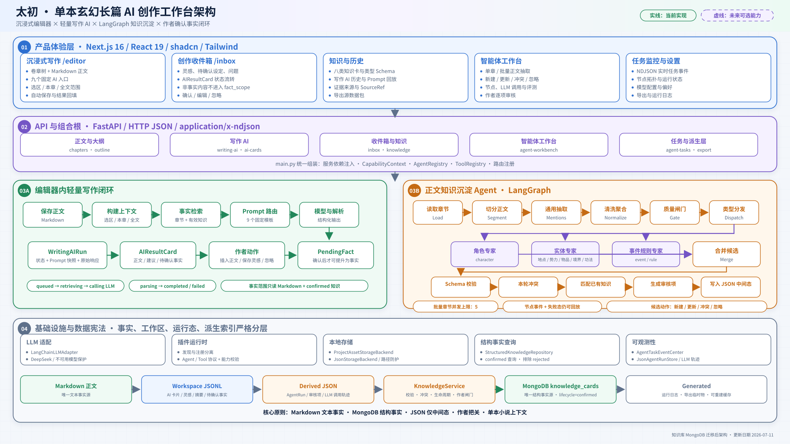
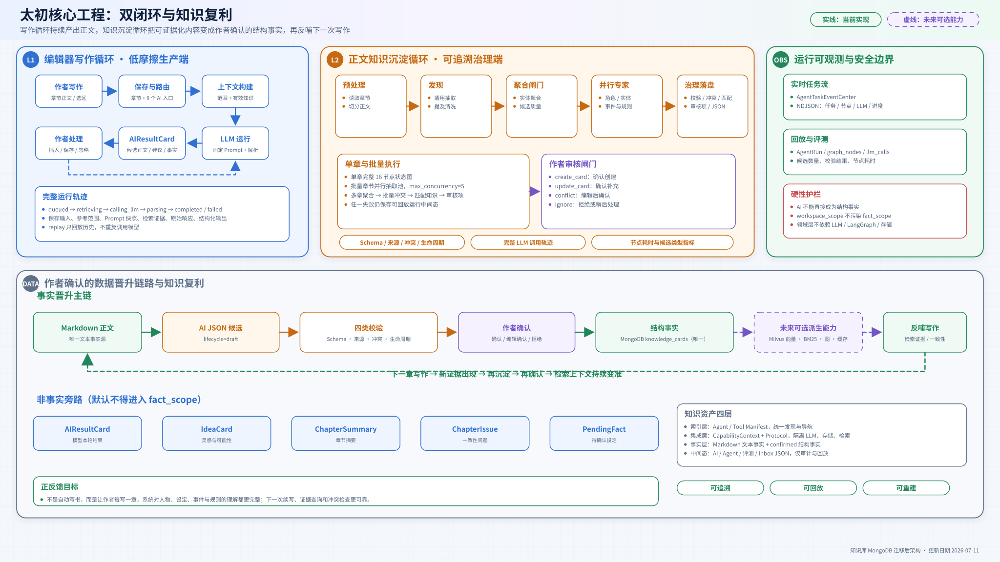

# 太初系统架构图

> 更新日期：2026-07-11
>
> 代码基线：2026-07-11 知识库 MongoDB 一次性迁移后的当前工作树
>
> 状态：架构学习资料，包含当前实现与目标演进，不作为已全部落地的承诺。

## 交付内容

### 1. 系统架构总览

从产品体验层、FastAPI 接口层、两条应用闭环、基础设施层和数据宪法五个层面展示太初当前架构。图中 MongoDB 已是当前事实源，不再作为目标演进或 JSON 兼容层之后的未来节点。

- [高清 PNG](7-10太初系统架构总览.png)
- [可编辑 SVG](7-10太初系统架构总览.svg)
- [Mermaid 语义源文件](7-10太初系统架构总览.mmd)

### 2. 双闭环与知识复利

重点展示编辑器轻量写作循环、正文知识沉淀 Agent、作者审核闸门、事实晋升链路、非事实旁路、confirmed 事实查询和未来可选派生能力。

- [高清 PNG](7-10太初双闭环与知识复利.png)
- [可编辑 SVG](7-10太初双闭环与知识复利.svg)
- [Mermaid 语义源文件](7-10太初双闭环与知识复利.mmd)

## 仓库探索依据

架构图不是按参考图套壳，而是从当前代码反推，主要依据如下：

| 结论 | 代码依据 |
|---|---|
| 前端存在写作、收件箱、知识、AI 历史、智能体工作台和任务监控等独立入口 | `web/src/app/`、`web/src/components/` |
| FastAPI 是统一服务边界，`main.py` 是唯一组合根 | `src/taichu/main.py`、`src/taichu/api/router.py` |
| 写作区九个 AI 入口共用真实模型调用、上下文构建、固定 Prompt 和运行轨迹 | `writing_ai_service.py`、`writing_ai_prompts.py`、`writing_ai.py` |
| 轻量写作闭环会生成 AIResultCard、IdeaCard 和 PendingFact 中间态 | `ai_card_service.py`、`inbox_service.py`、`mvp_inbox_service.py` |
| 正文知识沉淀 Agent 是 LangGraph 插件，存在单章完整图和批量并行图 | `application/agents/knowledge_extraction/`、`knowledge_extraction_service.py` |
| 当前单章图包含预处理、通用抽取、质量闸门、三类专家、校验、冲突、匹配、审核和中间态写入 | `knowledge_extraction/workflow.py` |
| 批量抽取章节并发上限为 5，并在统一后处理中聚合、查冲突、匹配知识和构建审核项 | `knowledge_extraction_service.py` |
| 任务状态通过 NDJSON 持续推送，运行中间态包含节点、LLM 调用、候选和指标 | `agent_tasks.py`、`agent_task_event_service.py`、`agent_run.py` |
| 当前模型统一经 RightCodeLLMGateway 调用；GPT 使用 Responses，Claude 使用 Claude Sale Messages，DeepSeek 使用 Right Code DeepSeek Anthropic Messages | `infrastructure/llm/`、`application/contracts/llm.py`、`api/routes/llm.py` |
| 结构事实通过 `KnowledgeService` 和 `StructuredKnowledgeRepository` 访问，默认上下文只读取 confirmed | `knowledge_service.py`、`knowledge_repository.py`、`mongo_repository.py` |
| MongoDB 初始化、集合校验和索引创建由组合根生命周期管理，失败时不回退 JSON | `main.py`、`mongo_repository.py` |

## 当前实现与目标架构边界

| 能力 | 当前实现 | 目标或预留 | 图中表达 |
|---|---|---|---|
| 文本事实源 | 章节 Markdown | 保持不变 | 绿色实线框 |
| 结构化知识仓库 | MongoDB `taichu.knowledge_cards`，`lifecycle=confirmed` 是有效事实 | 保持单一事实源，不增加 JSON 回退 | 绿色事实节点 |
| Agent 与评测中间态 | `derived/agent_runs/`、`derived/agent_evaluations/` 下的 JSON | 保持候选、运行、审计和回放用途 | 橙色实线框 |
| 工作区非事实 | AI 卡片、灵感、摘要、问题、待确认事实 JSONL | 继续与 fact_scope 隔离 | 蓝色旁路 |
| 事实查询 | 正文 Markdown + MongoDB confirmed 直接查询 | Milvus 向量、BM25 与图能力只能作为可重建派生层 | 绿色事实链与灰色预留节点 |
| 模型 | Right Code 单一产品级供应商、十模型目录、Responses 与 Messages 普通及流式调用 | 不启用会替换系统提示词的 Chat Completions；DeepSeek 通过平台提供的 Anthropic 格式保留角色边界 | 统一 LLM 网关 |
| 模型遥测 | `derived/llm_usage/calls.jsonl` 追加记录调用、Token、费用、耗时和脱敏错误 | 可按模型与任务类型聚合，并由“模型监控”页面查询 | 非事实派生遥测 |
| 运行机制 | 单章、批量并发、后台任务、NDJSON 事件 | 更完善的队列、恢复与重试策略 | 当前仅画已实现能力，不虚构任务队列 |

## 旧知识迁移快照

- 全部 88 张旧知识 JSON 已备份到 `E:\Taichu\迁移备份\知识库-20260711-151915`，并由 `migration-manifest.json` 保存逐文件哈希和处理结果。
- 58 张原有效卡已导入 MongoDB 为 `lifecycle=confirmed`；30 张原已弃用重复卡只保留备份，没有进入正式集合。
- 迁移 `finalize` 对账已通过，`project_assets/source/knowledge/` 已删除；存储骨架和业务代码不会重新创建该目录。

## 架构设计结论

1. 太初的核心不是“一个万能对话 Agent”，而是编辑器内轻量写作闭环与独立知识沉淀 Agent 双闭环。
2. AI 输出默认只是候选或工作区资产；只有通过校验并经作者确认，才能晋升为结构事实。
3. `fact_scope` 只读取正文和已确认知识，灵感、摘要、AI 卡片、问题和待确认事实不能污染事实上下文。
4. Agent、Tool、存储、检索和 LLM 都通过应用层协议和 CapabilityContext 解耦；新增 Agent 应继续采用插件目录 + Manifest + Graph 的方式。
5. SQLite/FTS 已废弃，不参与后续决策；Milvus 向量、BM25、图能力及未来缓存都只能作为可重建派生层。
6. “知识复利”来自作者持续写作、Agent 抽取证据、作者确认和下一轮 confirmed 事实查询反哺，而不是让模型自动写书或自动写入事实库。

## 图例

- 绿色：事实链、作者确认后的可靠输入、当前已实现能力。
- 蓝色：写作体验、工作区资产和非事实旁路。
- 橙色：Agent 运行、中间态、校验和治理节点。
- 紫色：作者审核、专家分支或未来可选能力。
- 灰色：基础设施和可重建派生层。
- 实线框：当前代码已实现。
- 虚线框：尚未启用的未来可选能力。
