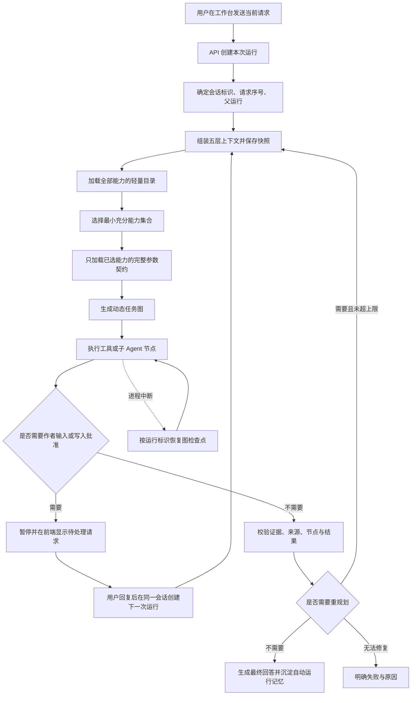
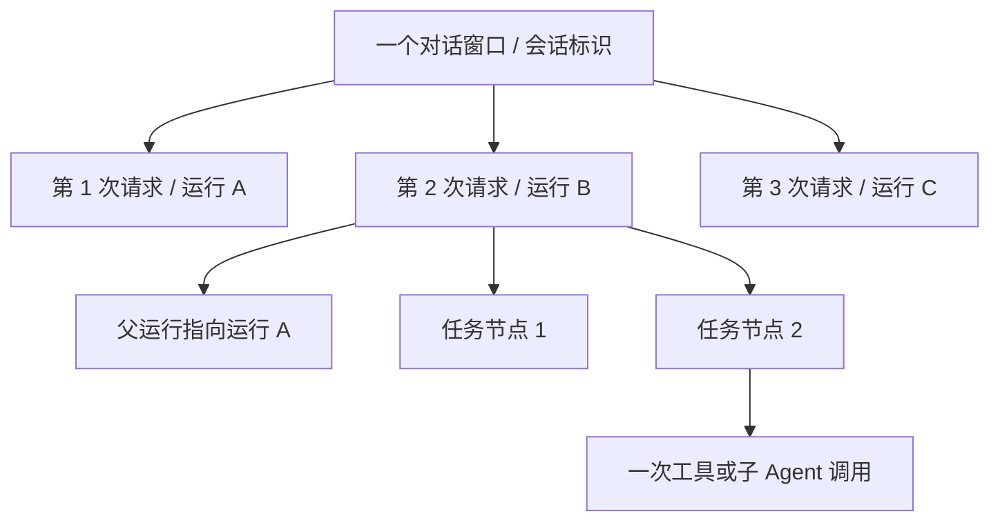
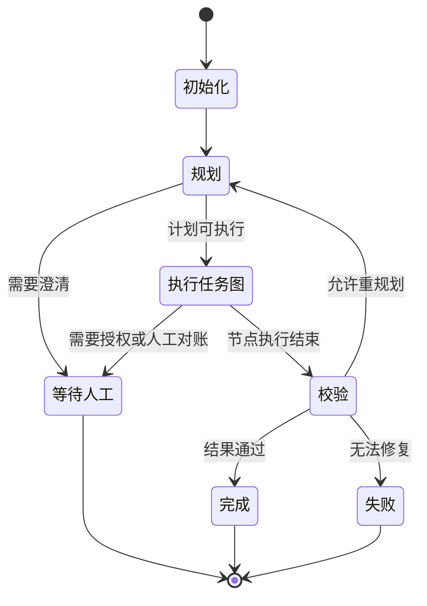
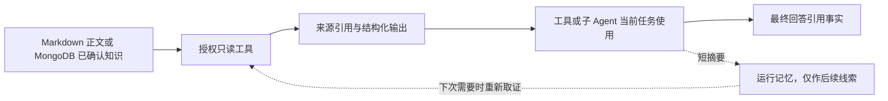
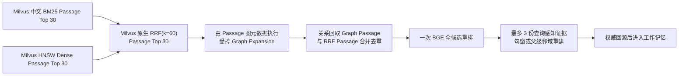

# 通用 Agent 运行链路、上下文与能力调用排查地图

> 更新日期：2026-08-24
> 状态：基于当前代码的排查地图；用于理解、排错与后续改造，不替代已确认产品决策  
> 适用范围：通用写作助手从网页请求进入，到上下文组装、动态规划、工具与子 Agent 调用、写入授权、恢复、校验和最终回答的完整链路  
> 精确事实源：当前源码与自动测试；历史报告只用于解释演进，不得反向覆盖当前代码

## 目录

1. [先看结论：现在的系统到底怎么工作](#1-先看结论现在的系统到底怎么工作)
2. [文档边界与阅读方法](#2-文档边界与阅读方法)
3. [一张图理解完整请求链路](#3-一张图理解完整请求链路)
4. [先分清三套容易混淆的系统](#4-先分清三套容易混淆的系统)
5. [会话、请求、运行与节点的身份关系](#5-会话请求运行与节点的身份关系)
6. [从前端点击发送到后端创建运行](#6-从前端点击发送到后端创建运行)
7. [运行状态机与两层 LangGraph](#7-运行状态机与两层-langgraph)
8. [五层上下文是怎样从第一条请求开始形成的](#8-五层上下文是怎样从第一条请求开始形成的)
9. [运行记忆怎么写、怎么取、怎么自动过期](#9-运行记忆怎么写怎么取怎么自动过期)
10. [上下文预算、压缩与固定裁剪顺序](#10-上下文预算压缩与固定裁剪顺序)
11. [规划器怎样渐进式了解全部能力](#11-规划器怎样渐进式了解全部能力)
12. [动态任务图怎样生成与执行](#12-动态任务图怎样生成与执行)
13. [16 个工具的职责、权限与选择方法](#13-16-个工具的职责权限与选择方法)
14. [12 个子 Agent 的职责、边界与选择方法](#14-12-个子-agent-的职责边界与选择方法)
15. [子 Agent 内部怎样取证、产出和留下证据](#15-子-agent-内部怎样取证产出和留下证据)
16. [写入授权、副作用、幂等与异常对账](#16-写入授权副作用幂等与异常对账)
17. [校验、重规划与最终回答](#17-校验重规划与最终回答)
18. [中断恢复：哪些沿用同一次运行，哪些新建一次请求](#18-中断恢复哪些沿用同一次运行哪些新建一次请求)
19. [事实源、运行态、派生物与索引的边界](#19-事实源运行态派生物与索引的边界)
20. [知识召回与向量能力在通用 Agent 中的位置](#20-知识召回与向量能力在通用-agent-中的位置)
21. [前端工作台、任务监控与后端接口地图](#21-前端工作台任务监控与后端接口地图)
22. [评测与自动测试分别证明了什么](#22-评测与自动测试分别证明了什么)
23. [按现象排查：最短诊断路径](#23-按现象排查最短诊断路径)
24. [常见误解与正确心智模型](#24-常见误解与正确心智模型)
25. [当前已发现的缺口与后续纠偏优先级](#25-当前已发现的缺口与后续纠偏优先级)
26. [改动影响面与关键文件总地图](#26-改动影响面与关键文件总地图)
27. [逐项审计清单](#27-逐项审计清单)
28. [术语对照表](#28-术语对照表)
29. [维护本地图的规则](#29-维护本地图的规则)

---

## 1. 先看结论：现在的系统到底怎么工作

当前通用写作助手不是一条固定的“检索—写作—审查”流水线。它的真实工作方式是：

1. 用户在一个对话窗口内发送第 N 次请求；系统把它归入同一个 `conversation_id`（会话标识），再为这一次请求建立新的 `run_id`（运行标识）。
2. `GeneralAgentRuntimeService`（通用 Agent 运行服务）从第一条请求开始维护这轮会话的消息与自动运行记忆，并在规划前组装五层上下文。
3. `GeneralAgentOrchestrator`（通用 Agent 编排器）先看到所有能力的轻量目录，再只为本次选中的能力加载完整参数契约。
4. 编排器根据当前请求生成最小充分的 `DAG`（有向无环任务图）：简单问题可以只调用一个工具，复杂任务可以组合多个工具、多个子 Agent、并行节点、校验和有限重规划。
5. `GeneralAgentExecutor`（通用 Agent 执行器）执行任务图。工具负责稳定、可验证的动作；子 Agent 负责需要模型判断、归纳或创作的专家任务。
6. 所有子 Agent 产物默认是 `draft`（草稿）派生物，不会直接成为正文或知识事实；所有真实写入都必须经过作者授权和副作用保护。
7. 执行后由编排器校验结果；若证据不足或节点失败，可以在上限内重规划；通过后才形成最终回答。
8. 同一次 `run_id`（运行标识）的系统中断依靠 `LangGraph`（图运行框架）检查点恢复；用户补充澄清或批准写入则会在同一个 `conversation_id`（会话标识）下创建下一次 `run_id`（运行标识）。

最重要的理解是：

> 对话窗口负责“这一轮连续交流属于谁”，一次运行负责“这一次请求怎么执行”，节点负责“任务图中的一步”，记忆负责“给后续请求补足当前工作状态”，事实源负责“小说世界中什么是真的”。这五者不能混为一谈。

当前实现已经具备动态规划、上下文预算、能力渐进式披露、工具与子 Agent 注册、写入授权、检查点恢复和前端监控，但仍有几个需要后续纠偏的明确缺口：

- `effect_reconciliation`（副作用人工对账）已经能被执行器提出，却没有完整的后端恢复分支和前端处理闭环。
- 统一召回的 60 题评测只证明知识召回层，不证明通用 Agent 从理解请求到最终回答的完整链路。
- 通用 Agent 当前固定基准包含 23 个作者场景并覆盖 29 项能力；完整真实合成运行、语义裁判校准与长期运行经验闭环仍需按规格形成可复验证据。
- 阶段 07 原任务包把阶段 05 作为依赖之一，但阶段 05 已被用户明确暂缓；进入阶段 07 前必须修订依赖口径，不能把“暂缓”误写成“已完成”。
- 阶段 06 是“有限通过”：本地确定性恢复矩阵通过，但真实模型、网络超时、混合故障和长时间付费运行尚未完成同等级验证。

---

## 2. 文档边界与阅读方法

### 2.1 这份地图解决什么问题

这份文档用于后续逐层排查和纠正以下问题：

- 为什么同一对话被拆成多次运行，或者不该串联的请求被串在一起；
- 模型某次回答为什么没有带上应该记住的内容；
- 上下文为什么太大、被裁了什么、哪些内容绝不能裁；
- 为什么规划器没有选中某个工具或子 Agent；
- 为什么选对了能力，却没有真正读到正文或知识卡；
- 为什么任务图卡住、重复执行、恢复后重跑或漏跑；
- 为什么模型声称“没有正文”，但正文实际存在；
- 为什么写操作需要批准，批准后是否可能重复写；
- 前端看到的状态对应后端哪一个对象、哪一个存储文件；
- 评测失败究竟是召回层、规划层、执行层、上下文层还是最终回答层的问题。

### 2.2 这份地图不是什么

- 不是新的产品需求文档；已确认产品意图仍以 [`AGENTS.md`（项目强制规则）](../../AGENTS.md) 为准。
- 不是历史实现报告；历史报告只回答“当时做了什么”，当前行为必须回到源码确认。
- 不是阶段 07 的详细设计；它先把当前链路照清楚，方便后续设计语义评测与长期经验闭环。
- 不是小说事实源；本文中的示例和运行信息不构成正文或知识卡事实。

### 2.3 代码定位约定

本文所有关键位置都尽量链接到当前文件。读代码时建议按以下顺序：

1. 先看 [`models.py`（运行领域模型）](../../src/taichu/application/general_agent/models.py)，理解对象和状态；
2. 再看 [`service.py`（运行总控服务）](../../src/taichu/application/general_agent/service.py)，理解一次请求如何流转；
3. 然后分别进入 [`context.py`（上下文组装）](../../src/taichu/application/general_agent/context.py)、[`orchestrator.py`（规划与校验）](../../src/taichu/application/general_agent/orchestrator.py)、[`executor.py`（任务图执行）](../../src/taichu/application/general_agent/executor.py)；
4. 能力问题进入 [`tools/`（工具目录）](../../src/taichu/application/tools/) 和 [`subagents/`（子 Agent 目录）](../../src/taichu/application/subagents/)；
5. 恢复问题进入 [`langgraph_checkpoint.py`（图检查点存储）](../../src/taichu/infrastructure/general_agent_runs/langgraph_checkpoint.py) 和 [`effect_repository.py`（副作用记录存储）](../../src/taichu/infrastructure/general_agent_runs/effect_repository.py)；
6. 页面问题进入 [`general-agent-workbench.tsx`（通用 Agent 工作台）](../../web/src/components/agent-workbench/general-agent-workbench.tsx) 和 [`general-agent-monitor-shell.tsx`（通用 Agent 任务监控）](../../web/src/components/agent-task-monitor/general-agent-monitor-shell.tsx)。

英文项目标识第一次或关键出现时均附中文解释。例如：`request_index`（本会话中的请求序号）。文件名、路径和接口地址保留原始拼写，以便直接定位。

---

## 3. 一张图理解完整请求链路

这张图中有两种“继续”，必须区分：

- **系统恢复**：进程退出、任务失败或超时后，继续同一个 `run_id`（运行标识），依靠图检查点跳过已经成功的节点。
- **用户继续**：作者补充澄清或批准写入后，在同一个 `conversation_id`（会话标识）下创建新的 `run_id`（运行标识），`request_index`（请求序号）加一。

主链路关键实现：

- 创建与恢复总控：[`service.py`（运行总控服务）](../../src/taichu/application/general_agent/service.py)
- 五层上下文：[`context.py`（上下文组装器）](../../src/taichu/application/general_agent/context.py)
- 能力选择与规划：[`orchestrator.py`（规划与校验编排器）](../../src/taichu/application/general_agent/orchestrator.py)
- 任务图执行：[`executor.py`（动态任务图执行器）](../../src/taichu/application/general_agent/executor.py)
- 运行与节点对象：[`models.py`（运行领域模型）](../../src/taichu/application/general_agent/models.py)

---

## 4. 先分清六类容易混淆的数据

通用 Agent 运行中同时出现“消息”“记忆”“上下文”“模型回放”“知识”“检查点”，但它们不是同一种数据。

| 数据 | 它回答的问题 | 数据范围 | 会不会直接作为小说事实 | 主要位置 |
|---|---|---|---|---|
| 会话消息与业务运行投影 | 用户和助手此前说过什么，这次请求产生了什么计划、节点与最终回答 | 单个 `conversation_id`（会话标识）与各次 `run_id`（运行标识） | 不会 | [`general_agent_runs/`（业务运行仓储）](../../src/taichu/infrastructure/general_agent_runs/) |
| 运行记忆 | 这一轮对话正在做什么、用户有哪些约束、前一步得到什么 | 单个 `conversation_id`（会话标识） | 不会；事实引用必须重新取证 | [`agent_memory/`（运行记忆应用层）](../../src/taichu/application/agent_memory/)、[`agent_memory/`（运行记忆基础设施）](../../src/taichu/infrastructure/agent_memory/) |
| 五层上下文快照历史 | 某次规划、重规划或校验时，编排模型实际获得了哪五层受预算输入 | 单个 `run_id`（运行标识）内的多个阶段 | 不会 | [`context_snapshot_repository.py`（上下文快照历史仓储）](../../src/taichu/infrastructure/general_agent_runs/context_snapshot_repository.py) |
| LLM 调用回放 | 主编排或子 Agent 某一次模型调用实际发送了哪些角色消息、收到什么规范化回答 | 单个 `run_id`（运行标识）内的多个 `call_id`（调用标识） | 不会 | [`llm_replays/`（模型调用回放仓储）](../../src/taichu/infrastructure/llm_replays/) |
| 小说知识与正文 | 小说里什么是真的、原文具体写了什么 | 当前唯一小说 | 会；Markdown 正文和 MongoDB 已确认知识卡才是事实源 | [`project_assets/source/`（正式源数据）](../../project_assets/source/)、[`knowledge_retrieval/`（知识召回工具）](../../src/taichu/application/tools/knowledge_retrieval/) |
| LangGraph 图检查点与副作用证据 | 一次任务执行到了哪个节点、怎样安全恢复、写操作是否已发生 | 单个 `run_id`（运行标识） | 不会；只属于运行态与审计态 | [`general_agent_runs/`（运行持久化基础设施）](../../src/taichu/infrastructure/general_agent_runs/) |

### 4.1 运行记忆不是知识库

比如“用户这次要求保留第一人称”“第 8 章已经读取过并生成了摘要”，可以进入运行记忆；但“角色秦浩轩已经突破某境界”不能因为某个模型说过就直接成为小说事实。需要时必须重新通过正文或已确认知识卡取证。

### 4.2 图检查点不是上下文快照

- `checkpoint`（图检查点）保存图执行位置、节点结果和恢复所需状态。
- `context_snapshot_id`（上下文快照标识）指向业务运行当前最新的一份五层上下文；完整的规划、重规划、校验快照历史独立追加保存。
- 业务运行 JSON 保存前端展示和审计投影，其中保留最新上下文快照以支持恢复时判断是否可以复用。

三者会互相引用，但不能相互替代。尤其不能只读取业务运行 JSON 就宣称可以恢复 `LangGraph`（图运行框架）。

### 4.3 子 Agent 产物不是正文

子 Agent 输出会保存为带来源和哈希的派生 `artifact`（任务产物），默认 `lifecycle=draft`（生命周期为草稿）。它可以被后续节点引用，但只有经过专门写入工具、作者授权和校验后，才可能进入 Markdown 正文或 MongoDB 已确认知识。

### 4.4 模型调用回放不是模型记忆

每次 LLM API 调用仍是独立请求。生产统一网关会为带 `run_id`（运行标识）的调用保存脱敏后的角色消息和规范化响应，供评测和回放；它不会让模型在下一次调用中自动拥有记忆。下一次模型实际看到什么，仍由应用层重新组装 `LLMRequest.messages`（模型请求消息）决定。

回放仓储不保存 HTTP 鉴权头、API Key 或供应商原始响应包。通用调用追踪只保存哈希、字符数、Token 和耗时；需要核对实际模型输入输出时，应读取独立回放资产，不能从技术追踪反推出原文。

---

## 5. 会话、请求、运行与节点的身份关系

### 5.1 正确层级

| 标识 | 中文含义 | 何时变化 | 用途 |
|---|---|---|---|
| `conversation_id`（会话标识） | 一个“新对话窗口”对应的一轮连续上下文 | 只有用户点击“新对话”或明确开始新会话时变化 | 消息归组、运行记忆隔离、最近对话列表 |
| `request_index`（请求序号） | 当前会话中的第几次用户请求 | 每次用户提出新请求、补充澄清或批准写入时递增 | 前端显示“第 N 次”、记忆自动过期判断 |
| `run_id`（运行标识） | 执行某一次请求的运行实体 | 每次新请求创建；系统级失败恢复不创建 | 图线程、运行文件、事件、节点、恢复 |
| `parent_run_id`（父运行标识） | 同一会话中前一次运行 | 从第 2 次请求开始通常指向上一次运行 | 追踪连续请求与恢复差异 |
| `task_id`（任务标识） | 当前实现中用于兼容和关联的任务标识 | 新实现中与会话标识保持同一归组语义 | 兼容旧运行和授权范围 |
| `node_id`（节点标识） | 动态任务图中的一步 | 每次规划生成 | 依赖、状态、输入绑定、结果定位 |
| `call_id`（调用标识） | 一次工具、子 Agent 或模型调用 | 每次调用生成 | 调用追踪、模型回放与审计 |
| `trace_id`（追踪标识） | 串联能力调用证据的追踪标识 | 调用时生成或传递 | 调用链排查 |

这些字段定义集中在 [`models.py`（运行领域模型）](../../src/taichu/application/general_agent/models.py) 和能力调用模型中。

### 5.2 同一会话怎样创建下一次请求

`GeneralAgentRuntimeService`（通用 Agent 运行服务）创建新请求时会：

1. 读取该 `conversation_id`（会话标识）最近一次运行；
2. 拒绝在上一运行仍活跃或等待人工时并行创建含义冲突的新请求；
3. 继承已有消息；
4. 把上一运行的最终回答加入消息历史；
5. 追加当前完整用户请求；
6. 把 `request_index`（请求序号）加一；
7. 把 `parent_run_id`（父运行标识）指向上一运行。

关键代码位于 [`service.py`（运行总控服务）](../../src/taichu/application/general_agent/service.py) 中的 `create_run`（创建运行）与 `_messages_for_new_turn`（组装新一次请求消息）。

### 5.3 旧数据怎样兼容

旧运行可能没有显式 `conversation_id`（会话标识）和 `request_index`（请求序号）。当前模型会根据旧 `task_id`（任务标识）、`run_id`（运行标识）和用户消息推导兼容值。这个逻辑只用于读取旧数据，不应成为新请求继续省略会话标识的理由。

排查“同一轮被分成多个对话”时，优先核对：

- 前端是否在继续发送时保留 `selectedConversationId`（已选会话标识）；
- 请求体是否错误地把 `start_new_conversation`（开始新会话）设为真；
- 后端是否收到空 `conversation_id`（会话标识）；
- 最近运行是否处于 `waiting_human`（等待人工）而前端绕过了恢复入口；
- 旧数据兼容推导是否造成意外分组。

---

## 6. 从前端点击发送到后端创建运行

### 6.1 前端工作台

通用写作助手页面由 [`general-agent-workbench.tsx`（通用 Agent 工作台组件）](../../web/src/components/agent-workbench/general-agent-workbench.tsx) 负责主要交互。

发送时的关键规则：

- 已选择最近对话：提交当前 `conversation_id`（会话标识），`start_new_conversation=false`（不新建会话）。
- 点击“新对话”后：清空已选会话，下一次提交 `start_new_conversation=true`（开始新会话）。
- 运行中：页面按约 900 毫秒轮询状态，更新消息、节点和人工请求。
- 最近对话：按会话聚合，而不是把每个 `run_id`（运行标识）当一条对话。

前端请求封装位于 [`general-agent.ts`（通用 Agent 前端接口封装）](../../web/src/lib/api/general-agent.ts)。

### 6.2 后端接口

接口前缀是 `/api/agent-workbench/general-assistant`（通用写作助手接口前缀）。主要入口位于：

- [`general_agent.py`（通用 Agent 后端路由）](../../src/taichu/api/routes/general_agent.py)
- [`general_agent.py`（通用 Agent 接口数据结构）](../../src/taichu/api/schemas/general_agent.py)

创建类接口会把网页请求转换为应用层运行对象；列表与详情接口只负责查询投影，不负责执行图恢复。

### 6.3 创建运行后的第一批状态

新运行默认进入 `init`（初始化）状态，随后由运行图依次进入：

1. 初始化；
2. 规划或澄清；
3. 执行动态任务图；
4. 校验；
5. 完成、失败或等待人工。

默认硬限制定义在 [`models.py`（运行领域模型）](../../src/taichu/application/general_agent/models.py)：

| 限制 | 当前默认值 | 目的 |
|---|---:|---|
| `max_plan_nodes`（最大规划节点数） | 12 | 避免一次规划无限膨胀 |
| `max_replans`（最大重规划次数） | 1 | 避免失败后反复自旋 |
| `max_concurrency`（最大并发数） | 3 | 控制并行节点资源占用 |
| `max_total_tool_calls`（最大工具调用总数） | 40 | 控制能力调用失控 |
| `max_runtime_seconds`（最长运行秒数） | 900 | 控制单次运行时间 |

这些是产品运行上限，不等于阶段 06 压力测试覆盖的最大范围。压力测试可以测试 40 节点和更高并发，但生产默认仍是 12 节点、并发 3。

---

## 7. 运行状态机与两层 LangGraph

### 7.1 外层运行图

外层 `LangGraph`（图运行框架）控制整个请求的生命周期：

运行状态枚举包括：

- `init`（初始化）
- `clarifying`（澄清中）
- `planning`（规划中）
- `executing`（执行中）
- `waiting_human`（等待人工）
- `verifying`（校验中）
- `replanning`（重规划中）
- `completed`（已完成）
- `failed`（失败）
- `cancelled`（已取消）
- `timeout`（已超时）

外层图构建与节点实现位于 [`service.py`（运行总控服务）](../../src/taichu/application/general_agent/service.py)。

### 7.2 内层能力任务图

规划器生成的 `DAG`（有向无环任务图）由执行器再编译成一张内层 `LangGraph`（图运行框架）。内层节点只有两种稳定类别：

- `tool`（工具节点）：执行确定性读取、搜索、预览或真实写入；
- `subagent`（子 Agent 节点）：执行需要模型判断、归纳、创作或审查的任务。

节点状态包括：

- `pending`（待执行）
- `running`（执行中）
- `success`（成功）
- `failed`（失败）
- `skipped`（已跳过）
- `waiting_human`（等待人工）

内层图由 [`executor.py`（动态任务图执行器）](../../src/taichu/application/general_agent/executor.py) 构建。每次规划修订使用 `capability_dag_{plan_revision}`（按规划修订隔离的能力任务图命名空间），避免外层图与不同修订版内层图的检查点互相覆盖。

### 7.3 为什么一定是两层图

如果只用一层图，动态生成的节点容易与总流程状态混在一起；如果只保存业务运行 JSON，又无法让图框架准确知道哪个节点已经提交。两层图分别解决：

- 外层图：这次请求处于规划、执行、校验还是等待人工；
- 内层图：具体能力节点的依赖、并行、结果和恢复位置。

两层图共用同一个 `thread_id=run_id`（图线程标识等于运行标识），但通过命名空间隔离。命名空间适配逻辑位于 [`checkpoint_namespace.py`（检查点命名空间适配器）](../../src/taichu/application/general_agent/checkpoint_namespace.py)。

---

## 8. 五层上下文是怎样从第一条请求开始形成的

### 8.1 五层不是五个独立数据库

`GeneralAgentContextEnvelope`（通用 Agent 上下文封装）是每次规划、重规划或校验前临时组装出来的模型输入。它把不同来源的信息按职责分成五层：

| 层级 | 中文职责 | 主要内容 | 是否长期常驻 | 裁剪优先级 |
|---|---|---|---|---|
| `stable_memory`（稳定记忆） | 作为 System Prompt 告诉模型它是谁、基本行为和能力边界是什么 | Agent 身份、安全准则、事实源规则、Static Capability Index | 稳定前缀 | 不裁 |
| `long_term_memory`（长期记忆） | 按当前请求补回跨任务用户偏好 | Markdown 中相关的身份、表达、写作和协作偏好条目 | 按需召回，可再次召回 | 最先裁 |
| `history_memory`（历史对话） | 延续用户与助手已经发生的真实交流 | 早期摘要、相关历史原文、近期 user/assistant 原文 | 按当前预算投影 | 较早裁 |
| `working_memory`（工作记忆） | 告诉模型当前任务已经做到哪 | 运行记忆、计划、节点结果、工具与子 Agent 结果、候选能力字段、授权和未决问题 | 当前任务内更新 | 较晚裁 |
| `current_request`（当前请求） | 明确这一刻到底要解决什么 | 当前用户原始请求全文 | 每次请求独立 | 绝不裁 |

模型消息固定按 `System Prompt → 长期记忆 → 历史对话 → 工作记忆 → 当前请求` 拼接。稳定规则位于首部，当前目标位于末尾；长期记忆紧跟稳定前缀，内容未变化时可以形成半稳定缓存区，但缓存命中不是正确性前提。

组装器位于 [`context.py`（上下文组装器）](../../src/taichu/application/general_agent/context.py)，上下文对象定义在 [`models.py`（运行领域模型）](../../src/taichu/application/general_agent/models.py)。

### 8.2 从第一条请求就开始，而不是到第二轮才开始

第一条请求创建时已经发生：

1. 当前请求完整进入 `current_request`（当前请求）；
2. 明确的作者硬约束自动写入运行记忆；
3. 固定的系统边界和静态能力索引进入 `stable_memory`（稳定记忆），并通过模型 API 的 `system` 角色发送；
4. 规划前生成第一份 `context_snapshot_id`（上下文快照标识）；
5. 从 `project_assets/source/workspace/long_term_memory.md` 按当前请求召回相关偏好；
6. 节点成功、校验完成或出现未决问题后，工作记忆继续被结构化更新。

因此，正确理解是：**上下文从本会话第一条请求开始建立，后续每次请求不是重新拼一段随意聊天记录，而是在同一会话范围内重新组装一份受预算约束的最新上下文。**

### 8.3 工作记忆不会存整章原文

如果某个节点读取了整章，原文仍来自 Markdown。进入工作记忆的是确定性摘要、来源引用和必要状态，而不是把整章永久复制进去。这样做避免：

- 同一章反复占用上下文；
- 摘要与原文混为事实源；
- 原文更新后，旧复制内容继续污染回答；
- 长会话随着读取章节数量线性膨胀。

需要引用原文事实时，应重新调用 `read_manuscript`（读取正文工具）或其他授权事实工具，而不是把运行记忆当正文缓存。

### 8.4 上下文快照不是会话永久快照

每次规划、重规划、校验可以保存一份冻结快照。快照复用有严格条件：

- 同一运行阶段；
- 同一策略；
- 同一重规划指导；
- 被引用的运行记忆未删除、未变化；
- 快照属于同一个运行和会话。

每次组装完成后，规划、每次重规划和校验快照都会追加保存到 `project_assets/derived/general_agent_context_snapshots/{run_id}/`（按运行保存的上下文快照历史目录）。业务运行 JSON 和 LangGraph 状态只保留当前最新快照，避免把整段历史复制进每个检查点并持续放大存储。

同一阶段可以出现多份快照。例如校验模型调用期间进程中断，恢复后会重新组装并再次调用校验模型；中断前和恢复后的两次真实尝试都应保留，不能因为阶段名称相同就覆盖或去重。

如果被引用记忆已经由 Runtime 替换、过期、软删除或内容哈希变化，系统会重建上下文并记录差异。快照不能跨会话复用，也不能把“上一请求快照”直接当成“整个会话永不变化的上下文”。

---

## 9. 运行记忆怎么写、怎么取、怎么自动过期

### 9.1 运行记忆的六种类型

运行记忆模型定义在 [`models.py`（运行记忆模型）](../../src/taichu/application/agent_memory/models.py)，应用服务位于 [`agent_memory_service.py`（运行记忆服务）](../../src/taichu/application/services/agent_memory_service.py)。

| 类型 | 中文解释 | 典型内容 | 默认用途 |
|---|---|---|---|
| `user_instruction`（用户指令记忆） | 作者明确要求后续持续遵守的约束 | “本轮都用第一人称”“不要修改原文” | 高优先级、通常不按请求数自动过期 |
| `task_summary`（任务摘要记忆） | 当前任务主线和已完成阶段 | “已完成第 6—10 章提取，等待审核” | 保持任务连续性 |
| `resource_summary`（资源摘要记忆） | 已读取文件、章节或产物的短摘要 | “第 8 章已读取，来源为……” | 避免忘记资源接触记录，但不替代原文 |
| `work_note`（工作笔记记忆） | 短期过程结论 | “节点输出了三个候选方向” | 低于任务摘要，较早过期 |
| `unresolved_issue`（未决问题记忆） | 尚未解决的阻塞、澄清或风险 | “章节范围不明确，等待用户确认” | 规划时优先带回 |
| `fact_reference`（事实引用记忆） | 指向需要重新取证的小说事实线索 | “此前提到角色身份，使用前需复核来源” | 只当线索，不当事实 |

注意：`fact_reference`（事实引用记忆）已经有模型与校验支持，但当前自动写入主链并没有把它作为常规写入类型。它目前更像预留能力，不能在排查时假定“所有正文事实都会自动转为事实引用记忆”。

### 9.2 什么时候自动写入

当前代码把写入时点收窄到明确事件，而不是让模型随时随意保存：

| 事件 | 自动写入内容 | 大致有效范围 |
|---|---|---|
| 创建请求并识别到作者硬约束 | `user_instruction`（用户指令记忆），优先级 100 | 默认持续到会话结束或由 Runtime 替换、过期 |
| 用户回答澄清问题 | `user_instruction`（用户指令记忆），优先级 95 | 默认持续有效 |
| 系统提出澄清问题 | `unresolved_issue`（未决问题记忆） | 约 3 次请求后自动失效 |
| 节点成功且有来源或任务产物 | `resource_summary`（资源摘要记忆），优先级 60 | 约 5 次请求 |
| 节点成功但没有资源产物 | `work_note`（工作笔记记忆），优先级 50 | 约 3 次请求 |
| 最终校验完成 | `task_summary`（任务摘要记忆），优先级 75 | 默认持续有效 |
| 校验仍有问题 | `unresolved_issue`（未决问题记忆），优先级 90 | 约 5 次请求 |

这些写入策略主要在 [`memory_policy.py`（运行记忆写入策略）](../../src/taichu/application/general_agent/memory_policy.py) 和 [`service.py`（运行总控服务）](../../src/taichu/application/general_agent/service.py) 中触发。

### 9.3 自动记忆为什么不需要作者确认

运行记忆是 Agent 执行自己的工作状态，不是小说结构事实，因此：

- 不使用 `draft/confirmed/rejected`（草稿/已确认/已拒绝）事实生命周期；
- 不要求作者逐条确认；
- 可以由运行服务在受控事件中自动写入；
- 可以按请求序号自动失效；
- 只能由 Runtime 根据替代、过期、冲突和会话清理策略改变有效性，用户不能新增、修改或逐条删除。

这与“AI 不得直接写入 MongoDB 已确认知识”没有冲突。一个约束运行行为，一个约束小说事实。

### 9.4 记忆怎样自动合并和过期

运行记忆的主要规则：

- 同一会话内内容哈希相同的记忆会合并来源和运行引用，而不是重复堆积；
- 合并时保留更高优先级和更晚有效期；
- 任一合并项没有过期时间，则合并结果视为不按时间自动过期；
- `deleted_at`（删除时间）存在的记忆永远不进入正常上下文；
- 请求序号到期的记忆不会再进入活跃选择，但不必立刻物理删除；
- 绝对时间到期的记忆会由清理逻辑软删除；
- 所有筛选必须带 `conversation_id`（会话标识），防止跨会话污染。

JSON 持久化位于 [`json_repository.py`（运行记忆 JSON 仓储）](../../src/taichu/infrastructure/agent_memory/json_repository.py)，词法索引位于 [`lexical_index.py`（运行记忆词法索引）](../../src/taichu/infrastructure/agent_memory/lexical_index.py)。这个词法索引只用于找相关运行记忆，不参与小说正文和知识卡的 Graph RAG 检索。

### 9.5 当前任务的运行工作记忆怎样选择

运行工作记忆的选择过程综合：

1. 记忆类型固定优先级；
2. 写入时的保留优先级；
3. 与当前请求的词法相关度；
4. 年龄衰减；
5. 内容去重；
6. `top-k`（最多返回条数）和字符预算。

`user_instruction`（用户指令记忆）与 `unresolved_issue`（未决问题记忆）属于受保护类型：只要仍有效，就必须优先进入上下文，不能因为普通相关度低而悄悄丢弃。如果受保护记忆本身已经超过预算，系统应明确报错，而不是无声截断。

这部分仍属于工作记忆，不是长期记忆。长期记忆只从 Markdown 文档按二级标题召回跨任务用户偏好；它会在规划、重规划和校验等上下文重新组装时再次检索，因此不能塞入稳定的 System Prompt。

---

## 10. 上下文预算、压缩与固定裁剪顺序

### 10.1 当前运行配置

实际运行值由配置注入，而不是只看数据类默认值。当前主链关键预算约为：

| 配置含义 | 当前值 |
|---|---:|
| 总上下文字符预算 | 180,000 |
| 长期记忆最多召回条数 | 8 |
| 长期记忆字符预算 | 12,000 |
| 运行工作记忆最多召回条数 | 12 |
| 工作记忆字符预算 | 24,000 |
| 历史对话最多原始消息数 | 10 |
| 历史对话字符预算 | 24,000 |
| 单个节点摘要字符预算 | 32,000 |
| 计划摘要字符预算 | 24,000 |
| 消息压缩触发条数 | 20 |
| 原始节点输出压缩阈值 | 48,000 |
| Token 粗估换算 | 约 4 字符 / Token |

配置入口可从 [`config.py`（项目运行配置）](../../src/taichu/config.py) 和 [`main.py`（应用装配入口）](../../src/taichu/main.py) 核对；裁剪实现位于 [`context.py`（上下文组装器）](../../src/taichu/application/general_agent/context.py)。

### 10.2 压缩不是平均删减

系统采用固定优先级：

具体顺序：

1. 先删除低相关度的 `long_term_memory`（长期记忆）召回条目；
2. 再压缩 `history_memory`（历史对话）的早期内容，之后才从最旧原始消息继续裁；
3. 再按顺序收缩工作笔记、资源摘要、任务摘要、未决问题、用户指令；
4. 然后收缩节点摘要和计划摘要；
5. `stable_memory`（稳定记忆/System Prompt）与 `current_request`（当前请求）均不截断；如果其他层全部裁完仍无法容纳，明确失败。

### 10.3 什么情况下生成结构化摘要

满足任一条件就可能生成 `ContextDigest`（上下文摘要）：

- 历史消息超过 20 条；
- 单个节点原始输出超过 48,000 字符；
- 为满足总预算已经开始省略内容。

摘要必须保留：当前目标、作者约束、任务摘要、成功节点、事实来源引用、未决问题、下一步条件和来源标识。模型压缩器失败时会生成非空的安全摘要，至少保住当前目标和硬约束，不能返回空字符串。

### 10.4 排查“模型忘了”的正确顺序

不要直接把原因归结为“模型上下文不够”。应依次检查：

1. 该信息是否本来就该进入运行记忆；
2. 写入事件是否真的触发；
3. 记忆是否属于正确会话；
4. 是否已按请求序号或时间过期；
5. 是否已被 Runtime 替代、过期或软删除；
6. 是否在相关选择中因低相关度未入选；
7. 是否在预算裁剪中被省略；
8. 当前请求是否表达了相反约束；
9. 模型是否拿到了上下文却没有遵守。

任务监控应结合 `context_snapshot_id`（上下文快照标识）、选择数量、省略原因、压缩状态与来源引用排查，而不是只看最终回答。

---

## 11. 规划器怎样渐进式了解全部能力

### 11.1 现在不再只看前 16 个能力

当前规划器采用“静态索引 + 相关字段摘要 + 入选 Schema”渐进披露。所有已注册工具和子 Agent 都进入 System Prompt 中的全量 `Static Capability Index（静态能力索引）`，不存在按候选数隐藏能力的限制。

稳定发现层：为全部能力提供轻量摘要。

- 工具：名称、类型、中文职责、是否有副作用、是否外部调用、授权方式；
- 子 Agent：名称、类型、中文名称、职责、明确不负责什么、接受和产出哪些任务产物类型。

工作记忆层：根据当前请求为默认 Top 12 相关能力及核心取证能力提供输入输出字段摘要。规划器在一次模型调用中生成最小充分能力、依赖、精确参数和节点输入绑定。

模型返回后：`ToolSchemaLoader` 只加载入选能力的完整 `JSON Schema` 并做确定性校验。合法计划直接交给 Executor；只有字段未知、必填字段缺失或类型错误时，才携带入选能力完整契约执行一次定向修复，而且不得扩展能力范围。

实现位于 [`orchestrator.py`（规划与校验编排器）](../../src/taichu/application/general_agent/orchestrator.py)。

### 11.2 为什么不全量加载 95,264 字符参数契约

能力名称和职责足够回答“该选谁”，完整参数契约只用于回答“具体怎样调用”。如果一开始把全部输入输出结构都塞给模型：

- 大量字段会挤占当前请求和任务状态；
- 模型更容易混淆相似工具参数；
- 新增能力会线性增加每次规划成本；
- 实际没有被选中的能力结构完全浪费。

因此当前设计是：**能力目录全量可见，相关字段按请求展开，完整契约按选择加载。** 这不是少给能力，而是把“发现能力”“形成计划”和“确定性验证”分成职责清楚的步骤。

### 11.3 两阶段都有什么硬保护

- 静态索引、相关字段摘要和已选契约共同受 40,000 字符能力提示预算保护；
- 超预算时明确报错，不允许无声丢能力；
- 定向 Schema 修复只能修复 `input_data`（节点静态输入）与 `input_bindings`（上游输出绑定），不能扩展能力范围；
- 未注册的工具或子 Agent 会校验失败；
- 外部能力没有用户授权会校验失败；
- 计划语义错误可修复重试一次；
- 模型返回的 JSON 结构损坏可结构修复一次。

### 11.4 明确章节请求的特殊门禁

当用户明确问“第 8 章讲了什么”这类问题时，规划必须选择 `read_manuscript`（读取正文工具）直接读取对应章节。只选 `search_manuscript`（搜索正文工具）、`retrieve_knowledge`（召回知识工具）或 `canon_evidence`（小说事实证据子 Agent）不能算充分路径。

原因很简单：用户已经给出确定章节，不需要先搜索位置；章节摘要必须以正文原文为主要来源。规划门禁和最终来源校验都对这个场景做了保护。

---

## 12. 动态任务图怎样生成与执行

### 12.1 一次规划，同时选择能力并填写当前可确定参数

规划器依据全量静态索引和相关字段摘要，一次生成可执行计划；随后 Schema Loader 确定性验证入选能力参数。一个节点至少包括：

- `node_id`（节点标识）
- `kind`（节点类别）
- `capability_name`（能力名称）
- 依赖节点列表
- `input_data`（静态输入）
- `input_bindings`（上游输出绑定）
- 是否允许失败后继续

计划与节点结构位于 [`models.py`（运行领域模型）](../../src/taichu/application/general_agent/models.py)。

### 12.2 输入绑定怎样传递上游结果

`input_bindings`（上游输出绑定）会从上游节点的 `output`（输出对象）按点路径读取值，再写入当前节点指定参数路径。这里有一个常见错误：来源路径根节点已经是上游 `output`（输出对象），不应再多写一层 `result`（结果）。

执行器还会：

- 为子 Agent 自动注入上游 `artifact_refs`（任务产物引用）；
- 为工具生成稳定 `idempotency_key`（幂等键）；
- 把当前选中的运行记忆和摘要放入调用范围，并明确标注“运行记忆不是小说事实”；
- 记录输入哈希、输出哈希、来源引用、任务产物引用和调用追踪。

实现位于 [`executor.py`（动态任务图执行器）](../../src/taichu/application/general_agent/executor.py)。

### 12.3 依赖、并行和失败传播

- 没有依赖关系的节点可以在 `max_concurrency`（最大并发数）内并行；
- 一个节点只有在依赖满足后才能执行；
- 阻塞性上游失败会使下游跳过；
- 当前节点设置 `continue_on_failure`（依赖失败后仍可继续）时，可以越过直接依赖的失败或跳过状态；
- 成功、失败和跳过状态写入内层图检查点，恢复时不重复执行已经终结的节点。

排查时以实际运行路径 `_blocked_by_dependency`（由依赖判定是否阻塞）为准。代码中即使存在某个辅助函数，也不能仅因函数存在就认定主链一定调用了它。

### 12.4 一条简单问题不应被强迫走长链

示例：

- “第 8 章讲了什么”：`read_manuscript`（读取正文工具）→ `narrative_summary`（叙事摘要子 Agent）→ 校验。
- “第 8 章标题是什么”：可能只需要 `get_novel_structure`（读取小说结构工具）后直接回答。
- “检查第 8—10 章时间线冲突”：读取结构与正文可以并行或分批，然后调用 `consistency_reviewer`（一致性审查子 Agent）。
- “按方案修改第 8 章”：先取证和修改候选，再预览差异，最后单独经过批准调用真实写入工具。

能力数量多不代表每次都要调用。高层编排器的目标是选择最小充分路径。

---

## 13. 16 个工具的职责、权限与选择方法

### 13.1 工具的共同契约

工具契约定义在 [`contract.py`（工具调用契约）](../../src/taichu/application/tools/contract.py)，注册和调用保护在 [`registry.py`（工具注册表）](../../src/taichu/application/tools/registry.py)。每个工具清单至少声明：

- 输入与输出结构；
- 所需应用能力和暴露范围；
- `side_effect`（副作用等级）；
- `allowed_callers`（允许调用者）；
- 是否调用外部网络；
- 授权策略；
- 幂等策略；
- 超时、输出预算与可重试性。

副作用等级：

| 等级 | 中文含义 | 是否需要作者批准 |
|---|---|---|
| `read_only`（只读） | 读取或检索，不修改事实源 | 通常不需要 |
| `preview`（预览） | 生成差异或方案，但不落盘 | 通常不需要 |
| `write`（写入） | 修改正文、结构或已确认知识 | 需要作者授权 |
| `high_risk_write`（高风险写入） | 归档或其他较高风险变更 | 需要二次确认 |

### 13.2 16 个已注册工具

| 工具 | 中文职责 | 什么时候用 | 不能替代什么 |
|---|---|---|---|
| `get_novel_structure`（读取小说结构） | 读取卷章树、标题、顺序、状态和结构版本 | 查看目录、定位章节、写结构前取版本 | 不读取章节正文 |
| `read_manuscript`（读取正文） | 按章节标识或顺序范围直接读取 Markdown 正文 | 已知章节、摘要、改写前取原文 | 不用于未知位置的全文搜索 |
| `search_manuscript`（搜索正文） | 对 Markdown 正文做确定性词法搜索 | 只知道关键词、不知道章节位置 | 不替代已知章节的直接读取 |
| `retrieve_knowledge`（召回知识） | 按策略统一召回已确认知识卡 | 需要相关角色、地点、规则等事实 | 不读取正文，不直接写知识 |
| `resolve_knowledge_identity`（解析知识身份） | 判断名字唯一、歧义或不存在 | 需要把“秦浩轩”等名称解析为稳定卡标识 | 不返回完整知识卡正文 |
| `list_knowledge_catalog`（列出知识目录） | 分页读取轻量知识目录 | 先浏览有哪些角色、势力、地点 | 不替代精确身份解析和完整卡读取 |
| `read_knowledge_cards`（读取知识卡） | 按稳定标识读取完整已确认知识卡 | 已经知道卡标识，需要精确字段 | 不按模糊语义搜索 |
| `preview_manuscript_patch`（预览正文补丁） | 生成无副作用差异和基线哈希 | 写正文前给作者看具体变化 | 不会真正修改 Markdown |
| `apply_manuscript_patch`（应用正文补丁） | 经授权后真正修改 Markdown 正文 | 作者批准精确补丁后 | 不负责生成创作候选 |
| `create_novel_structure_items`（创建小说结构项） | 创建卷或章节并校验结构版本 | 新增章节或卷 | 不写章节正文 |
| `update_novel_structure`（更新小说结构） | 重命名、移动或修改结构状态 | 调整卷章结构 | 不修改正文内容 |
| `delete_novel_structure_items`（归档小说结构项） | 高风险归档结构项 | 作者二次确认后归档 | 不是物理删除 Markdown 文件 |
| `create_confirmed_knowledge`（创建已确认知识） | 校验后向 MongoDB 创建已确认知识卡 | 作者批准候选知识后 | 不接受未经验证的模型自由文本 |
| `update_confirmed_knowledge`（更新已确认知识） | 按版本校验更新已确认知识卡 | 修正已有结构事实 | 不绕过冲突和版本保护 |
| `search_external_sources`（搜索外部资料） | 经授权搜索公开外部资料 | 用户明确需要外部研究 | 不用于默认检索小说内部事实 |
| `read_external_source`（读取外部资料） | 经授权读取公开网页文本 | 对搜索结果做进一步取证 | 不把外部内容自动变成小说事实 |

每个工具的实现都在 [`tools/`（工具实现目录）](../../src/taichu/application/tools/) 下，以工具名称命名文件或子目录。

### 13.3 谁可以调用什么

调用者集合集中在 [`_shared.py`（工具共享权限与辅助逻辑）](../../src/taichu/application/tools/_shared.py)：

- 内部只读工具允许高层编排器、11 个内部子 Agent 和测试调用；
- 外部研究子 Agent 不在内部只读调用者集合中；
- 外部研究工具只允许高层编排器、`external_research`（外部资料研究子 Agent）和测试调用；
- 写工具只允许高层编排器或测试路径调用，子 Agent 不得直接落盘。

因此，“子 Agent 允许调用哪些工具”不是提示词建议，而是注册层和调用层都会校验的权限边界。

### 13.4 注册和调用时的硬校验

`ToolRegistry`（工具注册表）会拒绝：

- 能力依赖缺失；
- 工具重名；
- 写工具没有副作用对账器；
- 输入输出不符合结构；
- 调用者不在允许集合；
- 外部调用缺少授权；
- 写调用缺少作者授权；
- 输出超过预算；
- 超时；
- 幂等冲突。

所以某个工具“在目录里看得到”不等于“任何节点都能调用”。排查必须同时看能力选择、调用者权限和运行时授权。

---

## 14. 12 个子 Agent 的职责、边界与选择方法

### 14.1 子 Agent 的共同契约

子 Agent 契约位于 [`contract.py`（子 Agent 契约）](../../src/taichu/application/subagents/contract.py)，注册表位于 [`registry.py`（子 Agent 注册表）](../../src/taichu/application/subagents/registry.py)。每个子 Agent 必须声明：

- 英文名称和中文显示名；
- 负责什么、不负责什么；
- 输入输出结构；
- 接受和产出哪些任务产物；
- 模型角色；
- 允许调用哪些工具；
- 超时、工具调用次数、输出字符和模型输出预算。

默认资源限制约为：超时 180 秒、最多 10 次工具调用、输出 50,000 字符、模型输出 8,000 Token、失败重试 1 次；正文初稿和正文修改会使用更高输出预算。

### 14.2 12 个已注册子 Agent

| 子 Agent | 中文职责 | 主要输出 | 明确不负责 |
|---|---|---|---|
| `canon_evidence`（小说事实证据） | 定位事实、证据、冲突和未知项 | `canon_evidence_report`（事实证据报告） | 不创作、不修改正文、不写知识库 |
| `external_research`（外部资料研究） | 经授权搜索与综合公开资料 | `external_research_report`（外部研究报告） | 不默认联网、不把外部资料当小说既定事实 |
| `narrative_summary`（叙事摘要） | 忠实概括章节、场景或事件 | `narrative_summary`（叙事摘要产物） | 不补写情节、不做项目工作摘要 |
| `worldbuilding`（世界观与设定设计） | 设计规则、境界、势力、地点和物品 | `worldbuilding_proposal`（世界观方案）、`knowledge_proposal`（知识候选方案） | 不直接写数据库、不写完整正文 |
| `character`（角色设定与关系） | 设计动机、性格、能力和关系 | `character_proposal`（角色方案）、`knowledge_proposal`（知识候选方案） | 不直接写数据库、不负责宏观剧情 |
| `story_architecture`（宏观剧情架构） | 设计卷级、阶段级主线支线、升级与伏笔 | `story_architecture`（剧情架构产物） | 不写场景级节拍、不写完整正文 |
| `scene_planning`（章节与场景规划） | 设计视角、节拍、信息释放与过渡 | `scene_plan`（场景计划） | 不负责宏观整卷架构、不写完整正文 |
| `drafting`（正文初稿生成） | 新写、续写或扩写正文候选 | `manuscript_candidate`（正文候选） | 不直接修改 Markdown、不负责保守型修改 |
| `revision`（正文修改） | 在保留原意前提下重写、压缩或润色 | `revision_candidate`（修改候选） | 不直接写 Markdown、不负责从零创作任务 |
| `consistency_reviewer`（一致性审查） | 检查设定、角色、时间线、因果、状态与伏笔一致性 | `consistency_review`（一致性审查报告） | 不替作者重写、不合并其他审查维度 |
| `narrative_reviewer`（叙事质量审查） | 检查节奏、冲突、揭示、悬念、转折和可理解性 | `narrative_review`（叙事审查报告） | 不重写、不主审文风或事实一致性 |
| `style_reviewer`（文风与语言审查） | 检查措辞、句式、重复、视角、声音和风格 | `style_review`（文风审查报告） | 不重写、不主审剧情或设定事实 |

对应实现均在 [`subagents/`（子 Agent 实现目录）](../../src/taichu/application/subagents/) 的同名目录。

### 14.3 内部子 Agent 的只读工具集合

除 `external_research`（外部资料研究子 Agent）外，内部子 Agent 当前统一允许使用七个只读工具：

1. `get_novel_structure`（读取小说结构）
2. `read_manuscript`（读取正文）
3. `search_manuscript`（搜索正文）
4. `retrieve_knowledge`（召回知识）
5. `resolve_knowledge_identity`（解析知识身份）
6. `list_knowledge_catalog`（列出知识目录）
7. `read_knowledge_cards`（读取知识卡）

这意味着高层规划器可以把“需要什么来源”写入子 Agent 的 `source_request`（来源请求），子 Agent 运行器再在自己的权限范围内取证。但它们仍然不能直接调用写工具。

### 14.4 怎么判断该用工具还是子 Agent

简单判断：

- 结果可以由确定性程序直接给出：优先工具；
- 需要理解、归纳、比较、创作或审美判断：使用子 Agent；
- 需要真实修改事实源：先由工具或子 Agent 形成证据/候选，再由写工具经过授权落地。

例如“读取第 8 章”是工具任务，“概括第 8 章”是摘要子 Agent 任务，“把摘要写回正文”本身就不合理；如果要修改第 8 章，应先产生修改候选和补丁预览，再让作者批准真实写入。

---

## 15. 子 Agent 内部怎样取证、产出和留下证据

### 15.1 来源请求驱动取证

子 Agent 运行器位于 [`runner.py`（子 Agent 通用运行器）](../../src/taichu/application/subagents/runner.py)。它根据 `AgentSourceRequest`（子 Agent 来源请求）按需调用：

- 小说结构读取；
- 已知章节直接读取；
- 正文词法搜索；
- 统一知识召回；
- 知识身份解析；
- 知识目录；
- 完整知识卡；
- 上游任务产物；
- 规划器显式传入的上下文。

取得的来源文本整体还有约 100,000 字符上限，避免子 Agent 在内部再次无限扩张。

### 15.2 一个需要注意的当前行为

`AgentSourceRequest.auto_collect`（自动收集来源）默认开启。开启时，运行器可能同时：

- 按明确 `chapter_ids`（章节标识列表）直接读取正文；
- 又使用主任务目标做正文搜索和知识召回。

这保证了取证充分，但对“已明确章节，只需忠实摘要”这种任务可能产生重复搜索、额外耗时和无关来源。后续优化应把“已知精确章节”和“未知位置探索”区分得更细，而不是取消子 Agent 的取证能力。

### 15.3 产物与追踪

子 Agent 输出必须通过自己的结构校验，并保存为派生任务产物。`InvocationEnvelope`（能力调用封装）会携带：

- 结构化输出；
- `source_refs`（来源引用）；
- `artifact_refs`（任务产物引用）；
- 调用追踪。

任务产物保存于 `project_assets/derived/capability_artifacts/`（能力任务产物目录），能力调用追踪保存于 `project_assets/derived/capability_invocations/calls.jsonl`（能力调用追踪文件）。调用追踪只保留哈希、数量、状态、模型、Token 计量和错误等审计信息，不把完整输入输出重复写入追踪文件。主编排与子 Agent 的实际模型角色消息和规范化响应由统一网关另存到 `project_assets/derived/llm_call_replays/`（模型调用回放目录），两类记录通过 `run_id`（运行标识）关联但职责不同。

### 15.4 任务产物怎样传给下一节点

上游子 Agent 产出的 `artifact_refs`（任务产物引用）会被执行器注入下游子 Agent 的 `source_request.upstream_artifact_refs`（来源请求中的上游任务产物引用）。下游读取的是已持久化、带哈希的产物，而不是依赖历史对话让模型“记得上一步说了什么”。

这条链路是复杂任务可靠性的关键：

> 节点间交付依靠结构化输出和任务产物引用；聊天历史只提供过程背景，不能代替正式节点输入。

---

## 16. 写入授权、副作用、幂等与异常对账

### 16.1 为什么子 Agent 不能直接写

写入必须把“模型建议”和“事实源变更”分开。正确链路是：

写工具共六个：正文补丁应用、结构创建、结构更新、结构归档、已确认知识创建、已确认知识更新。

### 16.2 批准前冻结什么

执行器发现写节点时，会先解析最终输入并冻结：

- 工具名称；
- 完整输入哈希；
- `idempotency_key`（幂等键）；
- 资源范围；
- 预期副作用；
- 是否需要二次确认。

这样作者批准的是一个确定动作，而不是“同意模型之后随便修改”。若批准后参数发生变化，原授权不应继续有效。

### 16.3 批准为什么创建下一次运行

作者批准属于一次新的用户动作，因此：

- 仍在同一个 `conversation_id`（会话标识）；
- 新建 `run_id`（运行标识）；
- `request_index`（请求序号）加一；
- 新运行只承接冻结的一个批准写节点；
- 拒绝则创建已完成的继续运行，不执行写入。

这与系统崩溃后的“原运行恢复”不同。批准是新的会话请求，崩溃恢复是原运行的技术续跑。

### 16.4 作者授权的约束

授权在进程内管理，通常具有：

- 一次性使用；
- 约 900 秒有效期；
- 绑定会话任务、工具、输入哈希和资源范围；
- 高风险结构归档需要第二次确认。

进入批准后的继续运行时，系统会根据已冻结的批准记录重新签发本次执行所需授权，避免简单依赖上一进程中的临时对象。

### 16.5 副作用状态与持久化证据

副作用记录可能处于：

- `prepared`（已准备）
- `started`（已开始）
- `succeeded`（已成功）
- `reconciled`（已对账）
- `failed`（已失败）
- `unknown`（结果未知）
- `requires_human`（需要人工处理）

记录通过 [`effect_repository.py`（副作用记录仓储）](../../src/taichu/infrastructure/general_agent_runs/effect_repository.py) 追加并强制落盘，真实执行逻辑位于 [`executor.py`（动态任务图执行器）](../../src/taichu/application/general_agent/executor.py)。

### 16.6 重启后怎样避免重复写

进程内幂等缓存重启后会丢失，所以真正的安全链不是只靠缓存，而是：

1. 稳定幂等键；
2. 持久化副作用记录；
3. 真实资源版本、内容哈希或结构版本；
4. 工具对应的 `reconciler`（副作用对账器）。

如果旧记录已经 `succeeded`（已成功）或 `reconciled`（已对账），恢复时复用持久证据，不再重复写。如果停在 `started`（已开始）或 `unknown`（结果未知），先查询真实资源判断动作是否已经发生。

### 16.7 当前未闭环的关键缺口

当对账器也无法判断真实副作用是否发生时，执行器会创建 `effect_reconciliation`（副作用人工对账）请求，并阻止自动重试。这一半已经实现。

但当前 [`service.py`（运行总控服务）](../../src/taichu/application/general_agent/service.py) 的 `resume`（恢复人工请求）分支只完整处理澄清和写入授权，没有针对 `effect_reconciliation`（副作用人工对账）的专用恢复处理；前端也没有让作者明确选择“已发生 / 未发生 / 放弃并人工处理”的完整操作闭环。

因此目前必须把它标为**真实系统缺口**：

- 不能声称所有未知副作用都可由网页闭环恢复；
- 不能在未知状态下自动重试写入；
- 后续应先定义人工对账输入、状态转移和审计证据，再补 API 与前端入口；
- 在修复前遇到该状态，应停止并人工核对事实源和副作用日志。

---

## 17. 校验、重规划与最终回答

### 17.1 执行完成不等于任务完成

能力节点全部结束后，外层运行图进入 `verify`（校验）阶段。校验至少检查三层：

1. **执行完整性**：是否存在阻塞性失败节点；
2. **来源充分性**：需要正文或知识事实的问题是否有授权来源；
3. **结果质量**：计划目标是否完成、是否需要有限重规划、最终回答能否直接交付用户。

校验入口在 [`service.py`（运行总控服务）](../../src/taichu/application/general_agent/service.py) 的校验节点，模型级校验在 [`orchestrator.py`（规划与校验编排器）](../../src/taichu/application/general_agent/orchestrator.py)。

### 17.2 明确章节请求的来源校验

如果用户明确要求某章内容，校验阶段会检查来源引用中是否存在 `manuscript:`（正文来源前缀）。即使某个子 Agent 给出了看似合理的摘要，只要没有真实正文来源，系统也不应把它当成功结果。

正确纠偏路径是：

1. 标记当前来源不充分；
2. 在重规划上限内要求补充 `read_manuscript`（读取正文工具）；
3. 用真实正文重新生成或修正结果；
4. 再次校验来源和回答。

这正是为了避免过去那种“目录说第 8 章存在，但能力契约没加载到正文读取，于是回答正文可能未起草”的错误推断。

### 17.3 重规划不是无限重试

当前默认 `max_replans=1`（最大重规划次数为一次）。重规划适用于：

- 能力选择不足；
- 节点失败但有替代路径；
- 关键来源缺失；
- 校验发现结果没有完成目标。

不适用于：

- 未经作者批准自动重试写入；
- 同一种错误无限循环；
- 把明确需要用户决策的问题伪装成模型重试；
- 事实源本身不存在时继续编造。

### 17.4 最终回答应该包含什么

最终回答由校验阶段基于：

- 当前完整请求；
- 已成功节点输出；
- 来源引用与任务产物；
- 未解决问题；
- 校验结论；

综合生成。它不应只是最后一个节点原样输出，也不应把内部计划、运行记忆或草稿产物误称为已落地事实。

若任务失败，最终状态和错误原因必须区分：能力调用失败、证据不足、等待人工、预算超限、超时或真实事实不存在。笼统的“目前无法完成”会让后续无法定位系统层级。

---

## 18. 中断恢复：哪些沿用同一次运行，哪些新建一次请求

### 18.1 三类继续方式

| 场景 | 会话标识 | 运行标识 | 请求序号 | 恢复依据 |
|---|---|---|---|---|
| 进程重启后恢复正在执行的任务 | 不变 | 不变 | 不变 | `LangGraph`（图运行框架）检查点 |
| 失败或超时后技术性续跑 | 不变 | 不变 | 不变 | 节点检查点与持久副作用证据 |
| 用户回答澄清或批准写入 | 不变 | 新建 | 加一 | 上一运行人工请求、消息与冻结授权 |
| 用户在同一窗口提出普通下一问 | 不变 | 新建 | 加一 | 会话消息与运行记忆 |
| 用户点击“新对话” | 新建 | 新建 | 从一开始 | 全新会话 |

### 18.2 外层与内层检查点怎样隔离

两层图都使用 `thread_id=run_id`（图线程标识等于运行标识）。内层能力图再增加 `capability_dag_{plan_revision}`（按计划修订隔离的能力图命名空间）。因此：

- 外层能恢复规划、执行、校验所处位置；
- 内层能恢复具体能力节点；
- 重规划产生的新任务图不会覆盖旧修订版节点状态；
- 已成功、失败或跳过的节点可按图状态避免重跑。

### 18.3 检查点存储的可靠性

[`langgraph_checkpoint.py`（图检查点存储）](../../src/taichu/infrastructure/general_agent_runs/langgraph_checkpoint.py) 采用按运行分目录、按修订保存的 JSON 检查点：

- 每次修订独立文件；
- `latest.json`（最新检查点指针）指向最新有效修订；
- 修订之间使用哈希链；
- 临时文件写入、强制落盘后原子替换；
- 最新尾部损坏时隔离损坏文件并回退到最近有效修订；
- 可从旧版平面检查点迁移并保留备份。

实际目录为 `project_assets/derived/general_agent_graph_checkpoints/{run_id}/`（按运行标识保存的图检查点目录）。副作用日志位于同一运行目录下的 `effects.jsonl`（副作用追加日志）。

### 18.4 业务运行 JSON 只是什么

`project_assets/derived/general_agent_runs/{run_id}.json`（业务运行投影文件）用于：

- 前端运行详情；
- 消息、计划、节点状态和最终结果展示；
- 审计与事件投影；
- 保存当前最新上下文快照引用与正文，供恢复时判断是否可复用；

它**不是**图执行位置的权威存储，也不保存完整的多阶段快照历史或逐次模型调用原文。阶段 06 后，恢复已经由 `LangGraph`（图运行框架）检查点主导；旧历史报告中“依靠业务 JSON 跳过成功节点”的表述已经过时，不能继续当当前实现解释。

### 18.5 启动恢复

应用启动时，[`main.py`（应用装配入口）](../../src/taichu/main.py) 会调用 `recover_interrupted`（恢复被中断运行），扫描活跃状态并按原 `run_id`（运行标识）继续。恢复时应同时检查：

- 图检查点是否完整；
- 运行投影是否能加载；
- 已成功节点是否被重复执行；
- 写节点是否先经过副作用对账；
- 恢复后事件流和前端状态是否继续更新。

---

## 19. 事实源、运行态、派生物与索引的边界

### 19.1 数据分层总表

| 数据 | 权威性 | 能否直接回答小说事实 | 能否重建 | 典型位置 |
|---|---|---|---|---|
| Markdown 正文 | 唯一文本事实源 | 能 | 否，必须保护原文 | `project_assets/source/`（正式源数据目录） |
| MongoDB 已确认知识卡 | 唯一结构事实源 | 能 | 不能从索引反向恢复为权威事实 | `taichu.knowledge_cards`（太初知识卡集合） |
| 运行记忆 | 自动运行状态 | 不能，事实线索需重新取证 | 可局部重建 | `project_assets/derived/general_agent_memory/`（通用 Agent 运行记忆目录） |
| 五层上下文快照历史 | 编排输入审计 | 不能 | 可由当时运行重新组装但不能保证逐字一致 | `project_assets/derived/general_agent_context_snapshots/`（上下文快照历史目录） |
| LLM 调用回放 | 脱敏后的模型输入输出审计 | 不能 | 上游调用结束后不能可靠重建 | `project_assets/derived/llm_call_replays/`（模型调用回放目录） |
| 子 Agent 任务产物 | 草稿派生物 | 不能直接当已确认事实 | 可重跑生成 | `project_assets/derived/capability_artifacts/`（能力产物目录） |
| 运行投影、追踪、评测 | 审计与回放数据 | 不能 | 可由运行部分重建 | `project_assets/derived/`（派生运行数据目录） |
| Milvus Vector Graph RAG 混合索引 | 可重建的实体、关系、来源 passage、Dense 向量与 BM25 稀疏索引 | 不能；命中必须携带权威来源引用 | 能 | `project_assets/generated/milvus_vector_graph/`（构建摘要）及 Milvus |
| 运行记忆词法索引 | 可重建运行记忆索引 | 不能 | 能 | `project_assets/derived/general_agent_memory/`（运行记忆目录） |

目录职责以 [`project_assets/readme.md`（项目数据目录说明）](../../project_assets/readme.md) 为准。

### 19.2 小说事实进入上下文的正确路径

严禁逆向关系：

- 不能因为运行记忆提到一个事实，就直接写入知识库；
- 不能因为向量命中一个片段，就把向量库当事实源；
- 不能因为子 Agent 输出了设定方案，就直接标记为 `confirmed`（已确认）；
- 不能因为业务运行 JSON 中保存过一段正文，就让它替代 Markdown。

### 19.3 正文子块与三子块邻域上下文

正文索引子块默认目标长度为 1000 字符、目标 overlap 为 200 字符。切片结束优先使用 Markdown 标题或段落边界；下一子块起点在目标 overlap 的 70%～130% 范围内优先对齐段落，其次对齐完整句首，无可用边界时才按固定字符位置回退。每个子块保存自身 `start_char/end_char`，并保存章节内前中后三块形成的 `parent_start_char/parent_end_char/parent_chunk_indexes`；章节首尾只记录实际存在的两个子块。

父级区间只是统一重排之后的工作记忆装配契约，不是第四类索引或向量：

- 查询时不做 LLM 实体抽取或关系重排；图种子只来自 RRF Passage 已有的 `entity_ids/relation_ids`，并受单跳、Hub、每实体、Beam 和全局关系预算约束。
- BM25、ANN、图扩展和 BGE 不消费父级邻域正文；RRF 与 Graph Passage 合并后只调用一次 BGE。
- 邻域扩展不得跨章节；多个邻域相交时按字符区间合并，禁止重复投影相同原文。
- 单事实题优先投影覆盖主体、谓词和客体的最小原文句窗；因果、过程、方式和共同经历问题保留更宽父级邻域。`content/source_ref` 与补充上下文字段不得混写。
- 父级正文从 Markdown 事实源对应字符区间读取或由同快照派生子块无损合并；任何索引副本都不能反向成为正文事实源。
- 知识卡是一卡一 passage，不应用正文邻块规则。

### 19.3 写入知识的门禁

AI 产生的知识候选先是 JSON 中间态，必须经过结构、来源、冲突和生命周期校验，并由作者批准，才允许应用服务通过写工具进入 MongoDB 已确认知识卡。已废弃字段如 `importance`（知识卡中禁止使用的重要性字段）必须校验失败，不能静默删除后继续写入。

---

## 20. 知识召回与向量能力在通用 Agent 中的位置

### 20.1 生产主链是 Vector Graph RAG

通用 Agent 通过 `retrieve_story_context` 调用 `VectorGraphRAGService`：先对正文片段和已确认知识卡执行 BM25/Dense Passage 双路召回与 Milvus RRF，再从融合 Passage 的图元数据执行受控 Graph Expansion，回取 Graph Passage 后合并去重并进行一次 BGE 重排，最后完成查询感知上下文装配。命中结果进入模型上下文前，正文必须回读 Markdown 对应区间并校验内容摘要，知识卡必须回读 MongoDB 当前 `lifecycle=confirmed` 记录。

装配事实可从 [`main.py`（应用装配入口）](../../src/taichu/main.py) 和 [`retrieve_story_context.py`（故事上下文检索工具）](../../src/taichu/application/tools/retrieve_story_context.py) 核对。

### 20.2 正确的向量定位

向量能力应被理解为新增一个可选召回后端：

1. 从 MongoDB 已确认知识卡或未来正文切片构建可重建向量索引；
2. 查询时按显式策略选择词法或向量；
3. 返回命中标识、得分、后端和回退追踪；
4. 对知识卡命中回读 MongoDB 当前已确认卡；
5. 对正文切片命中回读对应 Markdown 原文范围；
6. 去重、重排、融合属于后续独立决策，不能把“加向量能力”等同于“替换词法”或“已完成融合”。

### 20.3 统一召回服务的保护

统一召回服务负责：

- 消费方策略；
- 显式后端选择；
- 硬条数和字符预算；
- 回退策略；
- 只保留 `confirmed`（已确认）知识；
- 去重和结果追踪；
- 记录实际后端与回退原因。

这意味着子 Agent 不应绕过 `retrieve_knowledge` 或 `retrieve_story_graph` 直接查询 MongoDB 或 Milvus。否则权限、来源边界、预算和调用追踪都会失效。

---

## 21. 前端工作台、任务监控与后端接口地图

### 21.1 页面职责

| 页面 | 中文职责 | 关键代码 |
|---|---|---|
| 通用 Agent 工作台 | 发起请求、继续会话、查看消息、处理澄清和授权、只读查看运行记忆，以及按请求和阶段查看五层上下文 | [`general-agent-workbench.tsx`（通用 Agent 工作台）](../../web/src/components/agent-workbench/general-agent-workbench.tsx) |
| 通用 Agent 任务监控 | 按会话和第 N 次请求查看运行、节点、追踪、上下文、压缩、恢复和副作用 | [`general-agent-monitor-shell.tsx`（通用 Agent 任务监控）](../../web/src/components/agent-task-monitor/general-agent-monitor-shell.tsx) |
| 工作台页面路由 | 装载通用 Agent 工作台 | [`page.tsx`（智能体工作台页面）](../../web/src/app/agent-workbench/page.tsx) |
| 任务监控页面路由 | 装载通用 Agent 监控页 | [`page.tsx`（通用 Agent 任务监控页面）](../../web/src/app/task-monitor/general-agent/page.tsx) |

### 21.2 后端接口职责

当前接口覆盖：

- 创建运行；
- 运行列表与详情；
- 会话列表、详情和删除；
- 运行记忆列表与详情，只读且没有单条新增、修改、删除接口；
- 按运行读取规划、重规划和校验阶段的五层上下文历史；
- 按运行读取脱敏后的逐次模型调用回放；
- 人工请求恢复；
- 取消与删除运行；
- 能力调用追踪；
- 恢复信息；
- `NDJSON`（逐行 JSON 事件流）事件读取。

接口实现见 [`general_agent.py`（通用 Agent 后端路由）](../../src/taichu/api/routes/general_agent.py)，请求响应结构见 [`general_agent.py`（通用 Agent 接口数据结构）](../../src/taichu/api/schemas/general_agent.py)，前端封装见 [`general-agent.ts`（通用 Agent 前端接口封装）](../../web/src/lib/api/general-agent.ts)。

### 21.3 前端显示与后端对象的对应关系

| 前端文案 | 实际后端对象 |
|---|---|
| “最近对话”一条记录 | 一个 `conversation_id`（会话标识） |
| “3 次” | 同一会话中的 `request_index`（请求序号）最大值或运行次数 |
| 一条消息 | 某次运行中的用户或助手消息 |
| 一个任务节点 | 执行计划中的 `GeneralAgentNode`（通用 Agent 节点） |
| 运行详情 | 一个 `run_id`（运行标识）的业务投影 |
| 上下文快照 | 所选请求、所选规划/重规划/校验阶段冻结的 `GeneralAgentContextEnvelope`（通用 Agent 上下文封装）；默认最新请求的最后阶段 |
| 恢复差异 | 快照重建或图恢复记录的差异 |
| 记忆数量 | 当前会话内活跃且未删除的运行记忆数量 |

### 21.4 监控页不能只显示“成功/失败”

要让用户真正纠正链路，监控至少需要看清：

- 规划时选了哪些能力，为什么；
- 节点依赖和实际开始顺序；
- 节点输入来自哪里；
- 工具或子 Agent 的来源引用；
- 哪些上下文层被选入、压缩或省略；
- 写入批准绑定的精确动作；
- 恢复是否重用了旧节点；
- 最终回答是否通过来源门禁。

当前页面已经展示其中大部分运行、节点、上下文和恢复信息，但阶段 07 若要做长期纠偏，仍需把“语义失败归因”和“经验建议”设计成独立可审计层，不能只把一段模型点评塞进页面。

---

## 22. 评测与自动测试分别证明了什么

### 22.1 三类验证不要混用

| 验证类型 | 回答的问题 | 当前代表资产 | 不能证明什么 |
|---|---|---|---|
| 单元与集成测试 | 代码契约、状态转移、校验与恢复是否按预期 | [`tests/`（自动测试目录）](../../tests/) | 不能证明模型回答质量稳定 |
| 通用 Agent 固定基准 | 从作者场景、能力覆盖到预检、硬门禁、逐案证据和冻结清单是否完整 | [`general_writing_agent_benchmark/suite.json`（通用写作智能体固定评测基准）](../../tests/fixtures/evaluations/general_writing_agent_benchmark/suite.json) | 不能单独证明真实模型长期语义表现稳定 |

### 22.2 通用 Agent 当前评分口径

当前评测不再使用五个维度的加权总分。固定基准先校验套件和能力覆盖，再执行预检与硬门禁，并以逐案确定性证据、需要人工或语义裁判复核的质量证据、冻结清单和迭代比较形成结论；任一关键门禁失败都不能被平均分掩盖。

评测服务位于 [`general_agent_benchmark/`（通用写作智能体固定基准应用层）](../../src/taichu/application/evaluations/general_agent_benchmark/)，接口位于 [`general_agent_benchmarks.py`（通用写作智能体固定基准路由）](../../src/taichu/api/routes/general_agent_benchmarks.py)，统一 API 前缀为 `/api/general-agent-benchmarks`。

### 22.3 关键自动测试覆盖

建议按故障类型定位以下测试：

- [`test_runtime.py`（运行主链测试）](../../tests/unit/application/general_agent/test_runtime.py)：真实规划、子 Agent、正文取证、错误移交重规划、写入授权、澄清和启动恢复；
- [`test_memory_context.py`（记忆与上下文测试）](../../tests/unit/application/general_agent/test_memory_context.py)：会话隔离、自动过期、固定裁剪、当前请求不截断、压缩回退、旧会话分组、全能力目录、明确章节读取；
- [`test_dynamic_dag_recovery.py`（动态任务图恢复测试）](../../tests/unit/application/general_agent/test_dynamic_dag_recovery.py)：失败节点恢复和真实写入对账不重复；
- [`general_agent_runs/`（检查点测试目录）](../../tests/unit/infrastructure/general_agent_runs/)：哈希历史、损坏尾部修复、临时写失败、最新指针、历史修复和旧格式迁移；
- [`test_general_agent_api.py`（通用 Agent 接口集成测试）](../../tests/integration/api/test_general_agent_api.py)：列表、详情、删除、失败恢复、多次请求和记忆删除。

若实际文件因后续整理改名，应使用 `rg --files tests | rg "general_agent|memory_context|dynamic_dag|checkpoint"`（搜索相关测试文件）重新定位，不能因文档链接过期就跳过验证。

### 22.4 阶段 06 到底证明了什么

阶段 06 当前结论是 `PASS_WITH_LIMITS`（有限条件下通过）：

- 本地确定性矩阵覆盖节点 1、3、6、12、20、40；
- 并发覆盖 1、3、8；
- 覆盖正常运行和进程中断恢复；
- 完成率与恢复率为 100%；
- 成功节点重复执行为 0；
- 最大检查点约 7.63 MiB。

但仍未同等级覆盖：

- 真实付费模型多轮重复；
- 混合节点故障；
- 网络超时；
- 召回后端回退；
- 重规划长链；
- 长时间运行下的真实进程与资源压力。

所以它证明“检查点恢复骨架和确定性矩阵可用”，不证明“所有真实长任务已经稳定”。阶段结果可结合任务包中的阶段 06 文档追溯；`docs/旧历史/` 中的旧运行报告已经废弃，恢复实现必须以当前源码为准。

---

## 23. 按现象排查：最短诊断路径

本节不从代码模块出发，而从用户实际看到的故障出发。每次排查先确定故障层级，再打开对应文件和运行证据。

### 23.1 同一对话被拆成多个“最近对话”

**先查前端身份传递：**

1. 工作台当前是否保存 `selectedConversationId`（已选会话标识）；
2. 下一次发送是否携带相同 `conversation_id`（会话标识）；
3. `start_new_conversation`（开始新会话）是否被错误设为真；
4. 用户是否点击过“新对话”；
5. 页面刷新后已选会话是否丢失。

**再查后端归组：**

1. 新运行的 `parent_run_id`（父运行标识）是否指向同会话最近运行；
2. `request_index`（请求序号）是否在同一会话内连续；
3. 旧数据迁移是否把 `task_id`（任务标识）错误推导成多个会话；
4. 会话列表是否错误按 `run_id`（运行标识）聚合。

关键位置：[`general-agent-workbench.tsx`（通用 Agent 工作台）](../../web/src/components/agent-workbench/general-agent-workbench.tsx)、[`service.py`（运行总控服务）](../../src/taichu/application/general_agent/service.py)、[`models.py`（运行领域模型）](../../src/taichu/application/general_agent/models.py)。

### 23.2 同一会话的请求被显示成“轮”而不是“次”

正确产品语义：

- 一个新对话窗口是一轮连续会话；
- 会话中的每条用户当前请求是第 N 次；
- 一次请求通常对应一个运行；
- 澄清回复或写入批准也是下一次请求。

检查前端展示是否读取 `request_index`（请求序号），不要用节点数、消息数或计划修订数替代。

### 23.3 用户问明确章节，系统却说“正文可能未起草”

按以下顺序检查：

1. 章节结构是否存在且状态有效；
2. 规划能力列表是否选中 `read_manuscript`（读取正文工具）；
3. 可执行计划是否给出正确章节标识或顺序范围；
4. 工具调用是否成功；
5. 输出中是否有 `manuscript:`（正文来源前缀）；
6. 摘要子 Agent 是否收到正文来源；
7. 校验门禁是否拦截无正文来源的回答；
8. 重规划是否补了直接读取。

如果只调用 `canon_evidence`（小说事实证据子 Agent）且其来源请求没有读到正文，不能据此推断“正文不存在”。目录存在、读取失败、索引缺失和正文未起草是四种不同结论。

### 23.4 规划器“看不到”某个工具或子 Agent

1. 检查插件扫描是否发现模块；
2. 检查模块导入是否成功；
3. 检查清单注册是否因重名、能力缺失或非法权限失败；
4. 检查轻量能力目录是否包含它；
5. 检查目录字符预算是否明确超限；
6. 检查规划器是否看见但没有选择；
7. 检查已选能力完整契约是否加载；
8. 检查定向 Schema 修复是否因扩展能力范围而被拒绝。

插件发现入口：[`plugin_discovery.py`（插件发现器）](../../src/taichu/infrastructure/plugin_discovery.py)。工具和子 Agent 注册入口分别是 [`registry.py`（工具注册表）](../../src/taichu/application/tools/registry.py) 与 [`registry.py`（子 Agent 注册表）](../../src/taichu/application/subagents/registry.py)。

### 23.5 能力选对了，但参数或输入不对

检查：

- `input_data`（静态输入）是否符合完整输入结构；
- `input_bindings`（上游输出绑定）来源路径是否从上游 `output`（输出对象）根开始；
- 目标路径是否写到正确字段；
- 上游节点输出结构是否与规划器假设一致；
- 子 Agent 是否收到了上游 `artifact_refs`（任务产物引用）；
- 明确章节是否被错误转换成全文搜索关键词；
- 写节点的冻结输入哈希是否与执行输入一致。

关键位置：[`orchestrator.py`（规划与校验编排器）](../../src/taichu/application/general_agent/orchestrator.py)、[`executor.py`（动态任务图执行器）](../../src/taichu/application/general_agent/executor.py)。

### 23.6 子 Agent 调用了太多无关检索

检查 `AgentSourceRequest.auto_collect`（自动收集来源）和显式来源字段是否同时开启：

- 已知章节时，是否已经直接读取却又按任务目标搜索全文；
- 是否同时做了知识召回，但任务只要求忠实章节摘要；
- 是否把高层任务目标原样传给每个子 Agent，导致来源范围过宽；
- 是否达到子 Agent 最大工具调用次数。

优化方向是让来源策略更精确，不是删除工具权限。关键位置：[`runner.py`（子 Agent 通用运行器）](../../src/taichu/application/subagents/runner.py)。

### 23.7 模型忘记作者约束

1. 约束是否从当前请求中被识别；
2. 是否写成 `user_instruction`（用户指令记忆）；
3. 是否属于当前会话；
4. 是否被删除；
5. 上下文快照是否复用了已经过时的记忆集合；
6. 受保护的运行记忆是否进入工作记忆；
7. 最终模型提示中是否仍包含该约束；
8. 模型是否明知约束却违反。

如果 1—7 都正常，才属于模型遵循问题；否则先修数据与上下文链。

### 23.8 上下文越来越大或压缩后失真

检查：

- 是否把整章正文写入了工作记忆；
- 是否把完整节点输出重复放进消息、记忆和任务产物；
- 相同记忆是否按内容哈希合并；
- 过期记忆是否仍被返回；
- `ContextDigest`（上下文摘要）是否保留当前目标和硬约束；
- 裁剪顺序是否仍是长期记忆 → 历史对话 → 工作记忆，且稳定记忆与当前请求受保护；
- 当前请求是否完整；
- 配置注入值是否与数据类默认值混淆。

### 23.9 恢复后成功节点又执行了一遍

1. 是否使用相同 `run_id`（运行标识）；
2. 外层与内层图是否使用相同图线程并正确命名空间；
3. `plan_revision`（计划修订号）是否错误变化；
4. 检查点最新指针和修订文件是否可读；
5. 成功节点结果是否从图状态恢复；
6. 是否错误地只从业务运行 JSON 重建执行；
7. 写节点是否缺少稳定幂等键；
8. 副作用记录是否成功落盘。

### 23.10 写入批准后没有写，或担心重复写

检查：

- 作者批准对应的工具、输入哈希和资源范围；
- 批准后是否创建同一会话的新运行；
- 新运行是否只有批准的写节点；
- 授权是否重新签发且未过期；
- 副作用状态停在 `prepared`（已准备）、`started`（已开始）还是 `succeeded`（已成功）；
- 对账器读取的真实资源版本或哈希；
- `effects.jsonl`（副作用追加日志）是否有冲突记录；
- 是否进入尚未闭环的 `effect_reconciliation`（副作用人工对账）状态。

未知状态下禁止“再点一次试试”。先核对真实文件或 MongoDB，再决定状态。

### 23.11 前端状态与后端不一致

1. 后端运行详情是否已更新；
2. 事件流是否包含最新检查点事件；
3. 前端轮询是否停止或选错运行；
4. 会话中是否出现新的继续运行，而页面仍停在父运行；
5. 删除是否只是软删除但列表未过滤；
6. 浏览器是否混用了 `localhost:3000`（固定前端地址）和其他临时端口；
7. API 是否固定访问 `127.0.0.1:8000`（固定后端地址）。

### 23.12 评测分数低，但不知道改哪一层

先按失败信号分层：

| 信号 | 优先排查层 |
|---|---|
| 正确知识没有进入候选 | 召回后端、查询改写、预算和过滤 |
| 正确工具存在但没被选 | 轻量目录、能力职责说明、规划提示和计划门禁 |
| 工具选中但没有拿到数据 | 输入参数、权限、工具实现和来源状态 |
| 子 Agent 有来源但回答漏重点 | 子 Agent 提示、输出结构、上下文预算 |
| 节点都正确但最终回答错误 | 校验与最终综合 |
| 长轮次才失败 | 运行记忆、压缩、过期和快照复用 |
| 恢复后才失败 | 图检查点、命名空间、副作用对账 |

不要用召回 60 题的分数直接决定通用 Agent 规划器怎么改。先证明失败发生在哪一层。

---

## 24. 常见误解与正确心智模型

| 常见误解 | 正确理解 |
|---|---|
| 一个 `run_id`（运行标识）就是一轮对话 | 一个 `conversation_id`（会话标识）才对应一个对话窗口；会话内可有多次运行 |
| 用户每发一条消息都应该新建会话 | 同一窗口继续提问只增加请求序号和运行，不更换会话 |
| 运行记忆需要作者逐条确认 | 运行记忆是自动工作状态，不是小说事实，不走知识生命周期 |
| 读取一章后应该把整章存进工作记忆 | 工作记忆只存短摘要和来源；事实需要时重新读 Markdown |
| 长期记忆就是小说知识向量召回 | 长期记忆只召回 Markdown 中的跨任务用户偏好；小说知识召回是另一条服务 |
| 能力渐进披露等于模型看不到全部能力 | 全部能力的轻量职责都可见，只按需加载完整参数结构 |
| 全量加载所有 JSON 参数最保险 | 会挤占任务上下文并增加混淆；发现和调用应分两阶段 |
| 已知第 8 章也可以先全文搜索 | 已知章节应直接读取正文，搜索用于位置未知 |
| 子 Agent 是拥有独立事实库的专家 | 子 Agent 仍需通过授权工具取证，产物默认只是草稿 |
| 子 Agent 可以完成后直接写正文或知识库 | 只能产出候选；真实写入由高层编排器调用写工具并经作者批准 |
| 节点成功就代表任务成功 | 还要经过来源、执行完整性和最终结果校验 |
| 恢复就是复制上一运行再跑一次 | 技术恢复沿用原运行和图检查点；用户继续才新建运行 |
| 业务运行 JSON 能完整恢复 LangGraph | 它是前端与审计投影，图检查点才保存恢复位置 |
| 有幂等键就绝不会重复写 | 重启后还必须结合持久副作用日志和真实资源对账 |
| 60 题通过说明通用 Agent 已经可靠 | 60 题只评统一知识召回；通用 Agent 需要端到端评测 |
| 向量召回上线就应该替换词法召回 | 当前目标是新增独立能力；选择、融合和替换是后续决策 |
| 阶段 06 通过说明所有真实长任务已验证 | 当前是有限通过，真实模型与混合故障仍需补证 |

---

## 25. 当前已发现的缺口与后续纠偏优先级

### 25.1 P0：副作用人工对账没有完整恢复闭环

**现状：**执行器可以生成 `effect_reconciliation`（副作用人工对账）请求，但运行服务和前端没有完成专用处理。

**风险：**发生“写操作可能已执行但进程未收到结果”时，用户无法通过标准页面明确裁定，任务会停在需要人工状态。

**应补：**

1. 定义人工选择：确认已发生、确认未发生、保持未知并转人工处理；
2. 定义每个选择允许的状态迁移；
3. 绑定真实资源证据、操作者和时间；
4. 后端 `resume`（恢复人工请求）增加专用分支；
5. 前端增加清晰警告和操作；
6. 增加“已发生不重写、未发生可安全重试、未知绝不自动重试”测试。

### 25.2 P0：阶段 07 依赖口径与阶段 05 暂缓冲突

**现状：**用户已明确暂缓阶段 05“自适应模型路由”，先完成阶段 06；但旧阶段 07 任务说明仍把阶段 05 和阶段 06 都列作前置依赖。

**风险：**若直接按旧任务包执行阶段 07，会把未实现的自适应路由指标、模型选择经验或成本归因当作已有基础。

**应补：**在阶段 07 设计前明确二选一：

- 修订阶段 07 范围，只评当前静态 `ModelRoleRouter`（模型角色路由器）下的语义质量与长期运行经验，不评自适应路由；或
- 先恢复阶段 05，再让阶段 07覆盖模型选择与自适应经验。

用户此前要求“设计前找我确认”，因此这里不能由实现者擅自替用户选。

阶段资料：[`阶段07-语义评测与长期运行经验.md`（阶段 07 任务说明）](../任务包/太初-通用Agent后续推进任务包-20260717/phases/阶段07-语义评测与长期运行经验.md)、[`修正后的推进路线图.md`（后续推进路线图）](../任务包/太初-通用Agent后续推进任务包-20260717/修正后的推进路线图.md)。

### 25.3 P1：端到端评测样本和语义裁判不足

**现状：**统一召回有 60 题，通用 Agent 核心集只有 8 题；创作类只能依赖有限人工复核标记，尚无完整语义裁判调用、逐题持久化、长期趋势和经验建议闭环。

**应补：**

- 按请求规模覆盖直接回答、单工具、单子 Agent、并行、多步依赖、澄清、写入授权、失败恢复、长会话；
- 每题保存输入、计划、上下文摘要、能力调用、来源、最终回答和裁判理由；
- 把召回失败、规划失败、执行失败、上下文失败、综合失败分开归因；
- 前端可查看逐题结果并一键复制给 Codex 分析；
- 经验建议只能作为可审计建议，不能自动改写生产提示或路由规则。

### 25.4 P1：真实模型长期恢复证据不足

**现状：**确定性恢复矩阵充分，但真实模型、多种故障混合、网络异常和重规划长链没有同等级重复验证。

**应补：**在控制费用前提下建立小而关键的真实运行矩阵，并持久化每次调用和恢复证据。不能只看最终完成率，还要看成功节点重复数、写入重复数、上下文变化、恢复耗时和检查点体积。

### 25.5 P1：子 Agent 自动来源收集可能冗余

**现状：**明确章节直接读取与按任务目标自动搜索可能同时发生。

**影响：**增加延迟、工具调用数和无关来源，严重时影响摘要忠实度。

**应补：**为来源请求增加明确策略，例如精确读取、探索搜索、知识补充、混合取证；让高层规划器显式选择，运行器只做受控兜底。

### 25.6 P2：运行记忆中的事实引用尚未形成完整自动策略

**现状：**`fact_reference`（事实引用记忆）类型存在，但自动写入主链未系统使用。

**应补：**先定义哪些事实线索值得保留、必须保存哪些来源标识、何时强制重新取证，再决定是否自动写入。不能简单把所有子 Agent 结论转成事实引用。

### 25.7 P2：阶段状态需要统一对外表述

当前准确状态应表达为：

| 阶段 | 当前状态 | 说明 |
|---|---|---|
| 阶段 01 统一召回基础 | 通过 | 生产默认仍是词法召回 |
| 阶段 02 独立向量实验 | 已执行实验 | 向量能力独立评测，不代表生产融合 |
| 阶段 03 融合召回 | 暂停 | 当前结论为 `HOLD`（暂不进入生产融合） |
| 阶段 04 能力渐进式披露 | 已实现 | 全量轻目录 + 已选完整契约 |
| 阶段 05 自适应模型路由 | 用户明确暂缓 | 当前仍是静态模型角色路由 |
| 阶段 06 检查点恢复与长期运行基础 | 有限通过 | 确定性矩阵通过，真实长运行仍需补证 |
| 阶段 07 语义评测与长期运行经验 | 尚未实现 | 可以做设计，但必须先确认跳过阶段 05 后的修订范围 |

因此，对“阶段 07 可以执行吗”的精确回答是：**可以进入设计确认和任务包修订，不能不改依赖口径就直接照旧任务包实现。**

---

## 26. 改动影响面与关键文件总地图

### 26.1 按职责找文件

| 想改什么 | 第一入口 | 必须联动核对 |
|---|---|---|
| 会话、请求、运行身份 | [`models.py`（运行领域模型）](../../src/taichu/application/general_agent/models.py)、[`service.py`（运行总控服务）](../../src/taichu/application/general_agent/service.py) | API 结构、前端最近对话、旧数据迁移、集成测试 |
| 运行状态与人工请求 | [`models.py`（运行领域模型）](../../src/taichu/application/general_agent/models.py)、[`service.py`（运行总控服务）](../../src/taichu/application/general_agent/service.py) | 前端操作、恢复 API、事件、测试 |
| 五层上下文 | [`context.py`（上下文组装器）](../../src/taichu/application/general_agent/context.py) | 配置、快照、监控展示、记忆服务、裁剪测试 |
| 运行记忆类型与策略 | [`models.py`（运行记忆模型）](../../src/taichu/application/agent_memory/models.py)、[`memory_policy.py`（运行记忆写入策略）](../../src/taichu/application/general_agent/memory_policy.py) | JSON 仓储、词法索引、API、前端记忆面板、过期测试 |
| 能力发现 | [`plugin_discovery.py`（插件发现器）](../../src/taichu/infrastructure/plugin_discovery.py) | 工具/子 Agent 注册、启动装配、发现测试 |
| 规划和能力渐进披露 | [`orchestrator.py`（规划与校验编排器）](../../src/taichu/application/general_agent/orchestrator.py) | 能力清单、提示、预算、显式章节门禁、规划测试 |
| 动态任务图与输入绑定 | [`executor.py`（动态任务图执行器）](../../src/taichu/application/general_agent/executor.py) | 节点模型、子 Agent 产物、工具幂等、图恢复测试 |
| 新增或修改工具 | [`contract.py`（工具契约）](../../src/taichu/application/tools/contract.py)、[`registry.py`（工具注册表）](../../src/taichu/application/tools/registry.py) | 调用者集合、发现、结构、追踪、写入对账、能力评测 |
| 新增或修改子 Agent | [`contract.py`（子 Agent 契约）](../../src/taichu/application/subagents/contract.py)、[`runner.py`（子 Agent 通用运行器）](../../src/taichu/application/subagents/runner.py) | 允许工具、输入输出产物、提示、注册、模型角色、评测 |
| 真实写入与授权 | [`executor.py`（动态任务图执行器）](../../src/taichu/application/general_agent/executor.py)、[`registry.py`（工具注册表）](../../src/taichu/application/tools/registry.py) | 工具对账器、授权服务、效果日志、前端确认、恢复测试 |
| 图检查点 | [`langgraph_checkpoint.py`（图检查点存储）](../../src/taichu/infrastructure/general_agent_runs/langgraph_checkpoint.py) | 命名空间、运行服务、启动恢复、损坏修复测试 |
| 业务运行投影 | [`json_repository.py`（通用 Agent 运行仓储）](../../src/taichu/infrastructure/general_agent_runs/json_repository.py) | API 列表详情、前端监控、旧数据兼容 |
| 知识召回 | [`knowledge_retrieval/`（知识召回工具）](../../src/taichu/application/tools/knowledge_retrieval/)、[`main.py`（应用装配入口）](../../src/taichu/main.py) | 后端策略、追踪、评测集、确认态过滤、向量索引回读 |
| 工作台 | [`general-agent-workbench.tsx`（通用 Agent 工作台）](../../web/src/components/agent-workbench/general-agent-workbench.tsx) | 前端接口封装、后端数据结构、会话身份、人工请求 |
| 任务监控 | [`general-agent-monitor-shell.tsx`（通用 Agent 任务监控）](../../web/src/components/agent-task-monitor/general-agent-monitor-shell.tsx) | 运行详情、追踪、上下文、恢复、效果日志 |
| 通用 Agent 评测 | [`general_agent_benchmark/`（通用写作智能体固定基准应用层）](../../src/taichu/application/evaluations/general_agent_benchmark/) | 固定基准、预检、硬门禁、逐案证据、前端工作台与合成运行接入 |

### 26.2 运行存储路径总览

| 路径 | 中文职责 | 能否删除后重建 |
|---|---|---|
| `project_assets/derived/general_agent_runs/`（业务运行投影目录） | 业务运行投影 | 不能随意删除；会影响历史展示和审计 |
| `project_assets/derived/general_agent_graph_checkpoints/`（图检查点目录） | 图检查点与副作用日志 | 运行中不可删除；历史可按明确策略归档 |
| `project_assets/derived/general_agent_memory/`（自动运行记忆目录） | 自动运行记忆与索引 | 索引可重建，记忆正文不可随意丢失 |
| `project_assets/derived/capability_artifacts/`（能力任务产物目录） | 子 Agent 和能力任务产物 | 可重跑但会影响历史回放 |
| `project_assets/derived/capability_invocations/calls.jsonl`（能力调用追踪文件） | 能力调用审计追踪 | 可重新运行生成新记录，旧审计不可反推 |
| `project_assets/derived/general_agent_benchmarks/`（通用写作智能体固定基准目录） | 运行、实验、迭代、比较、幂等记录、租约与隔离工作区 | 当前已登记目录职责；完整持久化装配与真实合成运行器按后续规格任务接入 |
| `project_assets/generated/milvus_vector_graph/`（多跳图索引摘要目录） | 最近一次联合建模快照与计数 | 可以从正文 Markdown 与 MongoDB confirmed 卡重建 |

### 26.3 装配入口为什么必须检查

即使某个类实现正确，没有在 [`main.py`（应用装配入口）](../../src/taichu/main.py) 中正确注入也不会进入生产链。每次改动以下内容都要核对装配：

- 工具和子 Agent 是否被插件发现并注册；
- 生产召回后端到底注入了哪些；
- 上下文预算使用配置值还是默认值；
- 检查点、运行仓储、记忆仓储和效果仓储路径；
- 启动恢复是否仍执行；
- API 路由是否挂载；
- `.env.example`（环境变量示例）和启动脚本是否需要联动。

---

## 27. 逐项审计清单

这份清单适合后续按模块建立整改任务。每一项都应保存“代码证据、测试证据、真实页面证据”三类结果。

### 27.1 身份与会话

- [ ] 新对话只在用户明确操作时创建新的 `conversation_id`（会话标识）。
- [ ] 同一窗口普通下一问沿用会话标识并递增 `request_index`（请求序号）。
- [ ] `parent_run_id`（父运行标识）指向同会话上一运行。
- [ ] 澄清回复和写入批准使用新运行，不伪装成原运行技术恢复。
- [ ] 进程中断恢复沿用原 `run_id`（运行标识）。
- [ ] 前端统一显示“第 N 次”，不把一次请求叫一轮会话。
- [ ] 旧数据迁移不会把一个会话拆成多个列表项。
- [ ] 删除会话后普通列表和搜索结果不再展示软删除项。

### 27.2 上下文与运行记忆

- [ ] 第一条请求就生成五层上下文和快照。
- [ ] 当前请求全文始终保留。
- [ ] 稳定记忆作为 System Prompt，不混入频繁变化的任务过程。
- [ ] 工作记忆只保存结构化摘要，不复制整章或大段节点原文。
- [ ] 长期记忆按当前请求从 Markdown 选择，不全量回灌。
- [ ] 历史对话先摘要再裁剪原始消息。
- [ ] 裁剪顺序有自动测试防回归。
- [ ] 运行记忆严格按会话隔离。
- [ ] 请求序号过期、时间过期和 Runtime 软删除都能阻止后续召回。
- [ ] 快照引用记忆变化后会重建并记录差异。
- [ ] 规划、每次重规划和校验阶段都追加独立快照，业务运行只保留最新快照。
- [ ] 主编排与子 Agent 的模型请求都携带同一运行标识并生成脱敏回放。
- [ ] 删除运行会清理该运行的上下文快照历史和模型调用回放。
- [ ] 事实引用只能作为重新取证线索。
- [ ] 前端能看到选择数量、省略原因、压缩状态和恢复差异。

### 27.3 规划与能力目录

- [ ] 所有已注册能力都出现在轻量目录中。
- [ ] 目录超预算明确失败，不静默截断。
- [ ] 当前请求相关能力只展开字段摘要，不全量注入全部 Schema。
- [ ] 只为已选能力加载完整输入输出结构。
- [ ] 定向 Schema 修复不能扩展能力范围。
- [ ] 未注册、未授权和越权能力都被拒绝。
- [ ] 简单问题生成最小路径，不被迫进入固定长流程。
- [ ] 明确章节问题必须直接读取正文。
- [ ] 规划失败重试有上限和可解释原因。
- [ ] 前端或评测能还原“为什么选这些能力”。

### 27.4 工具

- [ ] 每个工具职责稳定，不围绕某个临时任务专门命名。
- [ ] 输入输出结构、超时和结果预算完整。
- [ ] 调用者权限与子 Agent 清单一致。
- [ ] 内部工具、外部工具和写工具边界清晰。
- [ ] 写工具都有真实资源对账器。
- [ ] 只读工具不会修改事实源。
- [ ] 预览工具不会落盘。
- [ ] 明确章节读取与未知位置搜索不会混淆。
- [ ] 知识读取统一通过召回服务并过滤非确认态。
- [ ] 工具调用保存来源、哈希、状态和错误追踪。

### 27.5 子 Agent

- [ ] 12 个子 Agent 的负责与不负责边界无重叠冲突。
- [ ] 子 Agent 只使用清单允许的工具。
- [ ] 外部研究不会默认联网。
- [ ] 内部子 Agent 不直接调用写工具。
- [ ] 产物默认 `draft`（草稿）。
- [ ] 上游任务产物通过引用传递，不靠聊天记忆猜测。
- [ ] 来源收集有工具调用和字符预算。
- [ ] 精确章节任务不会无意义重复全文搜索。
- [ ] 输出结构损坏时的修复有限且可追踪。
- [ ] 审查子 Agent 不擅自改写正文。

### 27.6 动态任务图与校验

- [ ] 依赖无环且节点数不超过上限。
- [ ] 无依赖节点可按并发上限执行。
- [ ] 上游失败传播符合 `continue_on_failure`（失败后继续）语义。
- [ ] 输入绑定路径与真实输出结构一致。
- [ ] 成功、失败和跳过节点都会写检查点。
- [ ] 阻塞性失败在最终校验前被发现。
- [ ] 事实型回答有授权来源。
- [ ] 明确章节回答有正文来源。
- [ ] 重规划次数有限。
- [ ] 最终回答综合多节点结果，而不是简单复制最后节点。

### 27.7 写入与副作用

- [ ] 写入前冻结精确工具、参数哈希、幂等键和资源范围。
- [ ] 作者看到的是具体动作和影响，不是笼统授权。
- [ ] 授权一次性、限时、限工具、限参数和限资源。
- [ ] 高风险操作二次确认。
- [ ] 批准后的继续运行只执行获批写节点。
- [ ] 副作用记录在真实调用前后强制落盘。
- [ ] 重启后先对账真实资源，再决定是否重试。
- [ ] 已成功写入恢复时不重复执行。
- [ ] `effect_reconciliation`（副作用人工对账）后端、API、前端和测试形成闭环。
- [ ] 未知副作用绝不自动重试。

### 27.8 恢复与持久化

- [ ] 外层图和内层图共享运行线程但命名空间隔离。
- [ ] 不同 `plan_revision`（计划修订号）不会覆盖检查点。
- [ ] 检查点原子写入且尾部损坏可回退。
- [ ] 业务运行 JSON 不承担图恢复职责。
- [ ] 启动恢复会扫描正确活跃状态。
- [ ] 恢复后成功节点重复数为零。
- [ ] 恢复后事件和前端监控继续更新。
- [ ] 长运行检查点体积有监控和清理策略。
- [ ] 真实模型、网络故障和混合错误有补充验证。

### 27.9 事实源与召回

- [ ] Markdown 仍是唯一正文事实源。
- [ ] MongoDB 确认态知识卡仍是唯一结构事实源。
- [ ] 运行记忆、任务产物和评测结果不会反向成为事实源。
- [ ] 向量索引可以从事实源重建。
- [ ] 向量命中会回读权威对象。
- [ ] 生产实际后端、评测后端和回退路径可追踪。
- [ ] 词法、向量和未来融合是显式策略，不靠隐藏默认。
- [ ] 60 题召回评测与端到端 Agent 评测分别报告。

### 27.10 评测与长期经验

- [ ] 每个评测样例保存输入、上下文、计划、节点、调用、来源、回答和裁判结果。
- [ ] 失败能归因到召回、规划、执行、上下文、校验或回答层。
- [ ] 语义裁判提示、模型、输入和输出可审计。
- [ ] 创作质量保留人工复核入口。
- [ ] 长期趋势不会覆盖单次原始结果。
- [ ] 经验建议默认只读，不自动改生产策略。
- [ ] 前端支持逐题查看和一键复制给 Codex。
- [ ] 阶段 05 暂缓时，阶段 07 不评未实现的自适应路由。

---

## 28. 术语对照表

| 英文项目标识 | 中文解释 | 通俗理解 |
|---|---|---|
| `Agent`（智能体） | 能理解目标并调用能力完成任务的模型运行单元 | 会做事的模型角色 |
| `Runtime`（运行时） | 管理一次请求从创建到完成的执行系统 | 总控现场 |
| `conversation_id`（会话标识） | 一个新对话窗口的稳定身份 | 这一轮连续聊天的身份证 |
| `request_index`（请求序号） | 同一会话中的第 N 次用户请求 | 这轮里的第几次提问 |
| `run_id`（运行标识） | 执行一次请求的实体身份 | 这一次任务执行单 |
| `parent_run_id`（父运行标识） | 同一会话中上一运行的标识 | 上一次执行单 |
| `node_id`（节点标识） | 任务图中一步的标识 | 一个具体步骤 |
| `DAG`（有向无环任务图） | 有依赖、可并行、不能循环依赖的任务图 | 动态施工图 |
| `LangGraph`（图运行框架） | 执行和恢复状态图的框架 | 负责按图运行和续跑 |
| `checkpoint`（图检查点） | 保存图执行位置和状态的数据 | 断电后从哪里接着做 |
| `plan_revision`（计划修订号） | 本次运行第几个规划版本 | 第几版施工图 |
| `Tool`（工具） | 稳定、可校验的程序能力 | 确定性动作 |
| `Subagent`（子 Agent） | 负责一类专家判断或创作的模型能力 | 专家协作者 |
| `Manifest`（能力清单） | 能力名称、职责、权限和调用契约 | 能力说明书 |
| `JSON Schema`（JSON 参数结构约束） | 约束输入输出字段和类型的机器规则 | 参数表格规则 |
| `input_data`（静态输入） | 规划时直接给节点的参数 | 预先填好的参数 |
| `input_bindings`（上游输出绑定） | 从前一步结果取值填给当前节点 | 步骤间接线 |
| `artifact`（任务产物） | 子 Agent 或节点保存的结构化派生结果 | 可交给下一步的工作件 |
| `source_refs`（来源引用） | 正文、知识卡或外部资料的来源标识 | 结论从哪里来 |
| `trace_id`（追踪标识） | 串联调用证据的标识 | 调用链编号 |
| `lifecycle`（生命周期） | 草稿、已确认、已拒绝的候选状态 | 是否已被作者采纳 |
| `GeneralAgentContextEnvelope`（通用 Agent 上下文封装） | 五层模型输入的结构化容器 | 这次给模型的资料包 |
| `ContextDigest`（上下文摘要） | 预算紧张时保留主线的结构化摘要 | 压缩后的任务接力单 |
| `context_snapshot_id`（上下文快照标识） | 某次规划或校验所用冻结上下文的标识 | 当时模型实际看了什么 |
| `top-k`（最多返回条数） | 检索或记忆选择最多返回多少项 | 最多拿前几条 |
| `Token`（模型输入输出计量单位） | 模型处理文本的计量单位 | 不是字数，但与成本和上限相关 |
| `read_only`（只读） | 不改变事实源的能力 | 只看不改 |
| `preview`（预览） | 生成修改效果但不落盘 | 先看差异 |
| `write`（写入） | 真正改变事实源 | 正式落地 |
| `idempotency_key`（幂等键） | 防止同一动作被重复执行的稳定标识 | 同一写入的防重编号 |
| `reconciler`（副作用对账器） | 查询真实资源判断写入是否发生 | 出故障后查账 |
| `effect_reconciliation`（副作用人工对账） | 系统无法判断写入结果时请求人工裁定 | 必须人工确认到底写没写 |
| `retrieve_story_graph`（故事图谱多跳召回） | 跨正文片段与已确认知识卡扩展关系子图并返回可追溯证据 | 生产多跳检索能力 |
| `Milvus`（向量数据库） | 保存和搜索实体、关系与来源 passage | 可重建的向量图谱索引库 |
| `NDJSON`（逐行 JSON） | 每行一个 JSON 对象的流式格式 | 方便持续追加事件 |
| `ModelRoleRouter`（模型角色路由器） | 按固定角色选择模型的当前路由器 | 目前不是自适应路由 |
| `PASS_WITH_LIMITS`（有限条件下通过） | 核心验证通过但仍有明确未覆盖项 | 可以继续，但不能宣称全量成熟 |
| `HOLD`（暂不推进） | 当前证据不足或收益不明确，暂停进入下一形态 | 保留能力，不进入生产融合 |

---

## 29. 维护本地图的规则

1. 本文记录的是**当前代码地图**，不是不可变架构。每次更改会话身份、上下文层、能力契约、恢复或事实源边界时，都要同步更新本文日期和对应章节。
2. 历史报告若与当前源码冲突，在历史报告中保留当时表述，在本文明确标记已过时，不要篡改历史来制造“从来没有变过”的假象。
3. 新增工具或子 Agent 时，必须同时更新数量、职责矩阵、权限集合、调用关系、评测和审计清单。
4. 新增运行存储目录或改变 `project_assets/`（项目数据目录）职责时，同步更新 [`project_assets/readme.md`（项目数据目录说明）](../../project_assets/readme.md)。
5. 新增、移动或删除本文入口时，同步更新根目录 [`README.md`（仓库地图）](../../README.md)。
6. 英文代码标识面向用户出现时继续附中文解释，避免用内部枚举直接充当页面文案。
7. 每次宣布某阶段“通过”时，必须同时写明：验证环境、测试范围、真实模型覆盖、未覆盖项和是否改变生产默认路径。
8. 阶段 07 开始设计前，应先由用户确认：在阶段 05 暂缓的前提下，语义评测是否只针对当前静态模型角色路由；确认后再修订任务包并实现。

---

## 附：建议的整体排查顺序

后续要全面完善通用 Agent，建议按依赖顺序推进，而不是先从最终回答提示词反复微调：

1. **身份层**：会话、请求、运行、父运行和前端显示是否一致；
2. **事实源层**：正文、知识卡、运行记忆、任务产物和索引是否严格分层；
3. **能力层**：16 个工具与 12 个子 Agent 的职责、权限、来源和结构是否正确；
4. **规划层**：全量轻目录、按需完整契约、最小充分路径和明确章节门禁；
5. **执行层**：依赖、并行、输入绑定、任务产物传递和节点失败传播；
6. **上下文层**：五层组装、自动记忆、压缩、裁剪与快照差异；
7. **写入层**：冻结授权、单次继续运行、副作用落盘、对账和人工异常闭环；
8. **恢复层**：两层图、命名空间、损坏修复、成功节点不重跑；
9. **校验层**：来源充分性、有限重规划和最终回答综合；
10. **评测层**：逐题持久化、故障归因、语义裁判、长期趋势和只读经验建议。

先把 1—8 的结构性问题稳定，再用阶段 07 评测第 9—10 层，才能避免把底层故障误判成“模型不够聪明”。
