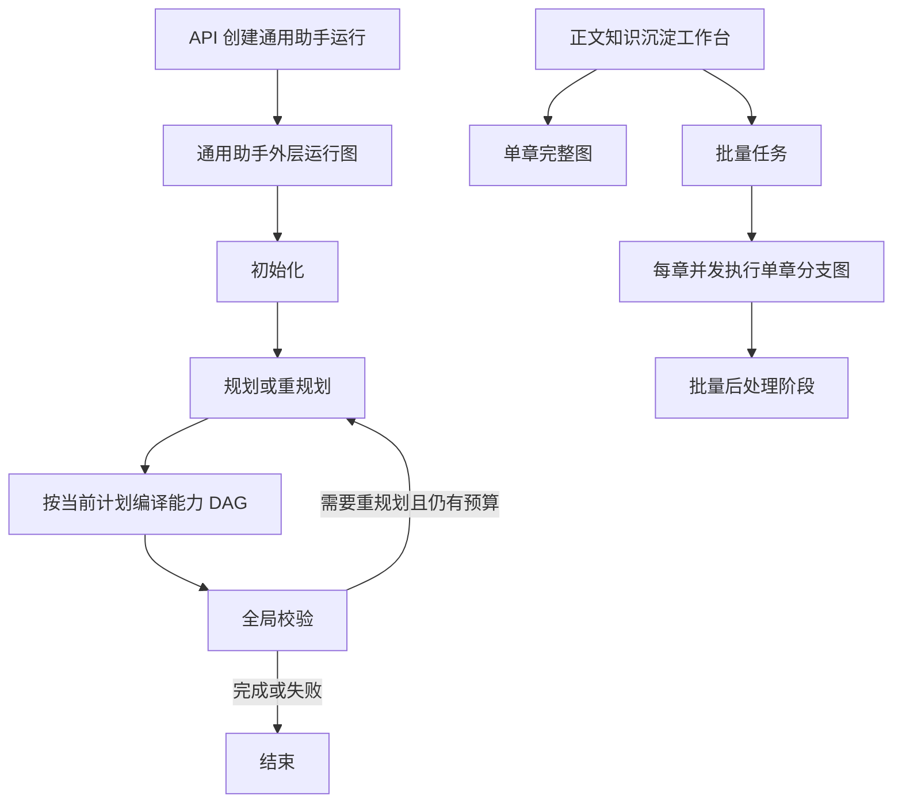
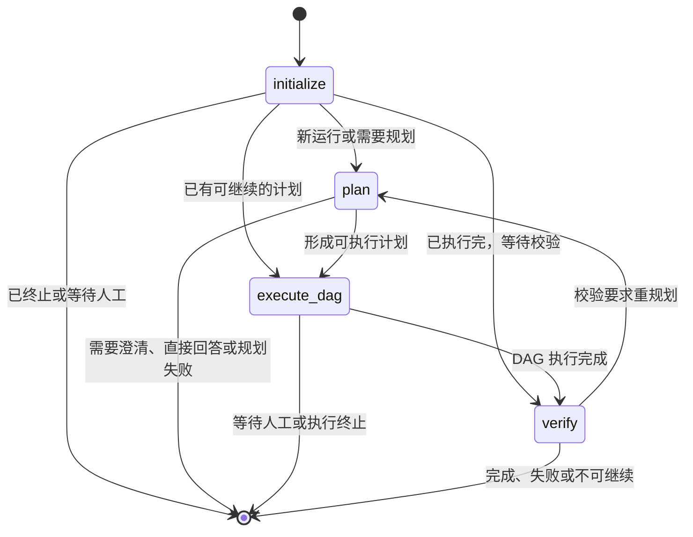
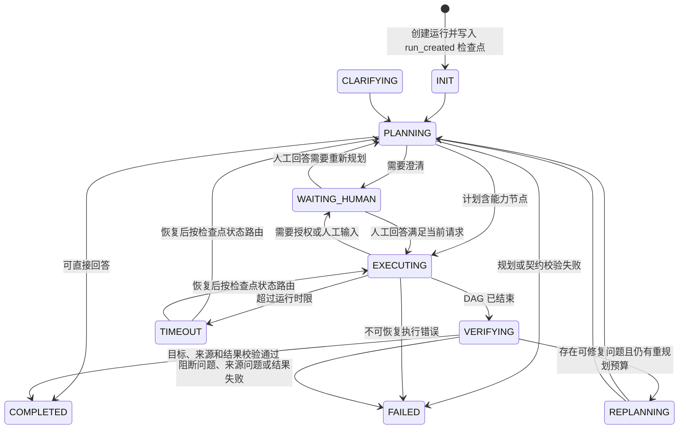
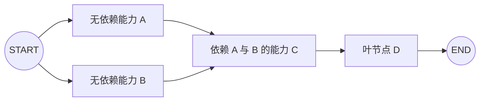
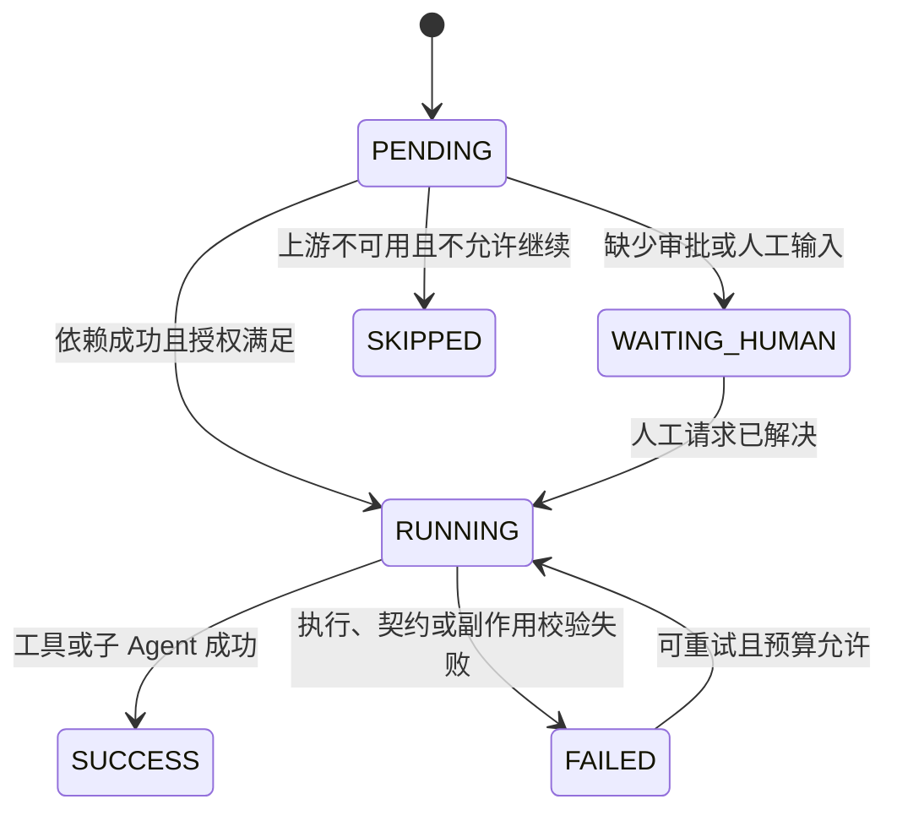
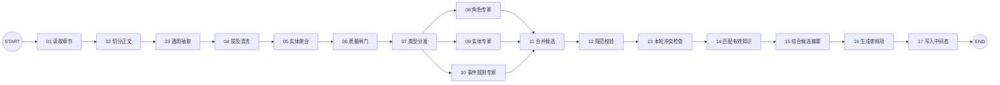
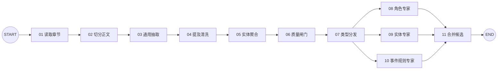
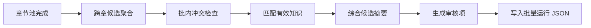

# 当前 LangGraph 图、节点、边与状态转移报告

> 更新日期：2026-08-24  
> 资料状态：当前实现快照。本文用于解释现有源码，不是独立于代码的长期权威规范；后续实现变化时应以文末所列源码为准并同步更新本文。  
> 调查范围：`src/taichu/application/general_agent/`、`src/taichu/application/agents/knowledge_extraction/` 及其直接调用链。

## 1. 总览

当前仓库里真正调用 `StateGraph(...).compile(...)` 的 LangGraph 图共有四类：

| 图 | 构建位置 | 图的粒度 | 是否动态 | 是否使用检查点恢复 |
| --- | --- | --- | --- | --- |
| 通用写作助手外层运行图 | `GeneralAgentService._build_graph` | 一次通用助手请求 | 固定四节点 | 是 |
| 计划能力动态 DAG | `DynamicPlanExecutor._build_graph` | 当前计划修订版 | 是，节点和边来自本轮计划 | 是，按计划修订版隔离 |
| 正文知识沉淀完整图 | `build_knowledge_extraction_graph` | 单章完整沉淀 | 固定十七节点 | 否 |
| 正文知识沉淀单章分支图 | `build_knowledge_extraction_branch_graph` | 批量任务中的单章候选生成 | 固定十一节点 | 否 |

此外，批量知识沉淀在十一号节点之后还有七个监控阶段：

`BatchChapterPoolNode → BatchCardAggregationNode → BatchConflictCheckNode → BatchMatchExistingKnowledgeNode → BatchSynthesizeCandidateSummariesNode → BatchBuildReviewItemsNode → BatchWriteRunNode`。

这七个阶段由 `KnowledgeExtractionService._run_batch_graph` 按顺序直接调用，并不是第五张编译后的 LangGraph。监控页把它们绘制成“节点”，表达的是运行阶段，不等同于 LangGraph 拓扑。

### 1.1 三层运行关系

## 2. 通用写作助手外层运行图

### 2.1 图状态

`_RuntimeGraphState` 是一个可选字段字典，只有两个顶层字段：

| 字段 | 含义 |
| --- | --- |
| `run` | 序列化后的 `GeneralAgentRun`，保存请求、计划、节点运行、人工介入、校验、恢复和生命周期信息 |
| `replan_guidance` | 校验阶段给下一次重规划的指导意见 |

图编译时传入通用助手检查点存储器；执行配置使用 `run_id` 作为 `thread_id`，递归上限为 20。

### 2.2 固定节点与边

| 节点 | 主要职责 | 关键输入 | 关键输出或状态 |
| --- | --- | --- | --- |
| `initialize` | 统一恢复入口；检查当前运行状态，决定从规划、执行还是校验继续 | `run.status`、已有计划和节点结果 | 将初始状态推进到 `PLANNING`，或保持可恢复状态 |
| `plan` | 组装规划上下文，调用高层编排模型，校验计划合法性 | 五层上下文、能力目录、当前请求、重规划指导 | 新的 `GeneralAgentExecutionPlan`、澄清请求、直接回答，或失败 |
| `execute_dag` | 为当前计划编译动态能力 DAG，执行工具或子 Agent，审计副作用 | 当前计划、节点运行、授权、恢复证明 | 节点结果、人工请求、`VERIFYING` 或终止状态 |
| `verify` | 检查证据、来源、节点结果和目标完成度，决定完成、失败或重规划 | 当前结果、问题列表、校验上下文 | `COMPLETED`、`FAILED` 或 `REPLANNING` |

### 2.3 外层持久状态

`GeneralAgentRunStatus` 定义以下状态：

| 状态 | 中文含义 | 是否可作为正常继续入口 |
| --- | --- | --- |
| `INIT` | 已创建、尚未初始化 | 是 |
| `CLARIFYING` | 正在生成或处理澄清 | 是 |
| `PLANNING` | 正在规划 | 是 |
| `EXECUTING` | 正在执行计划 DAG | 是 |
| `WAITING_HUMAN` | 等待作者批准、补充或纠正 | 需人工响应后继续 |
| `VERIFYING` | 正在全局校验 | 是 |
| `REPLANNING` | 校验后需要重规划 | 是 |
| `COMPLETED` | 已完成 | 否，终态 |
| `FAILED` | 已失败 | 仅在 `resumable=true` 且恢复入口允许时继续 |
| `CANCELLED` | 已取消 | 否，终态 |
| `TIMEOUT` | 已超时 | 可标记为可恢复 |

实际状态推进由各服务方法和节点显式设置，不存在一张独立的“允许状态转移表”。当前主要路径如下：

每次 `_checkpoint` 都会：

1. 增加 `checkpoint_revision`；
2. 更新时间戳；
3. 保存当前 `GeneralAgentRun`；
4. 发布运行事件。

启动或恢复时，服务先调用 LangGraph 的 `aget_state`：

- 若检查点存在下一节点，则用 `ainvoke(None, config)` 从检查点继续；
- 若只有已保存状态值，则从这些值继续；
- 若没有图检查点，才使用当前 `GeneralAgentRun` 构造初始图状态。

### 2.4 运行与恢复边界

- 外层图负责完整请求生命周期和是否重规划，不直接实现每个工具或子 Agent。
- LangGraph 检查点负责“从哪个图节点继续”；`GeneralAgentRun` 负责业务运行状态、审计和页面展示。
- 运行超时会设为 `TIMEOUT`，通常保留可恢复能力。
- 上下文不安全、证据边界被破坏等错误会进入不可恢复失败。
- 达到终态后，图不会再自动创建新一轮；新用户请求会创建同一会话中的新运行。

## 3. 计划能力动态 DAG

### 3.1 构图规则

每次 `execute_dag` 根据当前 `GeneralAgentExecutionPlan.nodes` 现场构图：

1. 每个计划节点变成一个 LangGraph 节点；
2. 没有依赖的节点由 `START` 指向；
3. 每个 `dependencies` 条目生成“依赖节点 → 当前节点”的边；
4. 没有下游的叶节点指向 `END`；
5. 检查点命名空间使用 `capability_dag_{plan_revision}`，避免不同计划修订版串写。

实际节点数、并行分支和依赖关系完全来自本轮计划，因此上图只是构图规则示意，不是固定业务流程。

### 3.2 DAG 状态与归并

`_DynamicDagState` 包含：

| 字段 | 归并方式 |
| --- | --- |
| `run` | 当前业务运行快照 |
| `node_results` | 以节点 ID 为键的字典归并；新结果覆盖同键旧结果 |
| `human_requests` | 以请求 ID 为键的字典归并 |

字典归并器允许并行节点分别返回局部结果，再合并进同一个图状态。

### 3.3 计划节点状态

`GeneralAgentNodeStatus` 的状态转移如下：

关键规则：

- 默认只有 `SUCCESS` 的依赖被视为满足。
- 若当前计划节点声明 `continue_on_failure`，则失败或跳过的上游也可视为已结束，当前节点自行决定如何降级。
- 缺少写入授权时不会直接调用有副作用的工具，而是创建人工请求并进入 `WAITING_HUMAN`。
- 节点成功结果会记录输入、输出、来源、产物、副作用、幂等键和时间信息。
- 计划修订后只有在生产者身份、证据有效性和依赖证明仍成立时，才允许复用旧修订版的节点结果。
- 图的递归上限为 `max(20, 节点数 × 3 + 10)`，并行度来自运行限制，默认最大并发为 3。

## 4. 正文知识沉淀完整图

### 4.1 固定拓扑

### 4.2 十七个节点职责

| 序号 | 源码节点 | 中文职责 | 核心产物 |
| --- | --- | --- | --- |
| 01 | `LoadChapterNode` | 从 Markdown 事实源读取目标章节 | 章节正文、来源信息 |
| 02 | `SegmentChapterNode` | 按抽取需要切分正文 | 正文片段 |
| 03 | `GeneralExtractionNode` | 从正文识别角色、地点、势力、物品、事件、规则等提及 | 原始提及 |
| 04 | `MentionNormalizeNode` | 清洗名称、别名和字段格式 | 规范化提及 |
| 05 | `EntityAggregationNode` | 合并同一章内指向同一实体的提及 | 实体组 |
| 06 | `CandidateQualityGateNode` | 丢弃证据不足或结构不合格的候选 | 通过闸门的候选 |
| 07 | `TypeDispatchNode` | 按候选类型分发到专家分支 | 三类分支输入 |
| 08 | `CharacterExpertNode` | 补全和校验角色类候选 | 角色专家候选 |
| 09 | `EntityExpertNode` | 处理地点、势力、物品、境界等实体候选 | 实体专家候选 |
| 10 | `EventRuleExpertNode` | 处理事件、规则和事实边界 | 事件规则专家候选 |
| 11 | `MergeExpertCandidatesNode` | 汇合三个专家分支 | 合并候选 |
| 12 | `NormalizeAndValidateNode` | 按知识卡 Schema 规范化并校验 | 合法候选及校验错误 |
| 13 | `RunInternalConflictCheckNode` | 检查本轮候选之间的名称、别名和事实冲突 | 批内冲突信息 |
| 14 | `MatchExistingKnowledgeNode` | 只与 MongoDB 中有效、已确认知识匹配 | 新卡、更新卡和外部冲突信息 |
| 15 | `SynthesizeCandidateSummariesNode` | 综合多段来源和已有卡信息，生成供审核使用的候选摘要 | 摘要完成或具体失败原因 |
| 16 | `BuildReviewItemsNode` | 将候选、匹配和校验结果转成作者可处理的审核项 | 审核项 |
| 17 | `WriteIntermediateJsonNode` | 写入候选运行中间态，不直接写入确认知识 | 运行 JSON 和审计信息 |

### 4.3 知识沉淀 State

`KnowledgeExtractionState` 主要字段可分为六组：

| 分组 | 代表字段 |
| --- | --- |
| 运行身份 | `run_id`、`chapter_id`、`chapter_ids`、`scope`、模型身份 |
| 正文输入 | `chapter`、`content`、`segments` |
| 抽取中间态 | `raw_mentions`、`normalized_mentions`、`entity_groups`、`candidates` |
| 专家分支 | `character_candidates`、`entity_candidates`、`event_rule_candidates`、`merged_candidates` |
| 审核输出 | `validated_candidates`、`review_items`、冲突和匹配结果 |
| 监控审计 | `graph_nodes`、`graph_edges`、`llm_calls`、`errors`、`failed`、批量进度 |

并行写入使用以下归并策略：

- `graph_nodes` 和 `llm_calls`：列表追加；
- `errors`：字符串列表追加；
- `failed`：逻辑“或”，任一分支失败后保持失败；
- `run`：保存当前运行结构。

完整图编译时没有传入 LangGraph checkpointer。因此：

- 单次 `ainvoke` 内可以完成分支归并；
- 运行 JSON 和事件可以用于审计、页面展示和人工重试；
- 但它不具备通用助手那种从 LangGraph 内部下一节点原位恢复的能力。

## 5. 批量知识沉淀

### 5.1 单章分支图

批量任务中的每章先执行一张缩短后的 LangGraph：

批量服务默认用并发上限 5 的信号量运行各章分支，`asyncio.gather` 等待所有章节结束。每章成功或失败都会更新批量章节进度，并把节点和模型调用事件归并到批量监控记录。

### 5.2 批量后处理逻辑阶段

这些阶段的真实执行语义是：

1. `_run_batch_node` 发布“节点开始”事件；
2. 执行同步或异步阶段函数；
3. 捕获异常，将该阶段标为失败并记录错误；
4. 失败阶段通常返回空列表，使后续阶段仍可运行；
5. 发布“节点结束”事件。

所以页面上看到“某后处理节点失败但后续节点仍有状态”是当前容错策略的结果，不代表 LangGraph 越过失败边继续执行。最终批量状态会综合章节失败、阶段错误和审核项结果决定。

## 6. 图状态、业务状态与监控状态的边界

| 状态层 | 用途 | 事实载体 | 是否直接给作者看 |
| --- | --- | --- | --- |
| LangGraph 图状态 | 节点之间传递本轮计算结果 | TypedDict 和检查点 | 通常不直接展示 |
| 通用助手业务运行状态 | 任务生命周期、计划、人工介入、恢复和审计 | `GeneralAgentRun` | 是 |
| 动态节点运行状态 | 工具或子 Agent 的单节点执行状态 | `GeneralAgentNodeRun` | 是 |
| 知识沉淀候选状态 | 抽取中间态和审核项 | 运行 JSON | 是 |
| 知识卡生命周期 | 作者是否确认结构事实 | MongoDB `lifecycle` | 是 |
| 监控节点状态 | 页面上的阶段进度与耗时 | 运行事件和运行快照 | 是 |

不能把上述状态混为一谈：

- LangGraph 节点成功不等于知识卡已确认；
- 批量监控“节点”不一定是编译图节点；
- 通用助手的 LangGraph 检查点不是对话历史；
- 运行 JSON 是候选和审计中间态，不是 MongoDB 结构事实源。

## 7. 当前实现结论

1. 通用写作助手采用“两层图”：固定外层生命周期图负责全局控制，动态能力 DAG 负责本轮实际执行。
2. 重规划回路只存在于外层图的 `verify → plan`；工具或子 Agent 不接管全局规划权。
3. 动态 DAG 的并行性来自计划依赖关系，而不是固定业务分支。
4. 正文知识沉淀采用固定专家分支图；批量运行复用单章分支图，再进入命令式跨章后处理。
5. 通用助手具备 LangGraph 检查点恢复；知识沉淀当前主要依靠运行记录、事件和人工重试，不是节点级原位恢复。
6. 监控页需要继续区分“编译图节点”和“逻辑阶段”，否则容易把可视化拓扑误认为源码调用关系。

## 8. 主要源码索引

- [通用写作助手外层图](../../src/taichu/application/general_agent/service.py)
- [动态计划 DAG 执行器](../../src/taichu/application/general_agent/executor.py)
- [通用助手运行与节点模型](../../src/taichu/application/general_agent/models.py)
- [通用助手检查点命名空间适配](../../src/taichu/application/general_agent/checkpoint_namespace.py)
- [知识沉淀完整图与分支图](../../src/taichu/application/agents/knowledge_extraction/workflow.py)
- [知识沉淀批量运行服务](../../src/taichu/application/services/knowledge_extraction_service.py)
- [知识沉淀 Agent 入口](../../src/taichu/application/agents/knowledge_extraction/graph.py)
