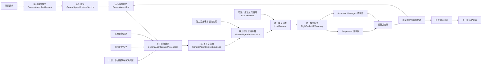
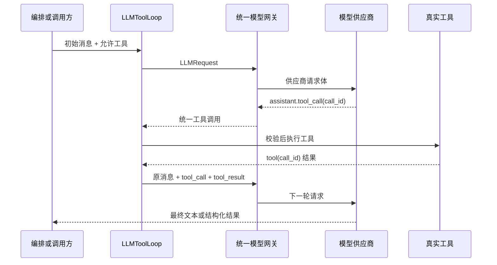

# 模型请求上下文生成、协议编码与多轮更新真实链路

> 更新时间：2026-08-24  
> 资料状态：当前源码学习资料  
> 适用范围：通用写作助手的请求入口、五层上下文、编排模型调用、原生工具调用循环与统一模型网关  
> 事实边界：本文解释的是当前真实代码；后续实现变更时，以源码、测试和实际接口行为为准。

## 一、结论总览

当前一次通用写作助手请求，从网页参数到供应商请求体，实际经过六层职责：

1. **接口层接收原始请求**：`GeneralAgentRunRequest` 接收当前用户原文、对话标识、作用范围、作者约束、外部访问授权和运行限制。
2. **运行服务创建本轮事实状态**：`GeneralAgentRuntimeService` 生成 `GeneralAgentRun`，维护本轮状态、原始会话消息、计划、节点结果、人工介入和检查点。
3. **上下文组装器生成五层模型上下文**：`GeneralAgentContextAssembler` 将数据严格归入稳定记忆、长期记忆、历史对话、工作记忆、当前请求。
4. **编排器生成模型语义消息**：`GeneralAgentOrchestrator` 选择规划或验证阶段提示词，将五层上下文投影为 `system / developer / user / assistant` 消息。
5. **统一模型契约承接供应商无关请求**：`LLMRequest`、`LLMMessage` 和 `LLMToolDefinition` 表达模型、消息、结构化输出、工具与生成参数。
6. **网关编码为具体供应商协议**：`RightCodeLLMGateway` 根据当前供应商和模型档案，把统一请求转换成 Responses 风格或 Anthropic Messages 风格请求体。

这里必须区分三组容易混淆的数据：

- **会话历史**只保存真实用户消息和最终展示给用户的助手回答。
- **工作记忆**保存计划、节点结果、工具结果、错误、重试、召回内容和阶段结论。
- **LangGraph 检查点**保存图执行位置和运行状态，用于恢复；它不是会话历史，也不是小说事实。

### 一次请求的真实数据流



---

## 二、核心字段由哪些源码生成

### 2.1 HTTP 请求入口

通用写作助手的外部输入契约位于：

- `src/taichu/api/schemas/general_agent.py`：`GeneralAgentRunRequest`
- `src/taichu/api/routes/general_agent.py`：创建和后台启动运行的接口
- `src/taichu/application/general_agent/service.py`：`create_run()`、`start()`、`run()`

主要字段来源如下：

| 模型可见或运行字段 | 原始来源 | 首次保存位置 | 后续模型投影 |
| --- | --- | --- | --- |
| 当前用户请求 | `user_goal` | `GeneralAgentRun.user_goal` 和当前轮用户消息 | 五层上下文的“当前请求”，最终一条 `user` 消息 |
| 对话归属 | `conversation_id`、`start_new_conversation` | `GeneralAgentRun.conversation_id`、`parent_run_id`、`request_index` | 不直接作为自然语言历史，供运行关联和上下文组装使用 |
| 作者约束 | `author_constraints` | `GeneralAgentRun.author_constraints`，同时写入用户指令类运行记忆 | 当前请求附加上下文与工作记忆 |
| 作用范围 | `scope` | `GeneralAgentRun.scope` | 当前请求附加上下文 |
| 外部访问授权 | `external_access_allowed` | `GeneralAgentRun.external_access_allowed` | 工作记忆和节点执行授权判断 |
| 运行上限 | `limits` | `GeneralAgentRun.limits` | 工作记忆中的本阶段运行参数，并约束运行时 |

`GeneralAgentRuntimeService.create_run()` 不直接拼接供应商请求体。它先建立完整运行对象，记录 `run_created` 检查点，并调用 `AgentMemoryService.record_user_instructions()` 将作者约束记录为高优先级运行记忆。

### 2.2 System Prompt（系统提示词）

当前编排调用的 System Prompt 只由两类稳定内容共同生成：

| 组成 | 代码位置 | 作用 |
| --- | --- | --- |
| 稳定记忆 | `src/taichu/application/general_agent/context.py` 中的 `_STABLE_MEMORY` | 固定身份、数据宪法、权限边界和运行原则 |
| 静态能力索引 | `CapabilityRegistry.lightweight_index()` | 向高层编排器提供长期稳定的 Tool（工具）和 Subagent（子 Agent）能力目录 |

`GeneralAgentOrchestrator._complete_json()` 将二者放入“稳定记忆（System Prompt）”对象，再通过 `_json_message()` 使用紧凑 JSON 编码：

- `ensure_ascii=False`：中文不转义成 Unicode 编码串；
- `separators=(",", ":")`：去除非必要空格，减少字符占用；
- 最终作为第一条 `LLMMessage(role="system")`。

因此，当前实现不是把一段超长字符串散落在路由层拼接，而是：

`稳定记忆 + 静态能力索引 → 结构化字典 → 紧凑 JSON → system 消息`。

规划、重规划和验证提示词会随阶段变化，不属于稳定记忆。它们与相关候选字段摘要、入选能力完整 Schema、输出 Schema、授权和本阶段参数一起进入工作记忆对应的 `developer` 消息。因此规划与验证调用拥有相同 System Prompt 前缀，阶段变化不会破坏稳定身份和能力目录的 Prompt Cache 前缀。

### 2.3 工具定义

当前存在两种不同的“工具信息”，不能混为一谈。

### A. 编排规划中的能力目录

`GeneralAgentOrchestrator.plan()` 会通过 `CapabilityRetriever` 从能力注册表筛选与当前目标相关的能力，并把能力字段摘要、输出契约和可用性写入阶段上下文。

这条链路的能力信息主要用于**让模型生成可执行计划**。全量轻量 Static Capability Index 进入 `system`，只包含稳定名称、类型、中文职责、副作用、外部访问要求和授权策略；查询相关能力的字段摘要与入选能力完整 Schema 进入 `developer`。当前规划调用不会把全部能力的完整输入 JSON Schema 作为模型 API 原生 `tools` 参数发送。真正执行时，动态 DAG 只能调用注册表中已存在且通过校验的能力。

### B. 原生模型工具调用

需要模型原生 Tool Calling（工具调用）时，使用：

- `src/taichu/application/services/llm_tool_loop.py`：`LLMToolLoop`
- `LLMToolLoop._definitions()`：从能力注册表的 Tool Manifest（工具清单）生成 `LLMToolDefinition`

生成过程会：

1. 按允许的工具名称过滤；
2. 按调用者和副作用策略过滤；
3. 读取工具名称、中文说明与输入模型；
4. 将输入模型转为 JSON Schema；
5. 生成供应商无关的 `LLMToolDefinition`；
6. 在每轮调用中放入 `LLMRequest.tools` 和 `tool_choice`。

工具调用返回时必须保持完整配对：

`assistant.tool_call(call_id) → tool(call_id)`。

工具内部消息、重试和原始结果属于当前运行轨迹与工作记忆，不会直接并入下一轮用户会话历史。

### 2.4 会话历史

会话历史的原始事实由 `GeneralAgentRuntimeService._messages_for_new_turn()` 生成。

### 第一轮

只保存一条真实用户消息：

```text
user: 当前 user_goal 原文
```

### 后续轮次

服务读取当前对话最后一个运行：

1. 拷贝上一运行的 `messages`；
2. 如果上一轮最终回答尚未在末尾，则追加真实展示过的 `assistant` 回答；
3. 追加本轮新的 `user_goal`；
4. 将上一运行标识写入 `parent_run_id`；
5. 将 `request_index` 加一。

如果上一个运行仍在执行或等待人工处理，系统拒绝直接创建新的并行轮次，避免同一对话出现两个竞争写入者。

`GeneralAgentContextAssembler` 在投影历史时只接受 `user` 和 `assistant` 两种角色，并执行两项额外处理：

- 当前最新 `user_goal` 若已出现在历史尾部，会从历史投影移除，避免它既作为历史消息又作为最终当前请求重复发送；
- 早期消息可压缩为历史摘要，近期消息保留原始角色和原文。

### 2.5 用户约束、作用范围和运行参数

作者约束不是拼进用户原文。当前实现保留两条独立路径：

1. `author_constraints` 经 `AgentMemoryService.record_user_instructions()` 进入高优先级“用户指令”运行记忆；
2. `GeneralAgentContextAssembler` 去重后写入 `current_request.user_constraints`；
3. `GeneralAgentOrchestrator._complete_json()` 再把它放进 `developer` 消息中的“当前请求附加上下文”。

作用范围同样作为结构化对象进入 `developer` 消息，不改写最后一条用户原文。这样可以保证：

- 用户最后一条 `user` 消息仍是原始请求；
- 应用生成的限制不会伪装成用户说过的话；
- 约束、权限和运行预算可以独立审计和更新。

---

## 三、五层上下文如何生成

`GeneralAgentContextAssembler` 输出 `GeneralAgentContextEnvelope`。模型可见内容只能归入以下五层：

| 顺序 | 层 | 当前来源 | 典型内容 | 是否允许裁剪 |
| --- | --- | --- | --- | --- |
| 1 | 稳定记忆 | `_STABLE_MEMORY`、静态能力索引 | 身份、基本行为与准则、事实源边界、Tool 与子 Agent 能力发现目录 | 不裁剪 |
| 2 | 长期记忆 | 长期记忆召回器 | 用户表达偏好、写作偏好、协作偏好、效果反馈 | 最先裁剪 |
| 3 | 历史对话 | `run.messages` | 早期摘要、相关或近期的真实用户/助手消息 | 从最旧消息开始裁剪 |
| 4 | 工作记忆 | 运行记忆、计划、节点结果、未决问题、错误、重规划指导 | 当前任务执行所需的中间态 | 按优先级裁剪，受保护项不裁剪 |
| 5 | 当前请求 | `run.user_goal`、作者约束、作用范围 | 最新用户原文与本轮直接约束 | 不裁剪 |

### 3.1 工作记忆的实际组成

`_assemble_envelope()` 当前组装：

- 当前有效运行记忆；
- 仅用于纠错的失效记忆隔离信号；
- 当前计划摘要；
- 当前计划版本的节点摘要；
- 验证问题与未决问题；
- 重规划指导；
- 必要时生成的压缩摘要；
- 当前请求、去重后的约束与作用范围。

运行记忆中的“事实引用”只保存引用标签。模型需要使用小说事实时必须重新从正文或统一召回取证；运行记忆本身不能升级为 MongoDB 中的权威知识卡。

### 3.2 压缩触发条件

满足任一条件时进入压缩：

- 会话消息数量超过策略阈值；
- 当前节点原始输出字符量超过阈值；
- 历史消息、节点摘要或计划摘要已经因为局部预算发生省略。

压缩器失败时会使用安全摘要回退，并把 `fallback_used` 记录在上下文信封中，避免因为压缩服务异常而静默丢失整个任务。

### 3.3 总预算与裁剪顺序

当前默认总字符预算为 180000，并预留 4000 字符安全余量。预算紧张时依次处理：

1. 从长期记忆尾部移除低相关项；
2. 生成摘要后，从历史对话最旧消息开始移除；
3. 移除不再需要的失效记忆修复信号；
4. 移除低优先级工作记忆；
5. 移除非直接依赖的节点摘要与可重建计划摘要。

以下内容受保护：

- 稳定记忆；
- 当前用户原文；
- 当前有效用户指令；
- 未决问题；
- 当前节点的直接依赖结果。

如果受保护内容本身已经超过预算，`GeneralAgentContextAssembler` 抛出 `unsafe_context`（不安全上下文）错误并终止本轮，不会截断用户原文后伪装成成功。

---

## 四、五层内容如何投影为统一模型请求

`GeneralAgentOrchestrator._complete_json()` 的实际消息顺序如下：

| API 顺序 | 角色 | 内容 |
| --- | --- | --- |
| 1 | `system` | 稳定记忆 + 静态能力索引 |
| 2 | `developer` | 当前召回的长期记忆 |
| 3 | `developer` | 历史对话摘要 |
| 4 | `user / assistant` | 近期保留的真实历史原文 |
| 5 | `developer` | 工作记忆 + 阶段行为与准则 + 阶段契约 + 本阶段参数 + 用户约束 + 作用范围 |
| 6 | `developer`（仅重试） | 上次结构错误、截断后的上次输出和仅修复 JSON 结构的要求 |
| 7 | `user` | 当前 `user_goal` 原文 |

随后创建供应商无关的 `LLMRequest`。规划和验证调用当前使用：

- 任务类型：通用 Agent 编排；
- 响应模式：JSON；
- 温度：0.1；
- 最大输出 Token：12000；
- 模型：由 `model_router.model_for("orchestrator")` 按当前全局供应商和角色路由选择。

结构化输出最多尝试两次。第二次只针对 JSON 解析或 Schema 校验错误进行结构修复，不会把失败输出写成新的用户消息。

### 重要边界：审计顺序不等于模型消息顺序

`GeneralAgentAssemblyTrace` 会为上下文内容生成指纹、计数和审计记录。它的内部序列化顺序用于快照比较和可观测性，不应被当成最终供应商消息顺序。模型实际接收的语义顺序以 `GeneralAgentOrchestrator._complete_json()` 创建的 `messages` 为准。

---

## 五、统一请求如何编码为供应商 API

统一协议定义位于：

- `src/taichu/application/contracts/llm.py`
- `LLMMessage`：`system / developer / user / assistant / tool`
- `LLMRequest`：模型、消息、工具、工具选择、响应模式、输出上限和采样参数
- `LLMResponse`：文本、结构化内容、工具调用、用量和供应商元数据

具体编码位于：

- `src/taichu/infrastructure/llm/rightcode.py`
- `_request_payload()`

### 5.1 Responses 风格请求

Responses 风格编码逻辑：

1. 收集所有 `system` 消息，用空行连接为顶层 `instructions`；
2. 其余普通消息保留 `developer / user / assistant` 角色，写入 `input`；
3. `assistant` 工具调用转换为 `function_call`；
4. `tool` 结果转换为 `function_call_output`，通过 `call_id` 配对；
5. `LLMToolDefinition` 转换为 `type=function` 的工具定义；
6. 根据模型能力设置 `tool_choice`、结构化输出格式、温度和 `max_output_tokens`；
7. 不支持某参数的模型会由模型档案显式省略，不做跨供应商静默降级。

Responses 风格下，`developer` 角色在输入数组中继续保持独立，不会被伪装成用户内容。

### 5.2 Anthropic Messages 风格请求

Anthropic Messages 风格编码逻辑：

1. 按原顺序收集 `system` 和 `developer` 内容；
2. 将两者连接成供应商协议的顶层 `system` 字符串；
3. 普通历史只保留供应商接受的 `user / assistant` 角色；
4. 助手工具调用转换为 `tool_use` 内容块；
5. 工具结果转换为 `tool_result`，放进 `user` 角色内容块；
6. 工具定义、工具选择、最大输出、温度和流式开关按模型档案编码；
7. JSON 模式在供应商不提供原生响应格式时，通过额外系统约束要求只返回 JSON。

因此，Anthropic 兼容协议在传输层会合并 `system` 和 `developer`，但业务层的五层归属没有改变。合并发生在最后的协议适配层，不会反向污染会话历史或当前用户原文。

### 5.3 供应商和模型选择

模型调用不会直接使用网页上某个历史模型名称。当前链路是：

`全局活动供应商 → 当前任务角色 → 模型路由 → 模型档案 → 协议编码`。

网关会校验当前模型是否属于活动供应商；不允许跨供应商自动回退到另一个供应商支持的模型。供应商请求 ID、状态码、错误摘要、内容块类型与重试信息在网关可观测性层记录，不进入用户历史。

---

## 六、原生工具调用时的增量消息链

`LLMToolLoop.run()` 是供应商无关的原生工具循环。每一轮执行：

1. 复制当前模型消息；
2. 附加本轮允许使用的工具定义和工具选择策略；
3. 发起模型调用；
4. 若模型直接返回文本，结束循环；
5. 若模型返回工具调用，保存完整 `assistant.tool_calls`；
6. 校验调用标识、工具名称、调用预算、授权和幂等键；
7. 执行真实工具；
8. 追加与调用标识配对的 `tool` 结果；
9. 进入下一模型轮次。

当前默认边界包括最大轮数、最大工具调用数、单次重试和调用超时。超出边界会形成运行错误，不会把内部失败轨迹追加成对用户可见的历史对话。



---

## 七、多轮交互如何增量更新、合并与裁剪

### 7.1 新一轮不是修改旧运行

正常多轮对话采用“同一 `conversation_id` 下新增运行”的方式：

- 新运行拥有新的 `run_id`；
- `parent_run_id` 指向上一轮；
- `request_index` 单调递增；
- 历史消息从上一轮复制并追加；
- 上一轮运行、计划、节点轨迹和检查点仍保留，便于审计。

这避免把旧运行原地覆盖后失去当时的计划、工具输出和错误现场。

### 7.2 人工澄清采用接续运行

当图进入“等待澄清”状态时，`resume()` 不把作者回答偷偷塞进原图某个字符串字段，而是：

1. 校验当前请求确实是澄清请求；
2. 使用作者回答创建接续运行；
3. 将上一轮助手问题作为历史中的助手消息；
4. 将作者回答作为新的当前用户请求；
5. 记录人工修正类运行记忆；
6. 从新运行重新进入图执行。

写入授权则不同：它恢复原运行的授权节点和图检查点，不创建虚假的用户对话轮次。

### 7.3 每次模型调用都重新投影，不重发完整存储

应用层可以保存完整运行状态，但每次规划、重规划或验证调用都会重新执行上下文组装：

1. 刷新运行记忆的证据有效性；
2. 按当前目标召回长期记忆；
3. 选择当前有效工作记忆；
4. 隔离失效但对纠错有用的记忆；
5. 只保留当前计划版本的必要节点结果；
6. 生成历史摘要和近期消息窗口；
7. 应用字符预算和裁剪策略；
8. 生成上下文内容指纹与快照；
9. 投影成当前阶段需要的消息。

因此，“完整存储”不等于“每一轮都把全部历史、全部 DAG 和全部工具轨迹发给模型”。

### 7.4 快照复用条件

上下文快照只有在以下关键输入都未变化时才允许复用：

- 阶段和上下文策略；
- 重规划指导；
- 运行记忆状态和有效性；
- 长期记忆召回身份；
- 当前请求、计划和节点内容指纹。

任一依赖变化都会重新组装。快照复用只减少重复计算，不改变五层内容的业务归属。

### 7.5 三种持久化的不同职责

| 持久化对象 | 保存什么 | 用于什么 | 是否进入下一轮用户历史 |
| --- | --- | --- | --- |
| 会话消息 | 原始用户消息、实际展示的助手回答 | 多轮语义连续性 | 是 |
| 运行记忆 | 用户指令、未决问题、节点结果摘要、任务结论、纠错信号 | 当前及后续任务的选择性工作上下文 | 按策略投影，不作为原始对话 |
| LangGraph 检查点 | 当前图状态、下一节点、运行数据 | 超时、失败、授权后的恢复 | 否 |
| 模型调用轨迹 | 请求角色、内容块类型、工具调用、用量、错误和重试 | 监控、诊断、评测和审计 | 否 |
| MongoDB 知识卡 | 作者确认的结构化小说事实 | 权威知识召回 | 通过工具重新召回后进入工作记忆 |

### 7.6 运行记忆的增量规则

`AgentMemoryService` 当前按类型增量维护：

- 作者约束写为高优先级用户指令；
- 人工澄清写为人工修正；
- 未回答问题写为有请求轮次有效期的未决问题；
- 成功节点结果写为带生产者和依赖证明的结果记忆；
- 验证成功写为任务摘要；
- 验证失败只保留为纠错信号，不作为有效结论；
- 删除整个对话时，关联运行记忆级联软删除。

检索运行记忆时先清理过期项，再按当前查询评分、类型优先级、数量和字符预算选择；失效结果不能以“有效事实”形式重新进入上下文。

---

## 八、当前实现的关键不变量

1. 最后一条 `user` 只承载当前用户原文，不混入应用生成说明。
2. `system` 只承载稳定身份、基本行为与准则和 Static Capability Index；阶段提示词、Schema、授权、预算与动态结果全部留在工作记忆对应的 `developer` 消息。
3. 历史对话只包含真实 `user / assistant` 内容。
4. 工具调用与工具结果必须通过 `call_id` 完整配对。
5. 子 Agent 内部轨迹不直接并入父 Agent 历史，只通过契约化结果回传。
6. 小说正文和知识卡检索结果属于工作记忆，不属于用户长期偏好记忆。
7. 运行记忆不是小说事实源；使用事实前必须重新取证。
8. 稳定记忆和当前请求不可被静默截断。
9. 供应商协议可以改变角色的传输表示，但不能改变五层业务归属。
10. 图检查点负责恢复执行，不负责证明用户说过什么。

---

## 九、源码索引

### 请求入口与运行状态

- `src/taichu/api/schemas/general_agent.py`：通用 Agent 请求模型
- `src/taichu/api/routes/general_agent.py`：创建、启动和恢复接口
- `src/taichu/application/general_agent/models.py`：运行、消息、计划、节点、上下文信封模型
- `src/taichu/application/general_agent/service.py`：运行创建、多轮历史、人工介入、检查点和外层 LangGraph

### 上下文与记忆

- `src/taichu/application/general_agent/context.py`：五层上下文组装、压缩、预算和裁剪
- `src/taichu/application/services/agent_memory_service.py`：运行记忆写入、召回、有效性和过期
- `src/taichu/application/general_agent/capability_resolution.py`：能力检索和计划期能力上下文

### 模型语义请求

- `src/taichu/application/general_agent/orchestrator.py`：规划/验证提示词、五层消息投影和结构化输出重试
- `src/taichu/application/contracts/llm.py`：供应商无关的消息、请求、响应和工具契约
- `src/taichu/application/services/llm_tool_loop.py`：原生工具定义、调用配对、预算和循环

### 供应商协议编码

- `src/taichu/infrastructure/llm/rightcode.py`：活动供应商校验、模型档案、Responses/Anthropic 请求体编码与调用可观测性

## 十、与 LangGraph 报告的关系

本文件解释“某个节点准备调用模型时，请求内容从哪里来、如何编码、如何跨轮更新”。图结构、节点、边和状态迁移另见：

- [当前 LangGraph 图、节点、边与状态转移报告](./8-24当前LangGraph图节点边与状态转移报告.md)

两份文档共同构成当前运行链路快照：前者描述模型上下文和 API 请求，后者描述图执行拓扑和状态机。
