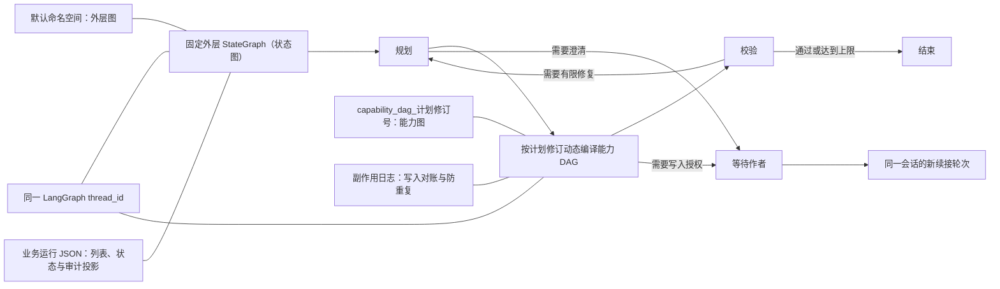

# 太初 LangGraph 原生能力与项目封装盘点

> 更新日期：2026-07-26

## 盘点口径

本文记录 2026-07-26 当前工作区中 LangGraph 的真实使用情况，范围包括：

- 通用写作助手的外层运行图、动态能力 DAG、节点检查点、恢复、有限重规划和人工介入。
- 正文知识沉淀 Agent 的固定图与批量执行方式。
- LangGraph 原生能力、太初业务封装、运行产物和测试证据之间的边界。
- 已确认应保留的能力、可以清理的重复实现，以及仍需单独决策的技术风险。

本次盘点直接读取当时的源码、测试和运行产物。本文是历史审计快照，不替代 `AGENTS.md`、当前源码或后续正式设计。

## 结论摘要

1. 太初已经真实使用 LangGraph 构建了两层通用 Agent 运行图：固定外层控制图和按计划修订动态编译的能力 DAG。它们不是只有文档或页面展示。
2. 通用 Agent 已真实使用 LangGraph 的线程、检查点命名空间、状态检查和空输入续跑机制，实现同一 `run_id（运行标识）` 的进程重启恢复和失败节点续跑。
3. 检查点恢复不是孤立功能。它与业务运行投影、计划修订隔离、成功节点复用、写入副作用日志和幂等对账共同组成恢复链路，不能只删除其中某一层。
4. 太初具备作者澄清和写入授权两类人工介入，但当前没有使用 LangGraph 原生 `interrupt()` 与 `Command(resume=...)`。现实现以业务状态暂停，并把作者回答建立为同一会话中的新续接轮次。
5. 正文知识沉淀 Agent 使用 LangGraph 固定图和并行汇合，但没有接入 LangGraph 检查点；批量章节并发由应用服务的 `asyncio.Semaphore（异步并发信号量）` 管理，不是 LangGraph 的 `Send（动态派发）`。
6. 当前可以确认的冗余主要集中在未被调用的注册表图入口、未被调用的执行器辅助函数、知识沉淀图定义与展示元数据的重复维护。没有证据支持推倒通用 Agent 的动态 DAG、检查点或恢复主链路。

## 当前结构



这两层图职责不同：

- 外层图负责初始化、规划、执行、校验和有限重规划，是固定控制循环。
- 内层能力图根据当次模型计划中的真实 Tool（工具）和子 Agent 节点动态构建，负责依赖、并行、汇合和能力执行。
- 两层图共用一个 LangGraph 检查点保存器和同一个 `thread_id`，再通过检查点命名空间隔离外层状态与各计划修订的能力图状态。

## LangGraph 原生能力清单

| 能力 | 当前状态 | 原生入口 | 太初中的真实用途 |
|---|---|---|---|
| 状态图 | 已使用 | `StateGraph`、`START`、`END` | 构建通用 Agent 外层图、动态能力 DAG、知识沉淀固定图 |
| 条件路由与循环 | 已使用 | `add_conditional_edges` | 外层图依据业务状态进入规划、执行、校验、结束，并支持校验后有限重规划 |
| 依赖边、并行与汇合 | 已使用 | `add_edge`、多起点、列表依赖 | 动态 DAG 的无依赖节点并行执行，多依赖节点等待上游汇合；知识沉淀的三个专家节点并行后汇合 |
| 状态归并 | 已使用 | `TypedDict` 与 `Annotated` reducer（归并器） | 合并并行能力节点的 `node_results` 和 `human_requests` |
| 并发上限 | 已使用 | 运行配置 `max_concurrency` | 动态能力 DAG 按本次运行限制控制最大并发 |
| 节点检查点 | 已使用 | `BaseCheckpointSaver`、`InMemorySaver` 协议 | 外层图和能力图在节点边界保存 LangGraph 通道状态、中间写入和父检查点关系 |
| 线程隔离 | 已使用 | `configurable.thread_id` | 一个通用 Agent 运行对应一个 LangGraph 线程，值为同一 `run_id` |
| 检查点命名空间 | 已使用 | `configurable.checkpoint_ns` | 默认命名空间保存外层图；`capability_dag_{plan_revision}` 保存某次计划修订的能力图 |
| 状态检查 | 已使用 | `aget_state` | 启动或恢复前判断是否存在待执行节点、已完成值或空状态 |
| 原位置续跑 | 已使用 | `ainvoke(None, config=...)` | 恢复检查点后继续待执行节点，不重新提交初始图输入 |
| 异步调用 | 已使用 | `ainvoke` | 通用 Agent 和知识沉淀图均以异步方式执行 |

当前安装环境为 `langgraph 1.2.6`、`langgraph-checkpoint 4.1.1`；项目依赖声明为 `langgraph>=1.0`。

## 通用写作助手链路

### 固定外层控制图

`src/taichu/application/general_agent/service.py` 中的 `GeneralAgentRuntimeService` 在服务构造时编译固定图：

`initialize（初始化） → plan（规划） → execute_dag（执行能力图） → verify（校验）`

各阶段通过条件边结束或进入下一阶段；校验失败且仍有重规划额度时，从 `verify` 返回 `plan`。该图是通用运行控制器，不是当次能力 DAG。

### 动态能力 DAG

`src/taichu/application/general_agent/orchestrator.py` 让高层编排 Agent 从真实注册的 Tool 和子 Agent 契约中生成最小充分计划。`GeneralAgentExecutionPlan（通用执行计划）` 在进入图构建前校验：

- 节点标识唯一。
- 依赖只能引用当前计划中的真实节点。
- 不允许自依赖和依赖环。
- 上游结果绑定只能来自直接依赖节点。
- 能力名称必须存在于真实注册表。
- 计划节点数、重规划次数和并发数受运行限制约束。

`src/taichu/application/general_agent/executor.py` 随后按当前计划修订逐节点调用 `add_node`、`add_edge`，在运行时编译该次能力图。无依赖节点从 `START` 同时出发；多依赖节点使用 LangGraph 的汇合边；没有下游的节点连接 `END`。

这里的“动态”指每个计划修订都会根据模型产生的节点和依赖重新构建、编译一张图，不是使用 `Send` 在已经编译的图中临时派发节点。

### 有限重规划与成功节点复用

校验发现能力失败、来源不足或模型判定需要修复时，外层图在限额内回到规划阶段并增加计划修订号。新计划可以通过 `reuse_from_node_id（成功节点复用来源）` 显式复用旧修订中的成功结果；运行时会校验能力类型和能力名称一致，不会静默复用不同契约的结果。

每个计划修订使用独立 `capability_dag_{plan_revision}` 检查点命名空间，避免新旧能力图的节点状态互相覆盖。

## 检查点与恢复

### 两类名称相近但职责不同的记录

| 记录 | 位置 | 职责 | 是否决定 LangGraph 续跑位置 |
|---|---|---|---|
| LangGraph 节点检查点 | `project_assets/derived/general_agent_graph_checkpoints/` | 保存图通道、节点写入、父检查点和命名空间状态 | 是 |
| 业务运行投影 | `project_assets/derived/general_agent_runs/` | 保存任务列表、业务状态、计划、节点结果、最终回答和审计字段 | 否 |

`GeneralAgentRun.checkpoint_revision（业务快照修订号）` 是业务投影的保存次数，不等于 LangGraph 检查点修订。二者互补，不应因名称相近而合并。

### 自定义持久化保存器

`JsonLangGraphCheckpointSaver` 继承 LangGraph 的 `InMemorySaver`，复用官方检查点协议，再把内存中的 `storage`、`writes`、`blobs` 持久化为 JSON 修订历史。它额外提供：

- 临时文件、文件同步和原子替换。
- 修订内容哈希与前序哈希链。
- 最新修订指针。
- 启动时完整性校验、损坏尾部隔离和回退。
- 从指定历史修订显式重建并追加修复修订。
- 旧版单文件检查点的一次性迁移与备份。
- 面向监控的脱敏修订摘要，不直接返回运行正文。

### 续跑路径

1. 后端启动时扫描业务投影中的活动状态运行。
2. 对每个活动运行使用原 `run_id` 启动恢复任务。
3. 外层图先通过 `aget_state` 读取同一线程；存在待执行节点时以 `ainvoke(None)` 继续。
4. 如果恢复点位于 `execute_dag`，动态执行器会以同一线程和对应计划修订命名空间检查内层能力图。
5. 已成功节点由 LangGraph 检查点或业务节点结果识别，不重新执行；失败或未完成节点继续执行。

失败和超时运行也可通过 API 使用同一 `run_id` 进入上述恢复路径。进程强制终止测试已经验证外层图能够在重启后继续到校验阶段，能力图能够保留成功节点并只重试失败节点。

### 写入副作用恢复

正文写入不能仅靠图检查点保证不重复：外部资源可能已经写成功，但进程在 LangGraph 新检查点落盘前崩溃。太初因此另设副作用日志，按 `PREPARED（已准备） → STARTED（已开始） → SUCCEEDED（已成功）/RECONCILED（已对账）` 记录写入窗口。

恢复时先核对真实正文与预期哈希；若外部写入已经完成，则把节点标记为对账成功并设置防重复标志，不再次执行写入。该日志不是 LangGraph 的重复实现，而是图外副作用一致性所需的补充。

## 人工介入的准确边界

当前产品能力已经存在：

- 规划阶段发现实质信息缺口时，任务进入 `WAITING_HUMAN（等待作者）`，记录澄清问题。
- 能力图即将调用需授权的写 Tool 时，节点进入等待状态，冻结输入、输入哈希、资源范围和二次确认要求。
- API 提供恢复入口，作者可以提交澄清答案，或批准、拒绝写入。

但实现不是 LangGraph 原生中断：

- 源码没有使用 `langgraph.types.interrupt`、`interrupt()` 或 `Command(resume=...)`。
- 外层图在业务状态变为等待作者后走到 `END`。
- 作者回答会创建同一会话中的新 `run_id`，保留原等待轮次不变，并通过 `parent_run_id` 建立续接关系。
- 澄清回答作为新一轮原始用户输入重新规划；写入批准只建立包含已冻结写入节点的新计划；拒绝则创建明确结束的新轮次。

因此，应把它描述为“基于业务轮次的人工介入与续接”，不能声称已经使用 LangGraph 原生中断恢复。它同时满足历史原文边界、授权审计和原等待轮次不可变要求，当前没有证据表明它是冗余实现。

## 正文知识沉淀 Agent

`src/taichu/application/agents/knowledge_extraction/workflow.py` 定义两张固定 LangGraph 图：

- 完整单章知识沉淀图：加载章节、切分、通用抽取、规范化、聚合、质量闸门、三类专家并行、合并、校验、冲突检查、匹配已有知识、摘要综合、生成审核项和写入 JSON 中间态。
- 批量章节分支图：复用前半段和三类专家并行，止于候选合并。

当前边界如下：

- 两张图使用 `StateGraph`、并行边和汇合边，但编译时没有传入检查点保存器。
- 服务直接构建并调用图，没有通过 `AgentRegistry.get_graph()` 执行。
- 页面流式事件由节点包装器调用项目 `event_sink（事件接收器）` 产生，不使用 LangGraph 原生 `astream（异步流式执行）`。
- 批量章节由应用服务创建信号量并并发调用多张分支图，不使用 LangGraph `Send`。

这部分证明 LangGraph 还承担了固定工作流编排，但不能与通用 Agent 的动态 DAG、检查点恢复能力混为一谈。

## 当前没有使用的 LangGraph 能力

源码中没有发现以下原生能力进入产品链路：

- `interrupt()` 与 `Command(resume=...)` 原生人工中断。
- `Send` 动态派发和原生映射归约。
- 把能力 DAG 作为 LangGraph 子图节点直接嵌入外层图；当前由 `execute_dag` 节点内部调用独立编译图。
- `astream` 原生事件流。
- `update_state`、`aupdate_state` 和 `get_state_history` 原生状态改写或历史遍历。
- LangGraph 预构建 ReAct Agent、`ToolNode（工具节点）`。
- 节点级 `RetryPolicy（重试策略）`、缓存策略和 LangGraph Store。

“没有使用”只说明当前能力边界，不自动表示必须补用，也不能作为删除已实现能力的理由。

## 冗余与保留判断

### 明确保留

| 实现 | 判断 | 原因 |
|---|---|---|
| 通用 Agent 固定外层图 | 保留 | 承担计划、执行、校验、重规划的稳定控制边界 |
| 每个计划修订的动态能力 DAG | 保留 | 真实表达能力依赖、并行、汇合和节点恢复 |
| 同线程、分命名空间的检查点设计 | 保留 | 同时满足外层恢复和计划修订隔离 |
| `JsonLangGraphCheckpointSaver` 主链路 | 保留并继续压测 | 已有恢复、损坏回退和真实运行证据，不能因其为自定义保存器而直接删除 |
| 业务运行投影 | 保留 | 服务任务列表、API、最终回答和审计，不替代图检查点 |
| 写入副作用日志 | 保留 | 解决“外部写成功、图检查点未落盘”的一致性窗口 |
| 业务轮次式人工介入 | 暂时保留 | 它承载历史原文、授权审计和不可变轮次语义，不是无意义复制 |

### 已确认的清理候选

以下候选可以在独立变更中清理，但不影响 LangGraph 主链路：

1. `DynamicDagExecutor._mark_blocked_nodes` 和 `_dependencies_satisfied` 当前只有定义，没有生产调用或测试调用，可确认是死代码候选。
2. `AgentRegistry.get_graph()` 当前只有定义和“未找到”测试，没有生产调用；知识沉淀服务直接调用图构建器。需要先决定 Agent 插件执行统一入口，再选择接通或删除，不能同时保留两套名义入口。
3. 知识沉淀的图节点、图边同时维护在展示常量和 `StateGraph.add_edge` 调用中，存在拓扑漂移风险。可以改为单一拓扑定义生成运行图与展示元数据。
4. 完整知识沉淀图和批量分支图重复声明大量相同节点与边，可以抽出共享构建函数；应保留两种业务终点，不应删除 LangGraph 图本身。
5. `test_runtime_pauses_for_bound_write_and_resumes_from_checkpoint` 的名称容易让人误以为作者批准后在同一 LangGraph 中断点恢复；实际断言明确要求创建新续接轮次。测试名称和文档术语可在后续清理。
6. “业务快照修订”和“LangGraph 检查点修订”都使用 checkpoint 术语，监控和文档中应始终带职责限定，避免误判为重复存储。

### 需要单独决策，不能直接判定冗余

- 是否把业务轮次式人工介入改为 LangGraph 原生中断，取决于“同一运行续跑”与“作者回答必须成为新历史轮次”之间的产品决策。
- 是否把批量章节并发改为 `Send`，需要比较监控、恢复、失败隔离和复杂度收益；当前信号量实现本身可用。
- 是否替换自定义 JSON 保存器，需要先验证官方持久化后端与太初本地单机、可审计修订、损坏回退和数据目录规则的兼容性。
- 是否把内层能力图直接作为 LangGraph 子图嵌入外层图，需要先证明能简化命名空间和恢复，而不会破坏动态计划修订与副作用对账。

## 风险与后续核验门禁

1. `JsonLangGraphCheckpointSaver` 直接序列化 `InMemorySaver` 的内部 `storage`、`writes`、`blobs` 结构。升级 LangGraph 或 `langgraph-checkpoint` 时必须运行兼容性回归，不能只看类型检查。
2. 当前保存器使用进程内 `RLock（可重入锁）` 保护写入，未看到跨进程文件锁。若未来允许多个后端进程共享同一资产目录，必须先补并发写入设计。
3. 检查点修订会持续增长，当前未发现自动保留上限或归档策略。长任务与高频运行应继续监控修订数量、磁盘体积和恢复时间。
4. 知识沉淀图没有 LangGraph 检查点。若未来要求单章或批量任务在后端重启后从节点级恢复，需要单独设计，不能误以为通用 Agent 保存器已经覆盖。
5. 人工介入不是原生图中断。任何以后声称“已接入 LangGraph 原生人工中断”的变更，都必须新增同一线程中断对象、恢复命令和重启后中断恢复测试作为证据。

## 运行与测试证据

盘点时的当前运行产物快照：

- `project_assets/derived/general_agent_graph_checkpoints/` 下有 20 个 LangGraph 线程目录、260 个检查点修订文件。
- `project_assets/derived/general_agent_runs/` 下有 46 个通用 Agent 运行投影：39 个已完成、3 个等待作者、3 个失败、1 个超时；其中 43 个已有计划修订。
- 这些数量只表示 2026-07-26 盘点时的工作区，不是固定产品指标。

定向验证命令：

```powershell
uv run --no-sync pytest tests/unit/application/agents/test_knowledge_extraction_workflow.py tests/unit/infrastructure/general_agent_runs/test_langgraph_checkpoint.py tests/unit/application/general_agent/test_dynamic_dag_recovery.py tests/unit/application/general_agent/test_runtime.py tests/integration/api/test_general_agent_api.py -q
```

结果：`41 passed in 16.48s`。

已覆盖的关键行为包括：

- 固定知识沉淀图执行和三类专家分支。
- 成功节点不重跑、失败节点从检查点续跑。
- 哈希链修订、最新修订损坏回退、原子写失败保护、显式历史修复和旧格式迁移。
- 通用 Agent 动态 DAG 的进程崩溃恢复。
- 正文写入后崩溃的真实资源对账与防重复执行。
- 作者写入批准、拒绝和澄清后的新轮次接续。
- 后端启动后以同一 LangGraph `run_id` 自动恢复活动运行。
- 失败运行经 API 恢复和有限重规划。

## 关键代码入口

| 职责 | 入口 |
|---|---|
| 外层运行图、恢复调度、人工接续 | `src/taichu/application/general_agent/service.py` |
| 动态能力 DAG、并行依赖、授权暂停、副作用对账 | `src/taichu/application/general_agent/executor.py` |
| 动态计划模型、无环校验、运行状态 | `src/taichu/application/general_agent/models.py` |
| 高层能力选择、计划与校验 | `src/taichu/application/general_agent/orchestrator.py` |
| 计划修订检查点命名空间 | `src/taichu/application/general_agent/checkpoint_namespace.py` |
| LangGraph JSON 检查点、修订与损坏恢复 | `src/taichu/infrastructure/general_agent_runs/langgraph_checkpoint.py` |
| 写入副作用状态模型 | `src/taichu/application/general_agent/recovery.py` |
| 知识沉淀固定图 | `src/taichu/application/agents/knowledge_extraction/workflow.py` |
| 知识沉淀图的直接执行与批量并发 | `src/taichu/application/services/knowledge_extraction_service.py` |
| 生产装配与启动恢复 | `src/taichu/main.py` |
| 检查点可靠性测试 | `tests/unit/infrastructure/general_agent_runs/test_langgraph_checkpoint.py` |
| 动态 DAG 与副作用恢复测试 | `tests/unit/application/general_agent/test_dynamic_dag_recovery.py` |
| 外层运行、人工接续与启动恢复测试 | `tests/unit/application/general_agent/test_runtime.py` |
